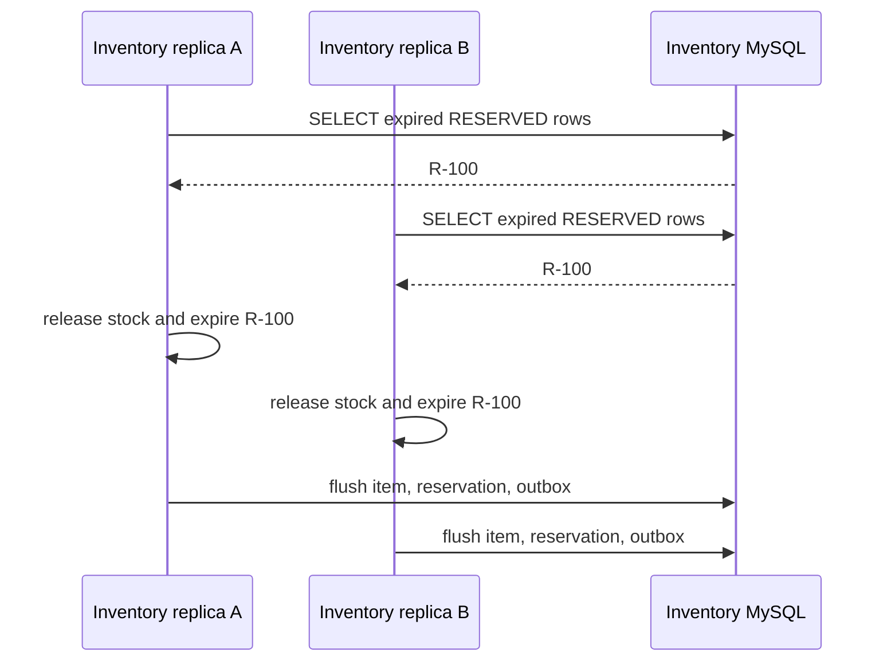
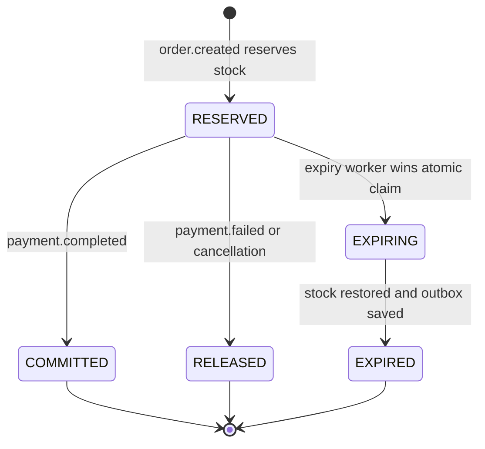

# Atomic Reservation Claim Implementation

This page contains the target multi-replica claim algorithm and its transaction boundaries. The current Shopverse runtime still uses the single-transaction baseline described in the [reservation-expiry hub](MULTI-REPLICA-RESERVATION-EXPIRY.md).

## Problem 1: Two Replicas Select The Same Reservation

Assume reservation `R-100` is expired and still `RESERVED`:



Both transactions can read the row before either commits because the query has
no lock or atomic ownership transition.

Possible effects:

- both workers attempt to restore the same quantity;
- both attempt to produce compensation outbox records;
- one transaction fails late with an optimistic-lock or uniqueness exception;
- the whole current batch rolls back because all expired rows share one
  transaction;
- logs and metrics report work that did not commit;
- repeated scans create contention and noisy exceptions.

## Why `@Version` Is Not The Complete Solution

`InventoryItem` has an optimistic-lock version:

```java
@Version
private long version;
```

Hibernate updates it with the old version in the predicate:

```sql
UPDATE inventory_items
SET available_quantity = ?,
    reserved_quantity = ?,
    version = version + 1
WHERE id = ?
  AND version = ?;
```

If replica A commits first, replica B's stale update may affect zero rows and
cause its transaction to roll back. This can prevent a silent lost update, but
it is conflict detection at flush time, not reservation ownership.

It does not provide:

- one clean winner before business processing begins;
- bounded per-reservation failure isolation;
- protection on the reservation row itself, which has no `@Version`;
- a guarantee that duplicate logs/metrics are emitted only after commit;
- a successful-payment state transition.

The losing transaction failing is safer than double stock release, but it is
not a deliberate multi-replica worker protocol.

## Problem 2: Paid Reservations Remain Eligible

The current reservation states are:

```java
RESERVED,
RELEASED,
EXPIRED
```

Inventory consumes `order.created` and `payment.failed`, but it does not
consume `payment.completed`. A successful reservation therefore remains
`RESERVED` after payment capture.

After its TTL, the scheduler can treat sold stock as abandoned:

```text
inventory reserved
  -> payment captured
  -> order confirmed
  -> reservation still RESERVED
  -> TTL reached
  -> scheduler restores sold stock incorrectly
```

This is a correctness problem even with only one Inventory replica. Scheduler
locking alone would serialize the wrong decision.

## Required Reservation State Machine

Add an explicit successful terminal state. `COMMITTED` is used here to mean
that the reserved stock became a completed sale:



Proposed enum:

```java
public enum ReservationStatus {
    RESERVED,
    EXPIRING,
    COMMITTED,
    RELEASED,
    EXPIRED
}
```

Only `RESERVED` may transition to one of the competing outcomes. Repeated or
late events must be idempotent.

## Recommended Solution: Atomic Conditional Claim

Use the database to choose exactly one owner before stock is changed:

```java
@Modifying(clearAutomatically = true, flushAutomatically = true)
@Query("""
        update InventoryReservation reservation
           set reservation.status = :claimStatus
         where reservation.id = :id
           and reservation.status = :expectedStatus
           and reservation.expiresAt <= :now
        """)
int claimExpiredReservation(
        Long id,
        ReservationStatus expectedStatus,
        ReservationStatus claimStatus,
        Instant now
);
```

Conceptually, the database executes:

```sql
UPDATE inventory_reservations
SET status = 'EXPIRING'
WHERE id = ?
  AND status = 'RESERVED'
  AND expires_at <= ?;
```

The affected-row count is the ownership decision:

```text
1 row updated -> this transaction owns expiry
0 rows updated -> another worker/event already changed it; skip
```

### What The `UPDATE` Returns

SQL `UPDATE` does not return the modified reservation row. JDBC returns an
integer update count through `executeUpdate`. Spring Data exposes that count
when an `@Modifying` repository method returns `int` or `long`:

```java
int claimed = reservations.claimExpiredReservation(
        reservationId,
        ReservationStatus.RESERVED,
        ReservationStatus.EXPIRING,
        Instant.now()
);
```

For this conditional update:

```sql
UPDATE inventory_reservations
SET status = 'EXPIRING'
WHERE id = ?
  AND status = 'RESERVED'
  AND expires_at <= CURRENT_TIMESTAMP;
```

the meaningful results are:

| Update count | Meaning | Worker action |
|---:|---|---|
| `1` | one row satisfied every predicate and was changed | this transaction owns the reservation and continues |
| `0` | row is missing, not expired, or no longer `RESERVED` | skip without error |
| greater than `1` | impossible when `id` is a primary key | treat as a defect |

The status predicate makes the operation compare-and-set:

```text
change RESERVED to EXPIRING only if it is still RESERVED
```

The worker should not fetch the row first and use that earlier result as proof
of ownership. Only the update count from the conditional write is authoritative.

### Concurrent Update Behavior In MySQL

Suppose replicas A and B both execute the claim for reservation `100`:

```mermaid
sequenceDiagram
    participant A as Replica A
    participant B as Replica B
    participant DB as MySQL

    A->>DB: UPDATE id=100 WHERE status=RESERVED
    DB-->>A: update count 1; row lock held until transaction ends
    B->>DB: UPDATE id=100 WHERE status=RESERVED
    Note over B,DB: B waits for the conflicting row lock
    A->>DB: release stock, mark EXPIRED, insert outbox, COMMIT
    DB-->>B: re-evaluate WHERE against committed state
    DB-->>B: update count 0 because status is EXPIRED
```

If A rolls back instead, its uncommitted `EXPIRING` change disappears. B can
then re-evaluate the predicate, change `RESERVED -> EXPIRING`, and receive `1`.
This gives failover without two committed owners.

Concurrent updates to the same row serialize inside MySQL. After the first
transaction commits, the second worker re-evaluates `status = 'RESERVED'`,
finds it false, and receives `0`.

## Can Two Replicas Read The Same Candidate Batch?

Yes. With the simple candidate query, both replicas can read the same IDs:

```text
Replica A candidates: [100, 101, 102]
Replica B candidates: [100, 101, 102]
```

The scan is only a work hint. It does not grant ownership. Each replica must
claim every ID separately:

```text
Reservation 100: A gets 1, B gets 0
Reservation 101: B gets 1, A gets 0
Reservation 102: A gets 1, B gets 0
```

Both replicas may therefore scan the same set while each reservation still has
one committed owner. Duplicate candidate reads waste a small amount of query
and claim work but do not duplicate the business operation.

To reduce duplicate scanning at higher scale, use a database-specific
`FOR UPDATE SKIP LOCKED` query. It lets each worker fetch rows not currently
locked by another worker. Atomic conditional claiming remains useful as the
business guard, especially for retries and alternative entry paths.

## Short Per-Reservation Transaction

Split scanning from processing:

```java
@Component
@RequiredArgsConstructor
class ReservationExpiryScheduler {

    private final InventoryReservationRepository repository;
    private final ReservationExpiryWorker worker;

    @Scheduled(
        fixedDelayString =
            "${shopverse.inventory.expiry-scan-delay-ms:60000}"
    )
    public void expireBatch() {
        repository.findExpiredCandidateIds(
                        ReservationStatus.RESERVED,
                        Instant.now(),
                        PageRequest.of(0, 100)
                )
                .forEach(worker::expireOne);
    }
}
```

The worker must be a separate Spring bean so calling it passes through the
transaction proxy. Calling a new `@Transactional` method through `this` would
bypass proxy interception.

```java
@Service
@RequiredArgsConstructor
class ReservationExpiryWorker {

    private final InventoryReservationRepository reservations;
    private final InventoryItemRepository items;
    private final OutboxService outbox;

    @Transactional(propagation = Propagation.REQUIRES_NEW)
    public boolean expireOne(Long reservationId) {
        Instant now = Instant.now();

        int claimed = reservations.claimExpiredReservation(
                reservationId,
                ReservationStatus.RESERVED,
                ReservationStatus.EXPIRING,
                now
        );

        if (claimed == 0) {
            return false;
        }

        InventoryReservation reservation = reservations
                .findById(reservationId)
                .orElseThrow();

        InventoryItem item = items
                .findByProductId(reservation.getProductId())
                .orElseThrow();

        item.release(reservation.getQuantity());
        reservation.expire();

        outbox.enqueue(
                "INVENTORY_RESERVATION",
                reservation.getOrderNumber(),
                "InventoryFailedEvent",
                "shopverse.inventory.failed",
                reservation.getOrderNumber(),
                createExpiryEvent(reservation),
                reservation.getCorrelationId()
        );

        return true;
    }
}
```

The code is a target design, not the current implementation. Exact types and
topic properties should use the existing Shopverse abstractions when built.

## Avoiding Whole-Batch Rollback

The current method processes the complete result list inside one transaction:

```text
one transaction
  reservation 100
  reservation 101
  reservation 102 -> optimistic-lock failure
  reservation 103
```

Failure on reservation `102` can roll back successful work for `100` and `101`.

The target design keeps the scheduler non-transactional and invokes a separate
proxied worker transaction for every ID:

```java
@Scheduled(
    fixedDelayString =
        "${shopverse.inventory.expiry-scan-delay-ms:60000}"
)
public void expireBatch() {
    List<Long> candidateIds = reservations.findExpiredCandidateIds(
            ReservationStatus.RESERVED,
            Instant.now(),
            PageRequest.of(0, batchSize)
    );

    for (Long id : candidateIds) {
        try {
            expiryWorker.expireOne(id);
        } catch (TransientDataAccessException exception) {
            log.warn(
                    "Reservation expiry rolled back; it will be retried "
                            + "by a later scan id={}",
                    id,
                    exception
            );
        }
    }
}
```

```java
@Transactional(propagation = Propagation.REQUIRES_NEW)
public boolean expireOne(Long id) {
    // conditional claim, stock release, final status, outbox insertion
}
```

Result:

```text
reservation 100 transaction -> COMMIT
reservation 101 transaction -> COMMIT
reservation 102 transaction -> ROLLBACK
reservation 103 transaction -> COMMIT
```

Reservation `102` remains eligible for a later bounded retry. Other committed
reservations are not undone.

`REQUIRES_NEW` guarantees an independent transaction even if a caller later
adds an outer transaction. The worker must remain a separate Spring bean;
self-invocation such as `this.expireOne(id)` bypasses the transactional proxy.

Catch only failures that the scheduler can safely defer. Configuration,
serialization, invariant, and programming errors should remain visible and
alertable rather than being swallowed indefinitely. Apply a retry limit or
recovery state if one reservation repeatedly fails.

## Complete Target Implementation

The following snippets form one coherent target implementation. They are not
present in the runtime yet.

### 1. Reservation States

```java
public enum ReservationStatus {
    RESERVED,
    EXPIRING,
    COMMITTED,
    RELEASED,
    EXPIRED
}
```

### 2. Expiry Configuration

```yaml
shopverse:
  inventory:
    reservation-ttl: 5m
    expiry-scan-delay-ms: 30000
    expiry-batch-size: 100
```

```java
@Validated
@ConfigurationProperties("shopverse.inventory")
public record InventoryProperties(
        @NotNull Duration reservationTtl,
        @Positive long expiryScanDelayMs,
        @Min(1) @Max(1000) int expiryBatchSize
) {
}
```

Use an injectable clock so boundary behavior is deterministic in tests:

```java
@Configuration
class TimeConfiguration {

    @Bean
    Clock utcClock() {
        return Clock.systemUTC();
    }
}
```

### 3. Candidate Scan And Atomic Claim Repository

```java
public interface InventoryReservationRepository
        extends JpaRepository<InventoryReservation, Long> {

    Optional<InventoryReservation> findByOrderNumber(String orderNumber);

    @Query("""
            select reservation.id
              from InventoryReservation reservation
             where reservation.status = :status
               and reservation.expiresAt <= :now
             order by reservation.expiresAt, reservation.id
            """)
    List<Long> findExpiredCandidateIds(
            @Param("status") ReservationStatus status,
            @Param("now") Instant now,
            Pageable pageable
    );

    @Modifying(clearAutomatically = true, flushAutomatically = true)
    @Query("""
            update InventoryReservation reservation
               set reservation.status = :claimStatus
             where reservation.id = :id
               and reservation.status = :expectedStatus
               and reservation.expiresAt <= :now
            """)
    int claimExpiredReservation(
            @Param("id") Long id,
            @Param("expectedStatus") ReservationStatus expectedStatus,
            @Param("claimStatus") ReservationStatus claimStatus,
            @Param("now") Instant now
    );
}
```

The existing `(status, expires_at)` index supports the candidate predicate.
InnoDB secondary indexes also carry the primary-key value internally, so add a
new `(status, expires_at, id)` index only after checking the actual plan with
`EXPLAIN`.

### 4. Worker Result

Returning a result lets the scheduler publish metrics and logs only after the
worker's transaction interceptor has committed:

```java
public record ReservationExpiryResult(
        Long reservationId,
        String orderNumber,
        String correlationId,
        Outcome outcome
) {
    public enum Outcome {
        EXPIRED,
        SKIPPED
    }

    public static ReservationExpiryResult skipped(Long reservationId) {
        return new ReservationExpiryResult(
                reservationId,
                null,
                null,
                Outcome.SKIPPED
        );
    }
}
```

### 5. One Transaction Per Reservation

```java
@Service
@RequiredArgsConstructor
public class ReservationExpiryWorker {

    private final InventoryReservationRepository reservations;
    private final InventoryItemRepository items;
    private final OutboxService outboxService;
    private final KafkaTopicsProperties topics;
    private final Clock clock;

    @Transactional(propagation = Propagation.REQUIRES_NEW)
    public ReservationExpiryResult expireOne(Long reservationId) {
        Instant now = clock.instant();

        int claimed = reservations.claimExpiredReservation(
                reservationId,
                ReservationStatus.RESERVED,
                ReservationStatus.EXPIRING,
                now
        );

        if (claimed == 0) {
            return ReservationExpiryResult.skipped(reservationId);
        }

        InventoryReservation reservation = reservations
                .findById(reservationId)
                .orElseThrow(() -> new IllegalStateException(
                        "Claimed reservation not found: " + reservationId
                ));

        InventoryItem item = items
                .findByProductId(reservation.getProductId())
                .orElseThrow(() -> new IllegalStateException(
                        "Inventory item not found for reservation: "
                                + reservationId
                ));

        item.release(reservation.getQuantity());
        reservation.expire();

        InventoryFailedEvent event = new InventoryFailedEvent(
                null,
                reservation.getOrderNumber(),
                reservation.getCorrelationId(),
                "Inventory reservation expired before payment completed"
        );

        outboxService.enqueue(
                "INVENTORY_RESERVATION",
                reservation.getOrderNumber(),
                InventoryFailedEvent.class.getSimpleName(),
                topics.inventoryFailed(),
                reservation.getOrderNumber(),
                event,
                reservation.getCorrelationId()
        );

        return new ReservationExpiryResult(
                reservation.getId(),
                reservation.getOrderNumber(),
                reservation.getCorrelationId(),
                ReservationExpiryResult.Outcome.EXPIRED
        );
    }
}
```

### 6. Non-Transactional Scheduler

The scheduler discovers candidates but does not own a batch transaction. Each
worker invocation enters a separate proxied bean and therefore receives its own
REQUIRES_NEW transaction.

```java
@Component
@RequiredArgsConstructor
public class ReservationExpiryScheduler {

    private final InventoryReservationRepository reservations;
    private final ReservationExpiryWorker worker;
    private final Clock clock;
    private final MeterRegistry meterRegistry;

    @Scheduled(
            fixedDelayString =
                    "${shopverse.inventory.expiry-scan-delay-ms:60000}"
    )
    public void expireReservations() {
        List<Long> candidates = reservations.findExpiredCandidateIds(
                ReservationStatus.RESERVED,
                clock.instant(),
                PageRequest.of(0, 100)
        );

        for (Long reservationId : candidates) {
            try {
                ReservationExpiryResult result =
                        worker.expireOne(reservationId);

                if (result.outcome()
                        == ReservationExpiryResult.Outcome.EXPIRED) {
                    meterRegistry.counter(
                            "shopverse.inventory.reservations.expired"
                    ).increment();
                }
            } catch (RuntimeException exception) {
                meterRegistry.counter(
                        "shopverse.inventory.reservations.expiry.failures"
                ).increment();
                log.error(
                        "Reservation expiry failed reservationId={}",
                        reservationId,
                        exception
                );
            }
        }
    }
}
```

Do not call `expireOne()` through `this`. Spring transaction advice is applied
by the proxy between the scheduler bean and worker bean.

## Transaction Boundary

For every candidate, the sequence is:

```text
begin transaction
  conditional RESERVED -> EXPIRING claim
  load the claimed reservation and inventory item
  release stock
  mark reservation EXPIRED
  insert inventory.failed into the outbox
commit transaction
```

Kafka publication remains outside this transaction. The outbox publisher sends
the persisted event later. If one reservation fails, only its transaction rolls
back and the scheduler continues with the remaining IDs.

## Successful Payment Must Compete Atomically

The `payment.completed` consumer needs its own conditional transition:

```java
@Modifying(clearAutomatically = true, flushAutomatically = true)
@Query("""
        update InventoryReservation reservation
           set reservation.status = :committed
         where reservation.orderNumber = :orderNumber
           and reservation.status = :reserved
        """)
int commitReservation(
        String orderNumber,
        ReservationStatus reserved,
        ReservationStatus committed
);
```

Payment completion and expiry race on the same `RESERVED` predicate:

```text
payment wins: RESERVED -> COMMITTED; expiry claim returns 0
expiry wins:  RESERVED -> EXPIRING; payment transition returns 0
```

If expiry wins, use the explicit late-payment workflow documented in
[Late payment after expiry](LATE-PAYMENT-AFTER-EXPIRY.md). Never silently move
an expired or cancelled order to `CONFIRMED`.

## Official References

- [Spring transaction management](https://docs.spring.io/spring-framework/reference/data-access/transaction.html)
- [Apache Kafka documentation](https://kafka.apache.org/documentation/)
- [PostgreSQL explicit locking](https://www.postgresql.org/docs/current/explicit-locking.html)
