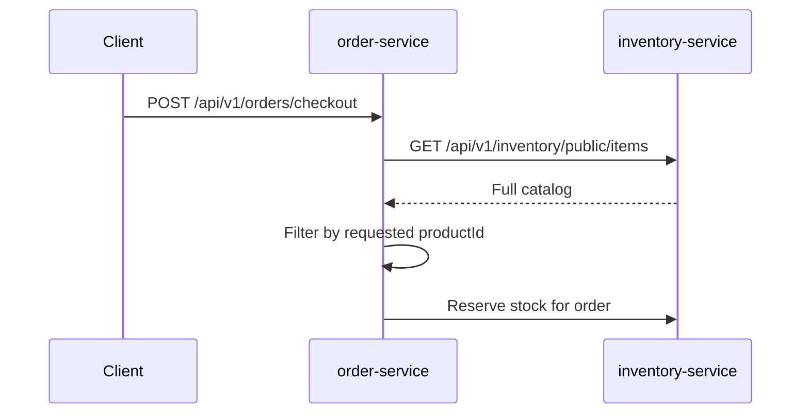
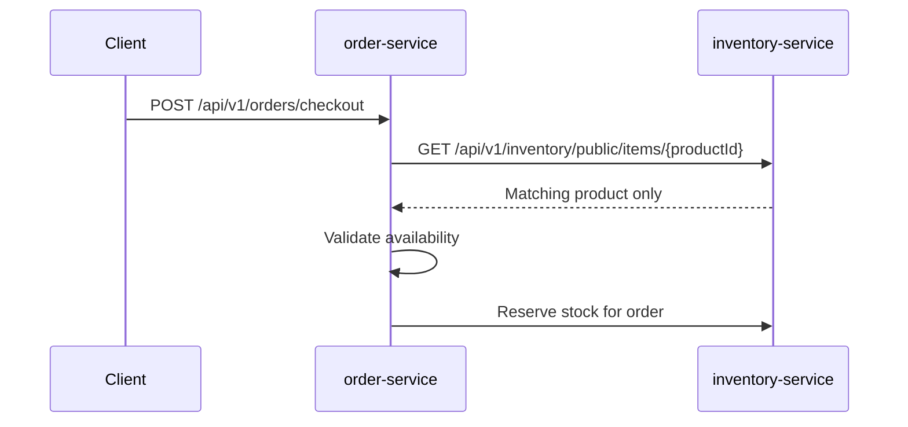
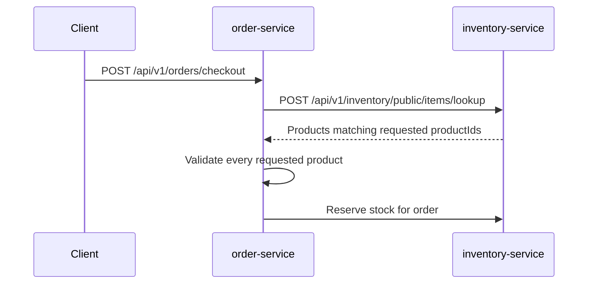

# Checkout Catalog Lookup Problem

Order checkout currently validates a requested product by loading the full
Inventory catalog and filtering it inside `order-service`. That works while the
catalog is small and checkout accepts one item, but it makes a write path depend
on a broad read endpoint.

## Problem Statement

During checkout, `order-service` needs only the products present in the
checkout request. The current implementation calls Inventory's full public
catalog endpoint, receives every product, and scans the response to find the
requested product.

Current behavior:



This is the wrong dependency shape for checkout. Checkout is a high-value write
path and should request only the product identifiers it must validate.

## Impact

- Checkout payload size grows with the whole catalog instead of the checkout
  request size.
- Order spends CPU and memory scanning unrelated products.
- A public browsing endpoint becomes part of the critical checkout path.
- Missing product, unavailable product, and Inventory dependency failure are
  easier to blur when the lookup is a broad list fetch.
- Future multi-item checkout would either rescan the same full catalog or create
  one direct call per item unless a bulk contract is introduced first.

## How We Identified It

The checkout flow in `order-service` asks `CatalogService` for the full catalog.
`CatalogService` delegates to `InventoryClient.getCatalog()`, which calls:

```http
GET /api/v1/inventory/public/items
```

`OrderServiceImpl` then filters the returned list by `productId` before adding
the item to the order. The required checkout input is much smaller: one product
today, and a bounded set of product IDs when multi-item checkout is enabled.

## Solution

Replace checkout's full-catalog dependency with direct product lookup now, and
design the service boundary so bulk lookup can be added before multi-item
checkout is enabled.

Target behavior for the current one-item checkout:



Target behavior for future multi-item checkout:



## Recommended Contract

Use a direct lookup endpoint first:

```http
GET /api/v1/inventory/public/items/{productId}
```

Response body should reuse Inventory's existing catalog item response shape so
Order does not need a new domain model:

```json
{
  "productId": 101,
  "productName": "Wireless Mouse",
  "price": 29.99,
  "available": true
}
```

Add bulk lookup only when checkout accepts more than one item:

```http
POST /api/v1/inventory/public/items/lookup
Content-Type: application/json

{
  "productIds": [101, 102]
}
```

Bulk response should be deterministic and easy for Order to validate:

```json
{
  "items": [
    {
      "productId": 101,
      "productName": "Wireless Mouse",
      "price": 29.99,
      "available": true
    }
  ],
  "missingProductIds": [102]
}
```

## Step-By-Step Implementation Plan

1. Add a direct Inventory read method.

   Add a service method in `inventory-service` that loads one product by
   `productId` and maps it to the existing catalog response DTO. Keep ownership
   in Inventory; do not move Inventory entities or domain models to a shared
   library.

2. Expose the direct public lookup endpoint.

   Add `GET /api/v1/inventory/public/items/{productId}` to
   `InventoryController`. Keep `GET /api/v1/inventory/public/items` for the web
   catalog and backwards compatibility.

3. Update the Order Feign client.

   Replace checkout usage of `getCatalog()` with a direct method such as
   `getCatalogItem(productId)`. Leave `getCatalog()` only if another Order path
   still needs it; otherwise remove it from the Order client.

4. Update `CatalogService`.

   Add `getProduct(productId)` or `getCatalogItem(productId)` that delegates to
   the direct Inventory endpoint and maps Inventory response DTOs to Order's
   local catalog response record.

5. Update checkout validation.

   In `OrderServiceImpl`, call the direct product lookup for each requested
   checkout item. With the current one-item checkout constraint, this is a
   single dependency call. Validate `available` before creating order items.

6. Preserve error semantics.

   Missing or unavailable product should remain a business failure with the
   current customer-facing checkout message. Inventory connection failures,
   timeouts, and non-business dependency failures should still map to service
   unavailable behavior instead of being reported as product-not-found.

7. Add focused tests.

   Cover direct Inventory lookup success, missing product behavior, unavailable
   product behavior, Inventory outage behavior, and a checkout path assertion
   that Order no longer calls the full-catalog endpoint.

8. Update API documentation.

   Document the new direct Inventory lookup endpoint in the API guide and
   service README. Mark the full catalog endpoint as a browsing/listing endpoint,
   not a checkout dependency.

9. Defer bulk lookup until multi-item checkout is real.

   Do not add a bulk endpoint only for theoretical use unless multi-item
   checkout is being implemented in the same change. When multi-item checkout is
   enabled, introduce the bulk endpoint first and have Order make one lookup
   call for the whole request.

## Files To Change

Expected implementation files:

- `inventory-service/src/main/java/io/shopverse/inventory_service/controller/InventoryController.java`
- `inventory-service/src/main/java/io/shopverse/inventory_service/service/InventoryService.java`
- `inventory-service/src/main/java/io/shopverse/inventory_service/service/InventoryServiceImpl.java`
- `order-service/src/main/java/io/shopverse/order/client/InventoryClient.java`
- `order-service/src/main/java/io/shopverse/order/service/CatalogService.java`
- `order-service/src/main/java/io/shopverse/order/service/OrderServiceImpl.java`

Expected test and documentation files:

- `inventory-service/src/test/...`
- `order-service/src/test/...`
- `documentation/docs/development/API-GUIDE.md`
- `inventory-service/README.md`
- `order-service/README.md`

## Verification Commands

Run service tests after the code change:

```powershell
cd inventory-service
.\gradlew.bat test --no-daemon
```

```powershell
cd order-service
.\gradlew.bat test --no-daemon
```

Run documentation validation after docs are updated:

```powershell
cd documentation
npm run build
```

Manual smoke test after the stack is running:

```http
POST /api/v1/orders/checkout
Idempotency-Key: direct-product-lookup-smoke-001
Authorization: Bearer <customer-token>
Content-Type: application/json

{
  "items": [
    {
      "productId": 101,
      "quantity": 1
    }
  ]
}
```

Expected result: checkout validates product `101` through the direct Inventory
lookup and does not call the full catalog endpoint.

## Before And After

| Area | Before | After |
|---|---|---|
| Checkout lookup | Load full Inventory catalog | Load only requested product |
| Current complexity | `O(catalog size)` network payload and scan | `O(1)` lookup for one-item checkout |
| Future multi-item path | Full scan or one call per item | One bulk lookup for requested product IDs |
| Catalog endpoint role | Browsing plus checkout dependency | Browsing/listing only |
| Domain ownership | Inventory model remains service-local | Inventory model remains service-local |

## Residual Risk

- Direct lookup can become an N+1 dependency pattern if multi-item checkout is
  enabled without adding bulk lookup first.
- The direct public endpoint exposes the same product summary already exposed by
  the public catalog. If stricter internal boundaries are needed later, add an
  internal route at the gateway or service mesh layer without sharing domain
  models.
- Product availability is still a point-in-time read. Reservation remains the
  authoritative stock control step.
