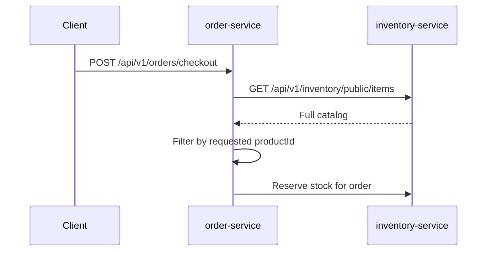
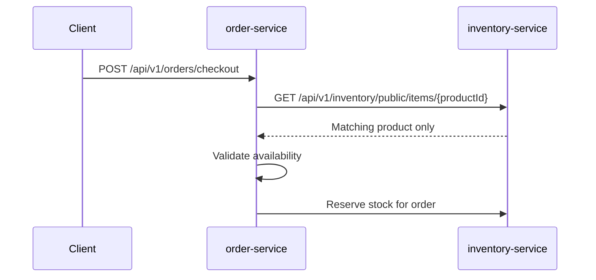
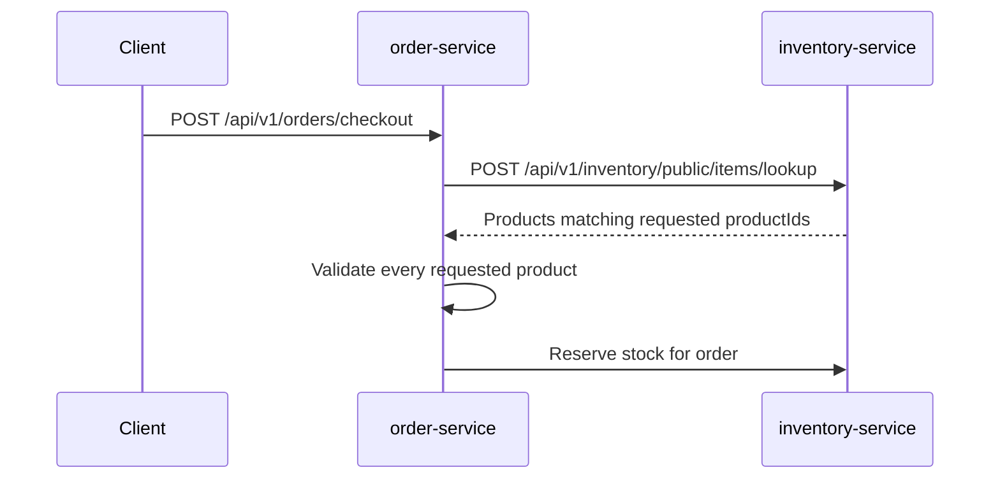

# Checkout Catalog Lookup Problem

Order checkout originally validated a requested product by loading the full
Inventory catalog and filtering it inside `order-service`. That worked while
the catalog was small and checkout accepted one item, but it made a write path
depend on a broad read endpoint. The current implementation uses a direct
Inventory product lookup for checkout and keeps the cached catalog path for
browsing.

## Problem Statement

During checkout, `order-service` needs only the products present in the
checkout request. Loading Inventory's full public catalog, receiving every
product, and scanning the response is the wrong dependency shape for that write
path.

Previous behavior:



This is the wrong dependency shape for checkout. Checkout is a high-value write
path and should request only the product identifiers it must validate.

## Impact

- Checkout payload size grows with the whole catalog instead of the checkout
  request size.
- Order spends CPU and memory scanning unrelated products.
- A public browsing endpoint becomes part of the critical checkout path.
- Missing product, unavailable product, and Inventory dependency failure are
  easier to blur when the lookup is a broad list fetch.
- Future multi-item checkout would either rescan the same full catalog or create
  one direct call per item unless a bulk contract is introduced first.

## Current Implementation

Checkout now asks `CatalogService` for the requested product only.
`CatalogService.getProduct(productId)` delegates to
`InventoryClient.getCatalogItem(productId)`, which calls:

```http
GET /api/v1/inventory/public/items/{productId}
```

`GET /api/v1/inventory/public/items` remains available for browsing and UI
catalog reads. Order Service caches that browse catalog with Caffeine, but
checkout does not use that cached list to validate products.

## Solution

Keep checkout on direct product lookup now, and design the service boundary so
bulk lookup can be added before multi-item checkout is enabled.

Current behavior for the one-item checkout:



Target behavior for future multi-item checkout:



## Recommended Contract

Use a direct lookup endpoint first:

```http
GET /api/v1/inventory/public/items/{productId}
```

Response body should reuse Inventory's existing catalog item response shape so
Order does not need a new domain model:

```json
{
  "productId": 101,
  "productName": "Wireless Mouse",
  "price": 29.99,
  "available": true
}
```

Add bulk lookup only when checkout accepts more than one item:

```http
POST /api/v1/inventory/public/items/lookup
Content-Type: application/json

{
  "productIds": [101, 102]
}
```

Bulk response should be deterministic and easy for Order to validate:

```json
{
  "items": [
    {
      "productId": 101,
      "productName": "Wireless Mouse",
      "price": 29.99,
      "available": true
    }
  ],
  "missingProductIds": [102]
}
```

## Step-By-Step Implementation Plan

Completed implementation:

- `inventory-service` exposes `GET /api/v1/inventory/public/items/{productId}`.
- `order-service` Feign client exposes `getCatalogItem(productId)`.
- `CatalogService.getProduct(productId)` maps one Inventory response into the
  Order catalog item record.
- `OrderServiceImpl.checkout(...)` validates each requested product through the
  direct lookup and checks `available` before persisting order items.
- `GET /api/v1/orders/public/catalog` still uses cached browse data.

Remaining/future implementation:

1. Add bulk lookup only when checkout accepts more than one item.

   Do not add a bulk endpoint only for theoretical use unless multi-item
   checkout is being implemented in the same change. When multi-item checkout is
   enabled, introduce the bulk endpoint first and have Order make one lookup
   call for the whole request.

2. Keep checkout error semantics explicit.

   Missing or unavailable product should remain a business failure with the
   current customer-facing checkout message. Inventory connection failures,
   timeouts, and non-business dependency failures should map to service
   unavailable behavior instead of being reported as product-not-found.

3. Extend tests as behavior grows.

   Cover bulk lookup behavior when multi-item checkout is implemented.

## Files To Change

Expected implementation files:

- `inventory-service/src/main/java/io/shopverse/inventory_service/controller/InventoryController.java`
- `inventory-service/src/main/java/io/shopverse/inventory_service/service/InventoryService.java`
- `inventory-service/src/main/java/io/shopverse/inventory_service/service/InventoryServiceImpl.java`
- `order-service/src/main/java/io/shopverse/order/client/InventoryClient.java`
- `order-service/src/main/java/io/shopverse/order/service/CatalogService.java`
- `order-service/src/main/java/io/shopverse/order/service/OrderServiceImpl.java`

Expected test and documentation files:

- `inventory-service/src/test/...`
- `order-service/src/test/...`
- `documentation/docs/development/API-GUIDE.md`
- `inventory-service/README.md`
- `order-service/README.md`

## Verification Commands

Run service tests after the code change:

```powershell
cd inventory-service
.\gradlew.bat test --no-daemon
```

```powershell
cd order-service
.\gradlew.bat test --no-daemon
```

Run documentation validation after docs are updated:

```powershell
cd documentation
npm run build
```

Manual smoke test after the stack is running:

```http
POST /api/v1/orders/checkout
Idempotency-Key: direct-product-lookup-smoke-001
Authorization: Bearer <customer-token>
Content-Type: application/json

{
  "items": [
    {
      "productId": 101,
      "quantity": 1
    }
  ]
}
```

Expected result: checkout validates product `101` through the direct Inventory
lookup and does not call the full catalog endpoint.

## Before And After

| Area | Before | After |
|---|---|---|
| Checkout lookup | Load full Inventory catalog | Load only requested product |
| Current complexity | `O(catalog size)` network payload and scan | `O(1)` lookup for one-item checkout |
| Future multi-item path | Full scan or one call per item | One bulk lookup for requested product IDs |
| Catalog endpoint role | Browsing plus checkout dependency | Browsing/listing only |
| Domain ownership | Inventory model remains service-local | Inventory model remains service-local |

## Residual Risk

- Direct lookup can become an N+1 dependency pattern if multi-item checkout is
  enabled without adding bulk lookup first.
- The direct public endpoint exposes the same product summary already exposed by
  the public catalog. If stricter internal boundaries are needed later, add an
  internal route at the gateway or service mesh layer without sharing domain
  models.
- Product availability is still a point-in-time read. Reservation remains the
  authoritative stock control step.
