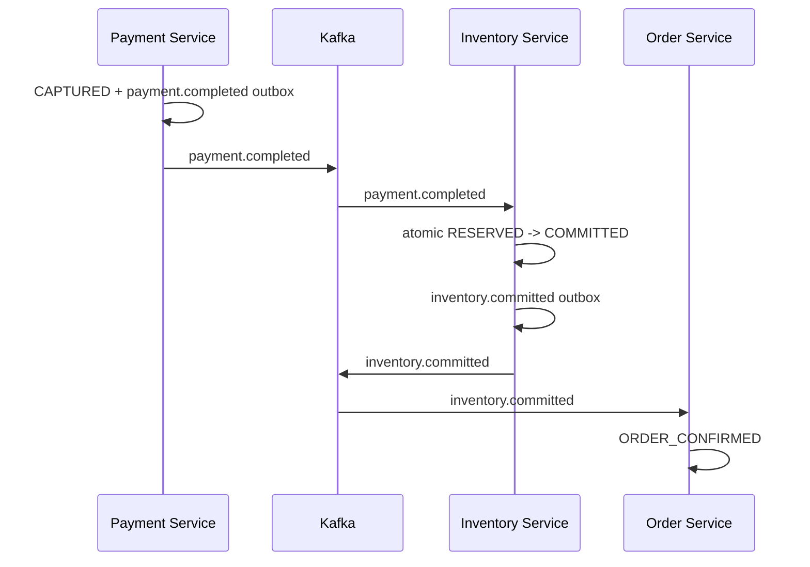

# Late Payment Reconciliation After Expiry

This page covers the race in which payment succeeds after inventory has expired, including event contracts, refund idempotency, and failure handling.

## Problem 3: Payment Arrives After Expiry

A payment provider can complete a charge while the result is delayed by a
timeout, network interruption, Kafka delay, consumer outage, retry topic, or
DLT recovery.

```text
12:00:00  Inventory reservation created; expires at 12:05:00
12:04:58  Provider captures payment
12:05:00  Inventory expiry worker wins and releases stock
12:05:10  payment.completed reaches Inventory and Order
```

The provider timestamp says payment completed before the nominal deadline,
but durable Inventory state already says `EXPIRED`. During those ten seconds,
the released stock may have been reserved by another order. Recreating the old
reservation would risk overselling or taking stock from the new customer.

Therefore the safe rule is:

> Once expiry commits, payment completion cannot resurrect the reservation.
> Treat the capture as a late payment and compensate financially.

The system may use a small configured expiry grace period to absorb expected
broker latency, but grace extends the stock hold. It does not change the rule
after expiry has committed.

## Provider Time Versus Processing Time

Store both timestamps when available:

| Timestamp | Meaning |
|---|---|
| `providerCompletedAt` | when the payment provider says capture completed |
| `eventPublishedAt` | when Payment Service created the event |
| `eventReceivedAt` | when a consumer processed the event |
| `reservation.expiresAt` | Inventory's reservation deadline |
| `reservation.updatedAt` | when the winning Inventory transition committed |

They are essential for audit and diagnosis, but the current durable state is
the concurrency authority:

```text
RESERVED  -> payment may still atomically commit the reservation
COMMITTED -> duplicate payment event; no-op
EXPIRING  -> expiry owns the transition; payment cannot commit
EXPIRED   -> start late-payment refund/reconciliation
RELEASED  -> payment is inconsistent; start refund/reconciliation
```

Do not compare application-server clocks and then update without a conditional
database predicate. Clock comparison alone does not prevent a concurrent
expiry commit.

## Corrected Choreography

The current Order listener confirms directly from `payment.completed`. That is
not sufficient once reservation expiry and late payment are modeled. Payment
capture and inventory commitment become separate durable facts.

Target happy path:



Target late-payment path:

```mermaid
sequenceDiagram
    participant I as Inventory Service
    participant K as Kafka
    participant P as Payment Service
    participant Provider as Payment Provider
    participant O as Order Service

    I->>I: RESERVED -> EXPIRING -> EXPIRED
    I->>K: inventory.failed
    K->>O: inventory.failed
    O->>O: mark order cancellation/refund pending
    K->>I: delayed payment.completed
    I->>I: commit update returns 0; status is EXPIRED
    I->>K: late-payment.detected
    K->>P: late-payment.detected
    P->>P: CAPTURED -> REFUND_PENDING
    P->>Provider: refund with idempotency key
    Provider-->>P: refund result
    P->>P: REFUNDED + payment.refunded outbox
    P->>K: payment.refunded
    K->>O: payment.refunded
    O->>O: CANCELLED with refund evidence
```

Order Service may record `PAYMENT_COMPLETED` when the payment event arrives,
but it must not transition to `CONFIRMED` until it consumes
`inventory.committed`. If `inventory.failed` or `late-payment.detected` wins,
the Order follows cancellation/refund recovery instead.

## Proposed States

These are target states; they are not all present in the current enums.

Reservation:

```text
RESERVED -> COMMITTED
RESERVED -> RELEASED
RESERVED -> EXPIRING -> EXPIRED
```

Payment:

```text
PENDING -> AUTHORIZED -> CAPTURED
CAPTURED -> REFUND_PENDING -> REFUNDED
REFUND_PENDING -> MANUAL_REVIEW  (unresolved provider result)
```

`LATE_PAYMENT_DETECTED` is better modeled as an event/recovery reason than as
the main payment status. The durable Payment status remains `CAPTURED` until a
refund workflow atomically claims it as `REFUND_PENDING`.

Order:

```text
PAYMENT_PROCESSING -> PAYMENT_COMPLETED
PAYMENT_COMPLETED + inventory.committed -> CONFIRMED
PAYMENT_COMPLETED + inventory expired -> REFUND_PENDING
REFUND_PENDING + payment.refunded -> CANCELLED
```

The exact Order enum names can be simplified for the POC, but transition guards
must prevent terminal failure/cancellation from being overwritten by a delayed
success event.

## Proposed Event Contracts

Every event should carry a stable event ID and business identifiers:

```java
public record InventoryCommittedEvent(
        UUID eventId,
        String orderNumber,
        String correlationId,
        Instant committedAt
) {
}
```

```java
public record LatePaymentDetectedEvent(
        UUID eventId,
        String orderNumber,
        String correlationId,
        String paymentReference,
        Instant providerCompletedAt,
        Instant reservationExpiredAt,
        String reason
) {
}
```

```java
public record PaymentRefundedEvent(
        UUID eventId,
        String orderNumber,
        String correlationId,
        String paymentReference,
        String refundReference,
        Instant refundedAt
) {
}
```

Suggested topics:

```text
shopverse.inventory.committed
shopverse.payment.late-detected
shopverse.payment.refunded
shopverse.payment.refund-failed
```

Topic names are proposed. They must be added consistently to centralized
configuration, producer/consumer contracts, Docker Kafka initialization where
needed, and documentation when implemented.

## Late-Payment Decision Code

Inventory first attempts the atomic commit:

```java
@Transactional
public void handlePaymentCompleted(PaymentCompletedEvent event) {
    int committed = reservations.commitReservation(
            event.orderNumber(),
            ReservationStatus.RESERVED,
            ReservationStatus.COMMITTED
    );

    if (committed == 1) {
        outbox.enqueue(
                "INVENTORY_RESERVATION",
                event.orderNumber(),
                InventoryCommittedEvent.class.getSimpleName(),
                topics.inventoryCommitted(),
                event.orderNumber(),
                createInventoryCommitted(event),
                event.correlationId()
        );
        return;
    }

    InventoryReservation reservation = reservations
            .findByOrderNumber(event.orderNumber())
            .orElseThrow();

    switch (reservation.getStatus()) {
        case COMMITTED -> log.debug(
                "Duplicate payment completion ignored orderNumber={}",
                event.orderNumber()
        );
        case EXPIRED, RELEASED -> enqueueLatePayment(event, reservation);
        case EXPIRING -> throw new ConcurrentReservationTransitionException(
                event.orderNumber()
        );
        case RESERVED -> throw new IllegalStateException(
                "Conditional reservation commit unexpectedly failed"
        );
    }
}
```

The example describes target behavior. A bounded retry can re-read an
`EXPIRING` transition after the expiry transaction finishes. The final durable
state then determines whether the event is a duplicate or a late payment.

`LatePaymentDetectedEvent` must be inserted through Inventory's outbox in the
same transaction as any local recovery record. A database uniqueness rule or
Inbox/event-ID record must ensure duplicate `payment.completed` deliveries
produce only one unresolved late-payment workflow.

## Idempotent Refund Workflow

Do not hold a Payment database transaction open while calling a third-party
provider.

### 1. Claim Refund Locally

```sql
UPDATE payments
SET status = 'REFUND_PENDING'
WHERE order_number = ?
  AND status = 'CAPTURED';
```

```text
1 row -> this event created the refund work
0 rows -> duplicate, already refunded, or manual-review state
```

Persist a refund work record with a unique provider idempotency key:

```text
refund:{paymentReference}
```

### 2. Call Provider Outside The Claim Transaction

```java
provider.refund(
        paymentReference,
        amount,
        refundIdempotencyKey
);
```

The same key must be reused after timeout. Before blindly retrying an uncertain
refund, query/reconcile the provider using that key or payment reference.

### 3. Finalize In A Short Transaction

Success:

```text
REFUND_PENDING -> REFUNDED
+ persist refund reference
+ insert payment.refunded outbox event
```

Unresolved provider result:

```text
REFUND_PENDING -> MANUAL_REVIEW
+ preserve attempts, timestamps, error category, and provider evidence
+ alert an operator
```

This mirrors the short-transaction outbox principle: database locks are not
held during remote provider waits.

## Idempotency Rules

| Input/current state | Required behavior |
|---|---|
| duplicate `payment.completed`, reservation `COMMITTED` | no-op; do not emit another `inventory.committed` |
| duplicate `payment.completed`, reservation `EXPIRED` | return existing late-payment recovery; do not create another refund |
| duplicate `late-payment.detected`, payment `REFUND_PENDING` | reuse existing refund work |
| duplicate refund request, payment `REFUNDED` | return stored refund result |
| refund provider timeout | reconcile by stable provider idempotency key before retry |
| delayed `inventory.committed`, Order already failed | reject invalid transition and send to recovery/manual review |

Useful uniqueness constraints include:

```text
UNIQUE late-payment recovery per order/payment reference
UNIQUE refund work per payment
UNIQUE provider refund idempotency key
UNIQUE processed event ID per consumer
```

## Transaction Boundaries For Late Payment

```text
Inventory transaction:
  reservation conditional transition
  + inventory outcome/late-payment recovery
  + outgoing outbox event

Payment refund-claim transaction:
  CAPTURED -> REFUND_PENDING
  + durable refund work

No database transaction:
  remote provider refund call

Payment finalization transaction:
  REFUND_PENDING -> REFUNDED or MANUAL_REVIEW
  + provider evidence
  + outgoing outbox event

Order transaction:
  guarded order status transition
  + timeline entry
```

Each transaction is local to its service database. Kafka connects the local
transactions asynchronously; transactional outbox and idempotent consumers
provide recovery rather than one distributed ACID transaction.

## Late-Payment Failure Matrix

| Scenario | Expected durable outcome |
|---|---|
| payment commit wins before expiry claim | reservation `COMMITTED`; Order confirms after `inventory.committed` |
| expiry claim wins before payment commit | reservation `EXPIRED`; refund workflow starts |
| provider captured before TTL but event arrived after committed expiry | do not resurrect stock; refund or manual review |
| duplicate payment event | one Inventory outcome and at most one refund workflow |
| refund succeeds but response is lost | provider reconciliation finds existing refund; finalize once |
| refund repeatedly fails | `MANUAL_REVIEW`, alert, preserved audit history |
| Order receives conflicting success/failure events | guarded state machine accepts only valid transition; conflict is audited |

## Additional Tests For Late Payment

Use MySQL and Kafka Testcontainers for these scenarios:

1. Pause `payment.completed` consumption until after reservation expiry.
2. Assert Inventory emits one `late-payment.detected` event.
3. Assert Payment creates one `REFUND_PENDING` workflow.
4. Deliver the same events repeatedly and assert one provider refund key.
5. Complete refund and assert one `payment.refunded` outbox event.
6. Assert Order never reaches `CONFIRMED` after committed expiry.
7. Race payment completion and expiry with a barrier; assert exactly one
   `RESERVED` transition wins.
8. Simulate refund timeout followed by provider reconciliation.
9. Assert conflicting terminal Order transitions are rejected and audited.
10. Verify correlation ID and event ID across Inventory, Payment, and Order
    recovery logs.

## Crash And Failure Behavior

| Failure point | Expected result |
|---|---|
| crash before claim | another scan can process the `RESERVED` row |
| crash after claim but before commit | database rolls back claim and local changes |
| item optimistic-lock conflict | complete per-reservation transaction rolls back and retries later |
| outbox insertion fails | stock and reservation transition roll back |
| crash after commit before Kafka publish | durable outbox publisher publishes later |
| duplicate scheduler candidate | claim returns `0` for every non-owner |
| duplicate `payment.completed` | conditional transition returns `0` after first success |

This design does not need a stale-claim recovery timeout because `EXPIRING` is
not committed independently of the final business transaction. If claiming
and processing are deliberately split into separate committed transactions,
then `claimed_at`, `claimed_by`, lease expiry, and stale-claim recovery become
mandatory.

