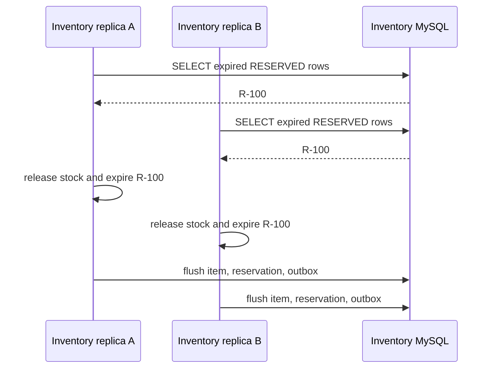
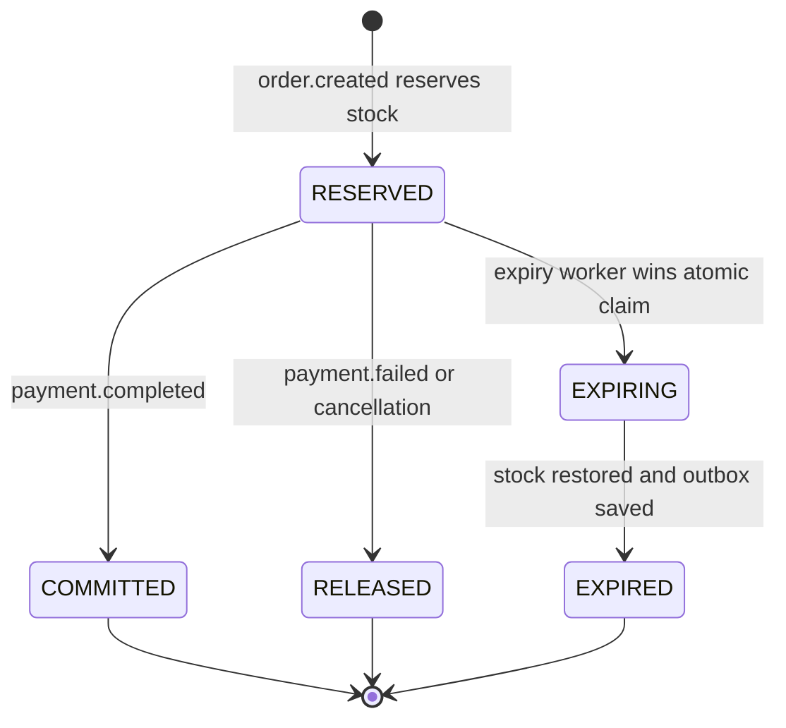

# Reservation Contention And State Model

<DocLabels items={[{label: 'Advanced', tone: 'advanced'}, {label: 'Shopverse', tone: 'shopverse'}, {label: 'Production', tone: 'production'}]} />

## Problem 1: Two Replicas Select The Same Reservation

Assume reservation `R-100` is expired and still `RESERVED`:



Both transactions can read the row before either commits because the query has
no lock or atomic ownership transition.

Possible effects:

- both workers attempt to restore the same quantity;
- both attempt to produce compensation outbox records;
- one transaction fails late with an optimistic-lock or uniqueness exception;
- the whole current batch rolls back because all expired rows share one
  transaction;
- logs and metrics report work that did not commit;
- repeated scans create contention and noisy exceptions.

## Why `@Version` Is Not The Complete Solution

`InventoryItem` has an optimistic-lock version:

```java
@Version
private long version;
```

Hibernate updates it with the old version in the predicate:

```sql
UPDATE inventory_items
SET available_quantity = ?,
    reserved_quantity = ?,
    version = version + 1
WHERE id = ?
  AND version = ?;
```

If replica A commits first, replica B's stale update may affect zero rows and
cause its transaction to roll back. This can prevent a silent lost update, but
it is conflict detection at flush time, not reservation ownership.

It does not provide:

- one clean winner before business processing begins;
- bounded per-reservation failure isolation;
- protection on the reservation row itself, which has no `@Version`;
- a guarantee that duplicate logs/metrics are emitted only after commit;
- a successful-payment state transition.

The losing transaction failing is safer than double stock release, but it is
not a deliberate multi-replica worker protocol.

## Problem 2: Paid Reservations Remain Eligible

The current reservation states are:

```java
RESERVED,
RELEASED,
EXPIRED
```

Inventory consumes `order.created` and `payment.failed`, but it does not
consume `payment.completed`. A successful reservation therefore remains
`RESERVED` after payment capture.

After its TTL, the scheduler can treat sold stock as abandoned:

```text
inventory reserved
  -> payment captured
  -> order confirmed
  -> reservation still RESERVED
  -> TTL reached
  -> scheduler restores sold stock incorrectly
```

This is a correctness problem even with only one Inventory replica. Scheduler
locking alone would serialize the wrong decision.

## Required Reservation State Machine

Add an explicit successful terminal state. `COMMITTED` is used here to mean
that the reserved stock became a completed sale:



Proposed enum:

```java
public enum ReservationStatus {
    RESERVED,
    EXPIRING,
    COMMITTED,
    RELEASED,
    EXPIRED
}
```

Only `RESERVED` may transition to one of the competing outcomes. Repeated or
late events must be idempotent.

## Recommended Next

Return to [Atomic Inventory Reservation](./ATOMIC-RESERVATION-CLAIM.md) to select the next focused guide.


## Official References

- [Resilience4j documentation](https://resilience4j.readme.io/docs)
- [Apache Kafka documentation](https://kafka.apache.org/documentation/)
