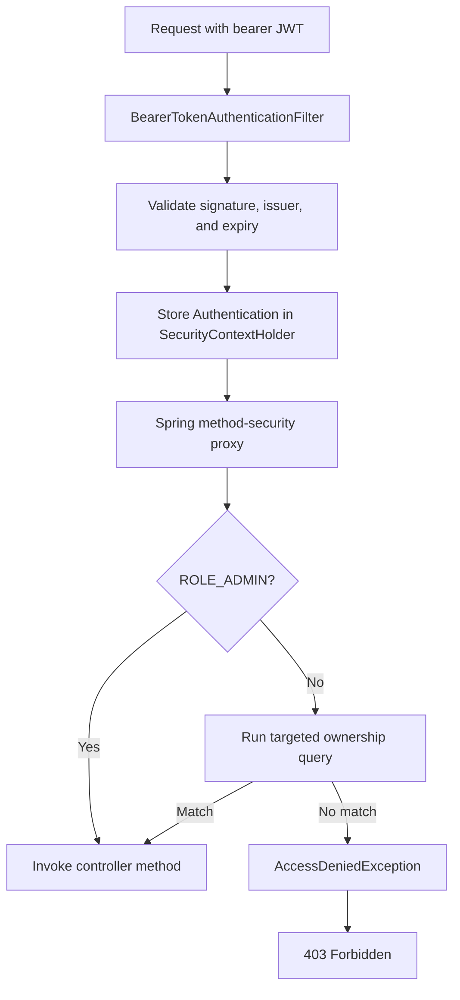

# Resource Ownership And SpEL Runtime

<DocLabels items={[{label: 'Advanced', tone: 'advanced'}, {label: 'Shopverse', tone: 'shopverse'}, {label: 'Production', tone: 'production'}]} />

## Problem Statement

Authentication proves who the caller is. It does not prove that the caller
owns every resource exposed by an authenticated endpoint.

Consider two customers:

```text
alice -> order 42 -> payment ORD-42
bob   -> valid JWT, but does not own either resource
```

If an API checks only `authenticated()`, Bob can change an ID in the URL and
attempt an insecure direct object reference (IDOR):

```http
GET /api/v1/orders/42/timeline
GET /api/v1/payments/orders/ORD-42
Authorization: Bearer <bob-token>
```

The JWT is valid, but access must still be denied. Route authentication or a
generic `ROLE_CUSTOMER` check cannot make this resource-level decision.

## Applied Policy

Shopverse applies this rule to customer-facing timeline and payment reads:

```text
allow when caller has ROLE_ADMIN
OR
allow when authenticated username equals the persisted resource owner
otherwise deny with 403 Forbidden
```

Administrators retain cross-customer access for support and operations.

| API | Resource owner stored in | Customer rule |
|---|---|---|
| `GET /api/v1/orders/{id}/timeline` | `order_service.orders.customer_username` | order ID and JWT subject must identify the same customer |
| `GET /api/v1/payments/orders/{orderNumber}` | `payment_service.payments.customer_username` | order number and JWT subject must identify the same customer |

## Spring Security Code Flow

Method security is enabled in both resource services:

```java
@EnableMethodSecurity
@Configuration
public class SecurityConfig {
    // SecurityFilterChain and JWT resource-server configuration
}
```

The controller declares the policy next to the protected operation:

```java
@GetMapping("/{id}/timeline")
@PreAuthorize("hasRole('ADMIN') or "
        + "@orderAuthorization.isOwner(#id, authentication.name)")
public List<OrderTimelineResponse> getTimeline(@PathVariable Long id) {
    return orderService.getTimeline(id);
}
```

```java
@GetMapping("/orders/{orderNumber}")
@PreAuthorize("hasRole('ADMIN') or "
        + "@paymentAuthorization.isOwner(#orderNumber, authentication.name)")
public PaymentResponse getByOrderNumber(@PathVariable String orderNumber) {
    return paymentService.getByOrderNumber(orderNumber);
}
```

Expression values have specific meanings:

| Expression | Meaning |
|---|---|
| `hasRole('ADMIN')` | checks for the `ROLE_ADMIN` granted authority |
| `#id` / `#orderNumber` | references the intercepted method argument |
| `authentication.name` | reads the authenticated principal name, derived from the validated JWT |
| `@orderAuthorization` | resolves a Spring bean by its component name |
| `isOwner(...)` | performs the resource-specific ownership decision |

Spring invokes these checks through its method-security AOP interceptor before
the controller method runs:



Because `or` short-circuits, an administrator does not execute the ownership
query. A customer reaches the repository check before business data is read.

## Detailed `@PreAuthorize` Evaluation

Consider this request:

```http
GET /api/v1/orders/123/timeline
Authorization: Bearer eyJ...
```

and the controller rule:

```java
@GetMapping("/{id}/timeline")
@PreAuthorize("hasRole('ADMIN') or "
        + "@orderAuthorization.isOwner(#id, authentication.name)")
public List<OrderTimelineResponse> getTimeline(@PathVariable Long id) {
    return orderService.getTimeline(id);
}
```

### 1. The Resource Server Authenticates The JWT

Before controller method authorization, `BearerTokenAuthenticationFilter`
extracts the bearer token. `JwtAuthenticationProvider` uses the configured
`JwtDecoder` to verify its signature and validate issuer, expiry, and other
configured constraints.

A Shopverse customer token has claims shaped like:

```json
{
  "iss": "shopverse-auth-service",
  "sub": "john",
  "roles": "ROLE_CUSTOMER",
  "permissions": ["ORDER_READ"]
}
```

Auth Service creates `sub` from `user.username()`. The resource-service
`JwtAuthenticationConverter` maps the `roles` claim into authorities. The
authenticated object is a `JwtAuthenticationToken`, not a
`UsernamePasswordAuthenticationToken`:

```text
JwtAuthenticationToken
  principal   = Jwt
  name        = "john"
  authorities = [ROLE_CUSTOMER]
```

Spring stores it in the request's `SecurityContext`, accessible through:

```java
Authentication authentication = SecurityContextHolder
        .getContext()
        .getAuthentication();
```

### 2. Method Security Intercepts Before Invocation

`@EnableMethodSecurity` registers Spring Security method interceptors. In the
current authorization architecture,
`AuthorizationManagerBeforeMethodInterceptor` handles `@PreAuthorize` before
the proxied controller method executes. `MethodSecurityInterceptor` belongs to
the older method-security architecture and should not be presented as the
primary Spring Security 6 implementation.

If authorization fails, `getTimeline` is never entered.

### 3. `hasRole('ADMIN')` Is Evaluated

`hasRole('ADMIN')` checks for authority `ROLE_ADMIN`; the expression helper
adds the conventional `ROLE_` prefix. For John's authorities:

```text
[ROLE_CUSTOMER] contains ROLE_ADMIN -> false
```

Shopverse keeps complete role names such as `ROLE_CUSTOMER` in the JWT and
configures its claim converter with an empty authority prefix. This avoids
adding another prefix while converting the claim. The later `hasRole` check
still looks for `ROLE_ADMIN`.

### 4. SpEL Resolves The Method Argument

`#id` references the intercepted Java method parameter. For
`/api/v1/orders/123/timeline`, the converted `Long id` is `123`, so the second
branch becomes conceptually:

```java
@orderAuthorization.isOwner(123L, authentication.name)
```

Parameter-name discovery must be available for named SpEL parameters. An
explicit annotation-based name such as `@P("id")`, or positional parameters
such as `#p0`, can be used when compiled parameter names are unavailable.

### 5. SpEL Resolves The Principal Name

`authentication` is the current `Authentication` from the security context.
For Shopverse's `JwtAuthenticationToken`:

```java
authentication.getName(); // "john"
```

The default `JwtAuthenticationConverter` uses the JWT `sub` claim as the
principal name. Shopverse does not override the principal claim, so
`authentication.name` equals the username written by Auth Service into
`JwtClaimsSet.subject(...)`.

The JWT itself remains available from the principal:

```java
JwtAuthenticationToken token =
        (JwtAuthenticationToken) authentication;

Jwt jwt = token.getToken();
String subject = jwt.getSubject();
String issuer = jwt.getIssuer().toString();
```

If a different issuer identifies users with `preferred_username`, configure
that deliberately while retaining Shopverse's role conversion:

```java
@Bean
JwtAuthenticationConverter jwtAuthenticationConverter() {
    JwtGrantedAuthoritiesConverter roles =
            new JwtGrantedAuthoritiesConverter();
    roles.setAuthoritiesClaimName("roles");
    roles.setAuthorityPrefix("");

    JwtAuthenticationConverter jwtConverter =
            new JwtAuthenticationConverter();
    jwtConverter.setPrincipalClaimName("preferred_username");
    jwtConverter.setJwtGrantedAuthoritiesConverter(roles);
    return jwtConverter;
}
```

Changing the principal claim without changing token issuance and persisted
owner values would break ownership matching. The chosen claim must be stable,
unique within the issuer, and use the same identity format stored on Orders
and Payments.

### 6. `@orderAuthorization` Resolves A Spring Bean

In SpEL, `@beanName` delegates to Spring's bean resolver. Therefore:

```text
@orderAuthorization
```

resolves the component declared as:

```java
@Component("orderAuthorization")
public class OrderAuthorization {
    // ...
}
```

Spring then invokes:

```java
orderAuthorization.isOwner(123L, "john")
```

### 7. The Repository Checks Persisted Ownership

The authorization component executes:

```java
return username != null
        && orderRepository.existsByIdAndCustomerUsername(
                orderId, username);
```

Spring Data parses `existsByIdAndCustomerUsername` into an existence query
with two bound predicates. Its SQL is equivalent in meaning to:

```sql
SELECT CASE WHEN COUNT(*) > 0 THEN TRUE ELSE FALSE END
FROM orders
WHERE id = ?
  AND customer_username = ?;
```

The exact generated SQL is provider- and dialect-dependent and may use a
limited row lookup instead of `COUNT`. Shopverse does not join a `customers`
table here: `customer_username` is stored directly in the Order Service's
`orders` table. Bound parameters represent `123` and `john`; values are not
concatenated into SQL.

### 8. Spring Allows Or Rejects The Call

The complete expression is now:

```text
false OR isOwner(123, "john")
```

- `true`: Spring invokes `getTimeline`, which calls `orderService`;
- `false`: Spring throws `AccessDeniedException`, translated to `403` for an
  authenticated HTTP caller.

An absent or invalid JWT fails earlier and normally produces `401`.

## Available Method-Security SpEL Values

| Value | Typical use | Availability note |
|---|---|---|
| `authentication` | current `Authentication` | security expressions |
| `principal` | `authentication.getPrincipal()` | security expressions |
| `#id`, `#orderNumber` | method arguments | pre/post method expressions |
| `@beanName` | custom Spring authorization component | when bean resolution is enabled, as in standard method security |
| `returnObject` | authorize using the returned value | primarily `@PostAuthorize` and post-processing |
| `filterObject` | current element being filtered | `@PreFilter` or `@PostFilter` |
| `this` | proxied target context | use cautiously; business authorization is clearer in a named bean |

`returnObject` is not available for a meaningful pre-invocation decision
because the method has not returned yet. `filterObject` is specific to filter
annotations rather than a general `@PreAuthorize` argument.

## Why Not Trust A Request Value?

This can be valid only when `username` is a server-controlled method argument:

```java
@PreAuthorize("#username == authentication.name")
```

It is unsafe when the client can choose the username independently of the
resource. This expression is also a poor ownership boundary:

```java
@PreAuthorize("#order.customerUsername == authentication.name")
```

The caller can submit an object claiming to belong to themselves. For reads by
resource identifier, querying the service-owned database makes the decision
against persisted state. An even stronger service design can combine
authorization and lookup in one scoped repository query, such as
`findByIdAndCustomerUsername`, then return `404` when no authorized resource is
visible.

## Accuracy Check

| Submitted statement | Verdict | Shopverse-correct interpretation |
|---|---|---|
| `@PreAuthorize` executes before the controller body | Correct | method-security proxy evaluates it before invocation |
| JWT creates `UsernamePasswordAuthenticationToken` | Incorrect for this flow | OAuth2 Resource Server creates `JwtAuthenticationToken` |
| `authentication.name` comes from JWT `sub` | Correct for current Shopverse | no custom principal claim is configured |
| `hasRole('ADMIN')` checks `ROLE_ADMIN` | Correct | `hasRole` applies the role prefix convention |
| `@orderAuthorization` resolves a Spring bean | Correct | the explicit component name matches the SpEL reference |
| query joins `orders` and `customers` | Incorrect for Shopverse | ownership is stored in `orders.customer_username` |
| shown SQL is exact generated SQL | Too strong | query meaning is correct; exact SQL varies by provider/dialect |
| database ownership check is safer than trusting client input | Correct | persisted service-owned state is authoritative |

## Recommended Next

Return to [Resource Ownership Authorization](./RESOURCE-OWNERSHIP-AUTHORIZATION.md) to select the next focused guide.


## Official References

- [Resilience4j documentation](https://resilience4j.readme.io/docs)
- [Apache Kafka documentation](https://kafka.apache.org/documentation/)
