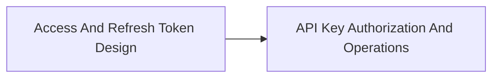

<!-- split-guide-index -->
# Access, Refresh Token, And API Key Design

<DocLabels items={[{label: 'Focused guides', tone: 'advanced'}, {label: 'Shopverse', tone: 'shopverse'}, {label: 'Architect route', tone: 'production'}]} />

Separate access-token, session, API-key, authorization, and operational responsibilities. The original long-form material is preserved without duplication across the focused pages below.

<TopicCards items={[
  {title: 'Access And Refresh Token Design', href: '/security/ACCESS-REFRESH-TOKEN-DESIGN', description: 'Part 1 of the focused Access, Refresh Token, And API Key Design learning route.', icon: 'route', tags: ['Focused', 'Advanced']},
  {title: 'API Key Authorization And Operations', href: '/security/API-KEY-AUTHORIZATION-OPERATIONS', description: 'Part 2 of the focused Access, Refresh Token, And API Key Design learning route.', icon: 'security', tags: ['Focused', 'Advanced']},
]} />

<DocCallout type="tip" title="Use the index as the stable entry point">

Each focused page owns one concern. Cross-links point to the canonical explanation instead of repeating the same material.

</DocCallout>

## Recommended Learning Order

1. [Access And Refresh Token Design](./ACCESS-REFRESH-TOKEN-DESIGN.md)
2. [API Key Authorization And Operations](./API-KEY-AUTHORIZATION-OPERATIONS.md)

## Reading Strategy

Use **Access, Refresh Token, And API Key Design** as a decision and verification guide inside **Access, Refresh Token, And API Key Design**. Start by naming the invariant or operational outcome, then follow the runtime flow and identify the owning component. For every example, record the expected success evidence, the most important failure mode, and the metric or test that proves recovery. This keeps the material useful for implementation reviews, production incidents, and architect interviews instead of treating it as isolated syntax.

Within **Access, Refresh Token, And API Key Design**, apply the Shopverse guidance incrementally: verify the current behavior, introduce one bounded change, test the unhappy path, and preserve a rollback or reconciliation route. Follow links to canonical pages when a concept belongs to another track; do not copy that explanation into this page. This ownership rule keeps the focused guides short while retaining technical depth and traceability.

## Official References

- [Spring Security reference](https://docs.spring.io/spring-security/reference/)
- [OAuth 2.0 Security Best Current Practice](https://www.rfc-editor.org/rfc/rfc9700)
