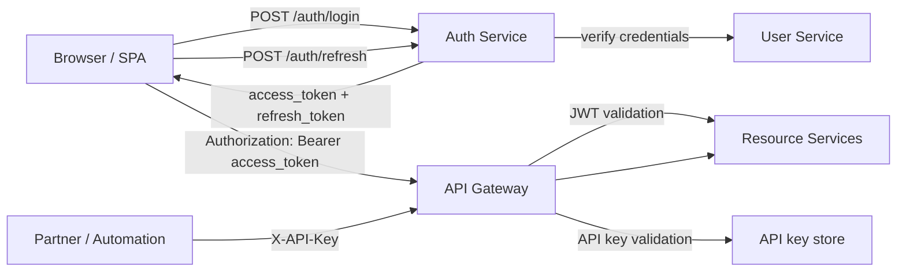
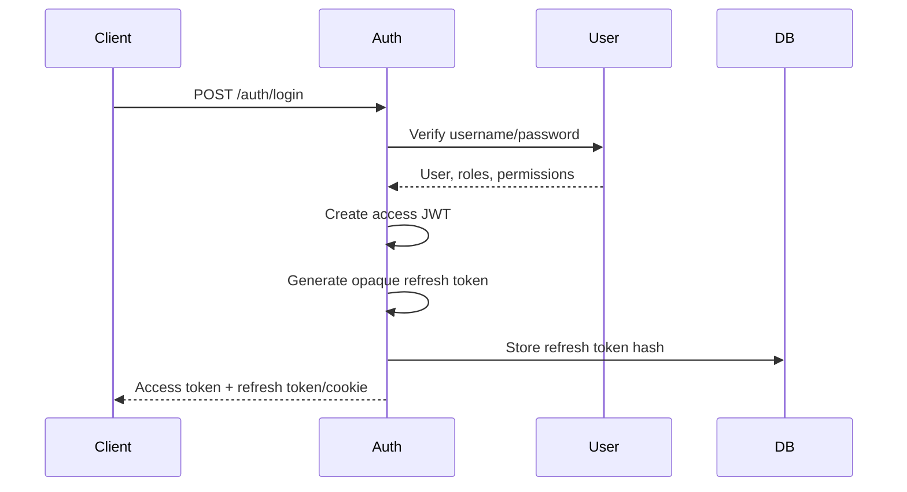

# Access Token, Refresh Token, And API Key Implementation Guide

This guide explains how Shopverse should implement access tokens, refresh
tokens, and API keys as one security ecosystem. It also marks what already
exists in the current codebase and what must be added next.

## Current Shopverse State

| Capability | Current state |
|---|---|
| Access token | Implemented. Auth Service issues an RSA-signed JWT from `POST /auth/login`. |
| JWKS validation | Implemented. Gateway and resource services validate JWT signatures through Auth Service JWKS. |
| Roles and permissions | Implemented in JWT claims and mapped by services for authorization. |
| Refresh token | Not implemented yet. Auth Service README explicitly documents this limitation. |
| API key | Not implemented yet. No API key table, issuance flow, hash validation, or gateway filter exists. |

The target design is:



## Token And Key Responsibilities

| Mechanism | Purpose | Lifetime | Storage | Sent to APIs |
|---|---|---|---|---|
| Access token | Proves the current user/session and carries roles/permissions. | Short, such as 5-15 minutes in production. | Memory or browser session storage for the current POC. | Yes, as `Authorization: Bearer <token>`. |
| Refresh token | Gets a new access token without asking for the password again. | Longer, such as 7-30 days. | HttpOnly secure cookie for browser clients, hashed row in DB for server side. | Only to `/auth/refresh` and `/auth/logout`. |
| API key | Identifies a machine client, integration, script, or partner app. | Long-lived but rotatable. | Client stores the raw key once; server stores only a hash. | Yes, as `X-API-Key: <key>` or `Authorization: ApiKey <key>`. |

Access tokens and refresh tokens are user-session credentials. API keys are
client credentials. Do not use API keys as a replacement for user login unless
the endpoint is explicitly designed for machine access.

## Step 1: Define The Security Contract

Use a consistent API response shape:

```json
{
  "accessToken": "<jwt>",
  "tokenType": "Bearer",
  "expiresIn": 900,
  "refreshToken": "<opaque-refresh-token>",
  "refreshExpiresIn": 2592000
}
```

For browser clients, prefer returning the refresh token as an HttpOnly secure
cookie instead of JSON:

```http
Set-Cookie: shopverse_refresh=<opaque-token>; HttpOnly; Secure; SameSite=Lax; Path=/auth; Max-Age=2592000
```

Keep the access token in the response body. Keep the refresh token away from
JavaScript when possible.

## Step 2: Keep Access Tokens Stateless And Short-Lived

Auth Service already creates a JWT through `JwtEncoder`. Update the response
contract from the current single `token` field to explicit access-token fields:

```java
public record AuthResponse(
        String accessToken,
        String tokenType,
        long expiresIn
) {
}
```

When refresh tokens are added, extend the contract:

```java
public record AuthResponse(
        String accessToken,
        String tokenType,
        long expiresIn,
        String refreshToken,
        long refreshExpiresIn
) {
}
```

Recommended access token claims:

```json
{
  "iss": "shopverse-auth-service",
  "sub": "admin",
  "jti": "access-token-id",
  "typ": "access",
  "roles": "ROLE_ADMIN",
  "permissions": ["USER_READ", "ORDER_READ"],
  "iat": 1782460800,
  "exp": 1782461700
}
```

Rules:

- Keep access tokens short-lived.
- Sign with the Auth Service private RSA key.
- Validate through JWKS in Gateway and every resource service.
- Do not store secrets, passwords, phone numbers, addresses, or payment data in
  JWT claims.
- Keep claim names stable across Auth Service, Gateway, resource services, and
  the Angular app.

## Step 3: Add Refresh Token Persistence

Refresh tokens should be opaque random values, not JWTs. The server stores only
a hash of the token.

Create a refresh-token table in the identity database:

```sql
CREATE TABLE refresh_tokens (
    id BIGINT PRIMARY KEY AUTO_INCREMENT,
    user_id BIGINT NOT NULL,
    token_hash VARCHAR(255) NOT NULL UNIQUE,
    family_id VARCHAR(64) NOT NULL,
    issued_at TIMESTAMP NOT NULL,
    expires_at TIMESTAMP NOT NULL,
    revoked_at TIMESTAMP NULL,
    replaced_by_hash VARCHAR(255) NULL,
    created_by_ip VARCHAR(64) NULL,
    user_agent VARCHAR(512) NULL,
    CONSTRAINT fk_refresh_tokens_user
        FOREIGN KEY (user_id) REFERENCES users(id)
);

CREATE INDEX idx_refresh_tokens_user ON refresh_tokens(user_id);
CREATE INDEX idx_refresh_tokens_family ON refresh_tokens(family_id);
CREATE INDEX idx_refresh_tokens_expires ON refresh_tokens(expires_at);
```

Generate tokens with strong randomness:

```java
byte[] bytes = new byte[64];
secureRandom.nextBytes(bytes);
String refreshToken = Base64.getUrlEncoder().withoutPadding().encodeToString(bytes);
```

Hash before storage:

```java
String tokenHash = sha256(refreshToken);
```

BCrypt/Argon2 can also be used, but SHA-256 with a high-entropy 512-bit token is
acceptable because the raw value is not guessable. Never store the raw refresh
token.

## Step 4: Implement Login Issuance

Login should create both tokens in one transaction:



Implementation tasks:

1. Add `RefreshToken` entity and repository.
2. Add `RefreshTokenService`.
3. Add configurable lifetimes:

```yaml
security:
  jwt:
    access-token-ttl: PT15M
  refresh-token:
    ttl: P30D
    cookie-name: shopverse_refresh
```

4. Update `JwtService` to accept configurable access-token TTL instead of the
   current fixed one-hour expiry.
5. Update `AuthService.authenticate` to create and persist a refresh token after
   credential verification.
6. Update Angular `SessionService` to read `accessToken` instead of `token`.

## Step 5: Implement Refresh Rotation

Add an endpoint:

```http
POST /auth/refresh
```

Request with JSON refresh token:

```json
{
  "refreshToken": "<opaque-refresh-token>"
}
```

Or request with the HttpOnly cookie:

```http
Cookie: shopverse_refresh=<opaque-refresh-token>
```

Refresh behavior:

1. Hash the presented refresh token.
2. Find the matching active database row.
3. Reject if missing, expired, or revoked.
4. Load the current user, roles, permissions, and status.
5. Revoke the old refresh token.
6. Issue a new access token.
7. Generate and store a new refresh token in the same `family_id`.
8. Return the new access token and new refresh token/cookie.

Rotation matters because a stolen refresh token becomes useless after it is
used once. If an already-revoked token is presented, treat it as token reuse and
revoke the whole token family.

```java
@Transactional
public AuthResponse refresh(String presentedToken) {
    String hash = hash(presentedToken);
    RefreshToken existing = repository.findByTokenHash(hash)
            .orElseThrow(() -> new BadCredentialsException("Invalid refresh token"));

    if (!existing.isActive(clock.instant())) {
        revokeFamily(existing.familyId());
        throw new BadCredentialsException("Invalid refresh token");
    }

    User user = userClient.getById(existing.userId());
    existing.revoke(clock.instant());

    String newRefresh = tokenGenerator.generate();
    repository.save(RefreshToken.replacementFor(existing, hash(newRefresh)));

    return jwtService.generateTokenPair(user, newRefresh);
}
```

## Step 6: Implement Logout And Session Revocation

Add endpoints:

```http
POST /auth/logout
POST /auth/logout-all
```

Rules:

- `logout` revokes the current refresh token only.
- `logout-all` revokes every active refresh token for the current user.
- Access tokens remain valid until expiry unless you add a JWT blocklist.
- Keep access-token TTL short so logout does not require a distributed blocklist
  for normal cases.

Use a JWT blocklist only for high-risk events such as password reset, account
compromise, or admin-forced revocation. A blocklist makes every request stateful
and should live in Redis or another low-latency store.

## Step 7: Update The Angular Client

Current Angular code stores `shopverse.session.token` in `sessionStorage`.
Target changes:

1. Rename the stored value to access token semantics, for example
   `shopverse.session.accessToken`.
2. Read `accessToken` from login response.
3. Add a refresh call when an API request returns `401`.
4. Queue concurrent refresh attempts so ten failed API requests do not trigger
   ten refresh calls.
5. On refresh failure, clear session state and redirect to login.

Interceptor behavior:

```text
request:
  if protected route and access token exists:
    add Authorization: Bearer <access-token>

response:
  if 401 and request was not /auth/login or /auth/refresh:
    call /auth/refresh once
    retry original request with new access token
```

If the refresh token is stored in an HttpOnly cookie, Angular does not read it.
It only calls `/auth/refresh` with credentials enabled.

## Step 8: Add API Key Data Model

API keys should represent machine clients such as CI jobs, partner integrations,
internal scripts, webhook senders, or admin automation.

Create an API key table:

```sql
CREATE TABLE api_keys (
    id BIGINT PRIMARY KEY AUTO_INCREMENT,
    key_id VARCHAR(64) NOT NULL UNIQUE,
    key_hash VARCHAR(255) NOT NULL UNIQUE,
    name VARCHAR(120) NOT NULL,
    owner_type VARCHAR(40) NOT NULL,
    owner_id VARCHAR(80) NULL,
    scopes VARCHAR(1000) NOT NULL,
    status VARCHAR(30) NOT NULL,
    created_at TIMESTAMP NOT NULL,
    expires_at TIMESTAMP NULL,
    last_used_at TIMESTAMP NULL,
    revoked_at TIMESTAMP NULL
);

CREATE INDEX idx_api_keys_key_id ON api_keys(key_id);
CREATE INDEX idx_api_keys_status ON api_keys(status);
```

Use a split key format:

```text
sv_live_<key_id>_<secret>
```

Example:

```text
sv_live_8f2a9d1c4b7e4a01_nGzKJx...longRandomSecret
```

Store:

- `key_id` in plain text for lookup;
- hash of the full raw key or secret part for verification;
- scopes for authorization;
- status and expiry for lifecycle control.

Show the raw API key only once at creation time.

## Step 9: Implement API Key Issuance

Add admin-only endpoints:

```http
POST /api/v1/api-keys
GET /api/v1/api-keys
DELETE /api/v1/api-keys/{keyId}
POST /api/v1/api-keys/{keyId}/rotate
```

Create request:

```json
{
  "name": "Inventory import job",
  "ownerType": "INTERNAL_JOB",
  "scopes": ["inventory:read", "inventory:write"],
  "expiresAt": "2026-12-31T23:59:59Z"
}
```

Create response:

```json
{
  "keyId": "8f2a9d1c4b7e4a01",
  "apiKey": "sv_live_8f2a9d1c4b7e4a01_nGzKJx...",
  "name": "Inventory import job",
  "scopes": ["inventory:read", "inventory:write"],
  "expiresAt": "2026-12-31T23:59:59Z"
}
```

Never return `apiKey` from list or detail endpoints after creation.

## Step 10: Validate API Keys At The Gateway

API keys should usually be validated at API Gateway because they are a public
edge concern. Resource services can receive a derived identity header after the
Gateway validates the key.

Request:

```http
X-API-Key: <redacted-api-key>
```

Gateway validation steps:

1. Extract `X-API-Key`.
2. Parse the `key_id`.
3. Look up active key metadata.
4. Hash the presented key and compare with constant-time comparison.
5. Verify status, expiry, and required scopes.
6. Add internal headers for downstream services:

```http
X-Shopverse-Client-Id: 8f2a9d1c4b7e4a01
X-Shopverse-Client-Type: API_KEY
X-Shopverse-Scopes: inventory:read inventory:write
```

7. Strip the original `X-API-Key` before forwarding.

Downstream services must trust those internal headers only from Gateway traffic.
Do not expose direct service ports publicly.

## Step 11: Decide When To Use Bearer JWT Vs API Key

| Scenario | Use |
|---|---|
| Customer browsing catalog, checkout, orders | Access token + refresh token |
| Admin operating users, inventory, recovery | Access token + refresh token |
| CI smoke test calling internal admin endpoint | API key with narrow scopes |
| Partner reading order status | API key or OAuth client credentials, depending on partner maturity |
| Webhook receiver validating provider callback | Provider signature, not Shopverse user JWT |
| Service-to-service internal call | mTLS/service identity or internal credentials; avoid customer token forwarding unless delegation is intended. |

Use user JWTs when the action belongs to a human user. Use API keys when the
action belongs to a machine client.

## Step 12: Authorization Rules

Access-token authorization:

```java
@PreAuthorize("hasAuthority('ORDER_CREATE')")
```

API-key authorization should use scopes:

```text
inventory:read
inventory:write
orders:read
orders:write
recovery:replay
```

Do not map API key scopes to human roles such as `ROLE_ADMIN`. Keep human
authorization and machine-client authorization separate.

## Step 13: Observability And Auditing

Log security events without leaking secrets:

| Event | Log fields |
|---|---|
| Login success/failure | username, result, reason category, correlation ID |
| Refresh success/failure | user ID, token family ID, result, reason category |
| Refresh token reuse | user ID, family ID, source IP, user agent |
| API key used | key ID, owner type, scopes, route, result |
| API key revoked/rotated | key ID, actor, reason |

Never log:

- raw access tokens;
- raw refresh tokens;
- raw API keys;
- passwords;
- RSA private keys.

Useful metrics:

```text
auth_login_total{result="success|failure"}
auth_refresh_total{result="success|failure|reuse_detected"}
api_key_requests_total{key_id, result}
api_key_validation_duration_seconds
```

## Step 14: Configuration Checklist

Auth Service:

```yaml
security:
  jwt:
    issuer: shopverse-auth-service
    access-token-ttl: PT15M
  refresh-token:
    ttl: P30D
    rotation-enabled: true
    cookie-name: shopverse_refresh
```

API Gateway:

```yaml
security:
  api-keys:
    enabled: true
    header-name: X-API-Key
```

Resource services:

```yaml
spring:
  security:
    oauth2:
      resourceserver:
        jwt:
          jwk-set-uri: http://auth-service:8081/auth/.well-known/jwks.json
security:
  jwt:
    issuer: shopverse-auth-service
```

## Step 15: Testing Plan

Access token tests:

1. Login returns an access token.
2. JWT has expected issuer, subject, roles, permissions, issued-at, and expiry.
3. Gateway accepts valid token.
4. Gateway rejects expired, malformed, unsigned, or wrong-issuer tokens.
5. Resource service rejects direct calls with invalid tokens.

Refresh token tests:

1. Login creates a database refresh-token hash.
2. Refresh returns a new access token and rotates the refresh token.
3. Old refresh token cannot be reused.
4. Reuse detection revokes the token family.
5. Logout revokes the current refresh token.
6. Logout-all revokes every user session.
7. Expired refresh token is rejected.

API key tests:

1. Admin can create an API key and sees the raw value once.
2. Server stores only the hash.
3. Gateway accepts a valid API key with required scope.
4. Gateway rejects missing, malformed, expired, revoked, or wrong-scope keys.
5. Gateway strips `X-API-Key` before forwarding.
6. Resource services reject forged internal identity headers when requests do
   not come through Gateway.

## Step 16: Implementation Order For Shopverse

Recommended order:

1. Refactor Auth Service response from `token` to `accessToken`.
2. Make access-token TTL configurable.
3. Add refresh-token Liquibase changelog, entity, repository, and service.
4. Add `/auth/refresh`, `/auth/logout`, and `/auth/logout-all`.
5. Update Angular session and interceptor refresh behavior.
6. Add integration tests for token rotation and reuse detection.
7. Add API key persistence and admin issuance endpoints.
8. Add Gateway API key validation filter.
9. Add scope-based authorization and downstream identity propagation.
10. Add audit logs, metrics, dashboards, and alerts.

This order keeps the current JWT flow working while adding refresh-token
session continuity first, then machine-client access.

## Production Rules

- Use HTTPS everywhere.
- Keep RSA private keys and API-key hashing secrets out of Git.
- Rotate signing keys with overlapping JWKS publication.
- Keep access tokens short-lived.
- Rotate refresh tokens on every use.
- Store refresh tokens and API keys only as hashes.
- Use constant-time comparison for secrets.
- Rate-limit login, refresh, and API-key validation failures.
- Alert on refresh-token reuse and unusual API-key failure spikes.
- Separate human roles from machine scopes.

## Related Guides

- [Security Implementation Guide](SECURITY-IMPLEMENTATION-GUIDE.md)
- [JWT, OAuth2, and Spring Security](JWT-OAUTH2-SPRING-SECURITY.md)
- [Token lifecycle](oauth/TOKEN-LIFECYCLE.md)
- [JWT best practices](jwt/JWT-BEST-PRACTICES.md)
- [JWKS asymmetric JWT](jwt/JWKS-ASYMMETRIC-JWT.md)
- [API security principles](principles/API-SECURITY-PRINCIPLES.md)
- [Secrets and credentials](principles/SECRETS-AND-CREDENTIALS.md)

## Official References

- [OAuth 2.0 Security Best Current Practice — RFC 9700](https://www.rfc-editor.org/rfc/rfc9700)
- [OWASP Cheat Sheet Series](https://cheatsheetseries.owasp.org/)
- [NIST Cybersecurity Framework](https://www.nist.gov/cyberframework)
