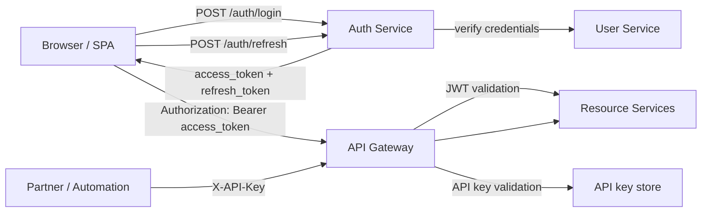
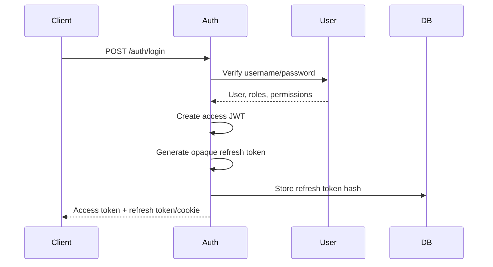

# Access And Refresh Token Design

<DocLabels items={[{label: 'Advanced', tone: 'advanced'}, {label: 'Shopverse', tone: 'shopverse'}, {label: 'Production', tone: 'production'}]} />

## Current Shopverse State

| Capability | Current state |
|---|---|
| Access token | Implemented. Auth Service issues an RSA-signed JWT from `POST /auth/login`. |
| JWKS validation | Implemented. Gateway and resource services validate JWT signatures through Auth Service JWKS. |
| Roles and permissions | Implemented in JWT claims and mapped by services for authorization. |
| Refresh token | Not implemented yet. Auth Service README explicitly documents this limitation. |
| API key | Not implemented yet. No API key table, issuance flow, hash validation, or gateway filter exists. |

The target design is:



## Token And Key Responsibilities

| Mechanism | Purpose | Lifetime | Storage | Sent to APIs |
|---|---|---|---|---|
| Access token | Proves the current user/session and carries roles/permissions. | Short, such as 5-15 minutes in production. | Memory or browser session storage for the current POC. | Yes, as `Authorization: Bearer <token>`. |
| Refresh token | Gets a new access token without asking for the password again. | Longer, such as 7-30 days. | HttpOnly secure cookie for browser clients, hashed row in DB for server side. | Only to `/auth/refresh` and `/auth/logout`. |
| API key | Identifies a machine client, integration, script, or partner app. | Long-lived but rotatable. | Client stores the raw key once; server stores only a hash. | Yes, as `X-API-Key: <key>` or `Authorization: ApiKey <key>`. |

Access tokens and refresh tokens are user-session credentials. API keys are
client credentials. Do not use API keys as a replacement for user login unless
the endpoint is explicitly designed for machine access.

## Step 1: Define The Security Contract

Use a consistent API response shape:

```json
{
  "accessToken": "<jwt>",
  "tokenType": "Bearer",
  "expiresIn": 900,
  "refreshToken": "<opaque-refresh-token>",
  "refreshExpiresIn": 2592000
}
```

For browser clients, prefer returning the refresh token as an HttpOnly secure
cookie instead of JSON:

```http
Set-Cookie: shopverse_refresh=<opaque-token>; HttpOnly; Secure; SameSite=Lax; Path=/auth; Max-Age=2592000
```

Keep the access token in the response body. Keep the refresh token away from
JavaScript when possible.

## Step 2: Keep Access Tokens Stateless And Short-Lived

Auth Service already creates a JWT through `JwtEncoder`. Update the response
contract from the current single `token` field to explicit access-token fields:

```java
public record AuthResponse(
        String accessToken,
        String tokenType,
        long expiresIn
) {
}
```

When refresh tokens are added, extend the contract:

```java
public record AuthResponse(
        String accessToken,
        String tokenType,
        long expiresIn,
        String refreshToken,
        long refreshExpiresIn
) {
}
```

Recommended access token claims:

```json
{
  "iss": "shopverse-auth-service",
  "sub": "admin",
  "jti": "access-token-id",
  "typ": "access",
  "roles": "ROLE_ADMIN",
  "permissions": ["USER_READ", "ORDER_READ"],
  "iat": 1782460800,
  "exp": 1782461700
}
```

Rules:

- Keep access tokens short-lived.
- Sign with the Auth Service private RSA key.
- Validate through JWKS in Gateway and every resource service.
- Do not store secrets, passwords, phone numbers, addresses, or payment data in
  JWT claims.
- Keep claim names stable across Auth Service, Gateway, resource services, and
  the Angular app.

## Step 3: Add Refresh Token Persistence

Refresh tokens should be opaque random values, not JWTs. The server stores only
a hash of the token.

Create a refresh-token table in the identity database:

```sql
CREATE TABLE refresh_tokens (
    id BIGINT PRIMARY KEY AUTO_INCREMENT,
    user_id BIGINT NOT NULL,
    token_hash VARCHAR(255) NOT NULL UNIQUE,
    family_id VARCHAR(64) NOT NULL,
    issued_at TIMESTAMP NOT NULL,
    expires_at TIMESTAMP NOT NULL,
    revoked_at TIMESTAMP NULL,
    replaced_by_hash VARCHAR(255) NULL,
    created_by_ip VARCHAR(64) NULL,
    user_agent VARCHAR(512) NULL,
    CONSTRAINT fk_refresh_tokens_user
        FOREIGN KEY (user_id) REFERENCES users(id)
);

CREATE INDEX idx_refresh_tokens_user ON refresh_tokens(user_id);
CREATE INDEX idx_refresh_tokens_family ON refresh_tokens(family_id);
CREATE INDEX idx_refresh_tokens_expires ON refresh_tokens(expires_at);
```

Generate tokens with strong randomness:

```java
byte[] bytes = new byte[64];
secureRandom.nextBytes(bytes);
String refreshToken = Base64.getUrlEncoder().withoutPadding().encodeToString(bytes);
```

Hash before storage:

```java
String tokenHash = sha256(refreshToken);
```

BCrypt/Argon2 can also be used, but SHA-256 with a high-entropy 512-bit token is
acceptable because the raw value is not guessable. Never store the raw refresh
token.

## Step 4: Implement Login Issuance

Login should create both tokens in one transaction:



Implementation tasks:

1. Add `RefreshToken` entity and repository.
2. Add `RefreshTokenService`.
3. Add configurable lifetimes:

```yaml
security:
  jwt:
    access-token-ttl: PT15M
  refresh-token:
    ttl: P30D
    cookie-name: shopverse_refresh
```

4. Update `JwtService` to accept configurable access-token TTL instead of the
   current fixed one-hour expiry.
5. Update `AuthService.authenticate` to create and persist a refresh token after
   credential verification.
6. Update Angular `SessionService` to read `accessToken` instead of `token`.

## Step 5: Implement Refresh Rotation

Add an endpoint:

```http
POST /auth/refresh
```

Request with JSON refresh token:

```json
{
  "refreshToken": "<opaque-refresh-token>"
}
```

Or request with the HttpOnly cookie:

```http
Cookie: shopverse_refresh=<opaque-refresh-token>
```

Refresh behavior:

1. Hash the presented refresh token.
2. Find the matching active database row.
3. Reject if missing, expired, or revoked.
4. Load the current user, roles, permissions, and status.
5. Revoke the old refresh token.
6. Issue a new access token.
7. Generate and store a new refresh token in the same `family_id`.
8. Return the new access token and new refresh token/cookie.

Rotation matters because a stolen refresh token becomes useless after it is
used once. If an already-revoked token is presented, treat it as token reuse and
revoke the whole token family.

```java
@Transactional
public AuthResponse refresh(String presentedToken) {
    String hash = hash(presentedToken);
    RefreshToken existing = repository.findByTokenHash(hash)
            .orElseThrow(() -> new BadCredentialsException("Invalid refresh token"));

    if (!existing.isActive(clock.instant())) {
        revokeFamily(existing.familyId());
        throw new BadCredentialsException("Invalid refresh token");
    }

    User user = userClient.getById(existing.userId());
    existing.revoke(clock.instant());

    String newRefresh = tokenGenerator.generate();
    repository.save(RefreshToken.replacementFor(existing, hash(newRefresh)));

    return jwtService.generateTokenPair(user, newRefresh);
}
```

## Step 6: Implement Logout And Session Revocation

Add endpoints:

```http
POST /auth/logout
POST /auth/logout-all
```

Rules:

- `logout` revokes the current refresh token only.
- `logout-all` revokes every active refresh token for the current user.
- Access tokens remain valid until expiry unless you add a JWT blocklist.
- Keep access-token TTL short so logout does not require a distributed blocklist
  for normal cases.

Use a JWT blocklist only for high-risk events such as password reset, account
compromise, or admin-forced revocation. A blocklist makes every request stateful
and should live in Redis or another low-latency store.

## Step 7: Update The Angular Client

Current Angular code stores `shopverse.session.token` in `sessionStorage`.
Target changes:

1. Rename the stored value to access token semantics, for example
   `shopverse.session.accessToken`.
2. Read `accessToken` from login response.
3. Add a refresh call when an API request returns `401`.
4. Queue concurrent refresh attempts so ten failed API requests do not trigger
   ten refresh calls.
5. On refresh failure, clear session state and redirect to login.

Interceptor behavior:

```text
request:
  if protected route and access token exists:
    add Authorization: Bearer <access-token>

response:
  if 401 and request was not /auth/login or /auth/refresh:
    call /auth/refresh once
    retry original request with new access token
```

If the refresh token is stored in an HttpOnly cookie, Angular does not read it.
It only calls `/auth/refresh` with credentials enabled.

## Recommended Next

Return to [Access, Refresh Token, And API Key Design](./ACCESS-REFRESH-API-KEY-IMPLEMENTATION-GUIDE.md) to select the next focused guide.


## Official References

- [Spring Security reference](https://docs.spring.io/spring-security/reference/)
- [OAuth 2.0 Security Best Current Practice](https://www.rfc-editor.org/rfc/rfc9700)
