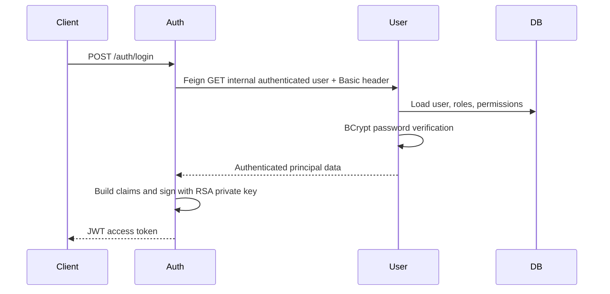
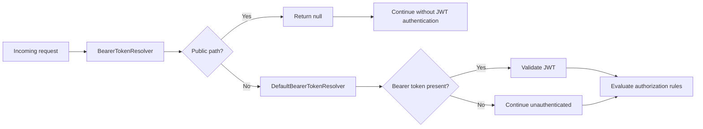
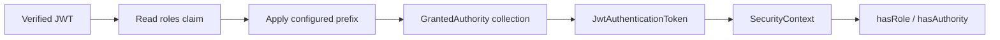

# JWT Login, Validation, And Authorities

<DocLabels items={[{label: 'Advanced', tone: 'advanced'}, {label: 'Shopverse', tone: 'shopverse'}, {label: 'Production', tone: 'production'}]} />

## What Shopverse Uses

Shopverse uses JWT bearer access tokens and Spring Security's OAuth2 Resource Server support. Auth Service performs a custom username/password login; it is not currently a full OAuth2 Authorization Server and does not implement authorization-code, client-credentials, or refresh-token grants.

## Login Flow



The Basic credentials are used only on the internal Auth-to-User endpoint. Public APIs use bearer JWTs.

Relevant Shopverse components:

| Step | Component |
|---|---|
| receive login | `AuthController` |
| call User Service | `AuthService` and `UserServiceClient` |
| create Basic header | `UserServiceClient.basicAuth(...)` |
| authenticate database user | User Service Basic `SecurityFilterChain` |
| load user and authorities | `DatabaseUserDetailsService` |
| verify password | configured `PasswordEncoder` through DAO authentication |
| create claims | `JwtService` |
| sign token | `NimbusJwtEncoder` |
| publish public key | Auth JWKS endpoint |

## JWT Structure

```text
base64url(header).base64url(payload).base64url(signature)
```

- Header: algorithm and key ID.
- Payload: `iss`, `sub`, `iat`, `exp`, `jti`, roles, and permissions.
- Signature: RSA signature over header and payload.

JWT payloads are encoded, not encrypted. Do not place secrets in claims.

Auth Service signs with `JwtEncoder`. Resource services obtain the public RSA key from `/auth/.well-known/jwks.json` and verify with `NimbusJwtDecoder`.

Shopverse tokens are signed JWS tokens. They are not encrypted JWE tokens.
The private RSA key stays in Auth Service; resource services need only public
key material.

## Validation

Resource services validate:

- RSA signature against JWKS;
- expiration and not-before timestamps through default validators;
- endpoint and method authorities.

Every Shopverse resource server validates issuer equal to
`shopverse-auth-service`:

```java
decoder.setJwtValidator(JwtValidators.createDefaultWithIssuer(issuer));
```

Gateway uses the reactive decoder equivalent. Auth, User, Order, Inventory, and
Payment use `NimbusJwtDecoder`. A token signed by the trusted key is still
rejected when its `iss` claim does not match the configured issuer.

## Claims And Authorities

Auth Service emits:

- `roles`: space-separated role names;
- `permissions`: a list of permission names.

The custom `JwtAuthenticationConverter` maps these claims into Spring authorities. `hasRole("ADMIN")` checks for `ROLE_ADMIN`; `hasAuthority("USER_READ")` checks the exact permission string.

```java
@PreAuthorize("hasAuthority('USER_CREATE')")
public UserResponse createUser(...) { ... }
```

To avoid Spring's default `SCOPE_` or `ROLE_` prefix, configure the granted-authority converter explicitly and use `hasAuthority`.

Shopverse currently stores roles as a space-separated string and permissions
as a list. This is a private token contract between Auth Service and resource
services, not an OAuth2 standard claim shape.

## Bearer Token Resolution On Public Endpoints

Inventory, Order, and Payment use a custom `BearerTokenResolver`:

```java
@Bean
public BearerTokenResolver publicEndpointBearerTokenResolver() {
    DefaultBearerTokenResolver delegate =
            new DefaultBearerTokenResolver();

    return request -> {
        String path = request.getRequestURI();

        if (path.startsWith(InventoryConstants.PUBLIC_API + "/")
                || isPublicActuatorEndpoint(path)) {
            return null;
        }

        return delegate.resolve(request);
    };
}
```

`BearerTokenResolver` decides whether the current request contains a bearer
token and returns the token string to Spring Security.

`DefaultBearerTokenResolver` normally reads:

```http
Authorization: Bearer eyJ...
```

The custom lambda first checks the request path:

```java
if (path.startsWith(InventoryConstants.PUBLIC_API + "/")
        || isPublicActuatorEndpoint(path)) {
    return null;
}
```

Returning `null` means:

```text
Do not attempt bearer-token authentication for this request.
```

This is useful for endpoints that must remain public even if a caller sends an
expired or malformed `Authorization` header. Without this resolver, the bearer
filter can detect that header, attempt authentication, and return `401` before
the later `permitAll()` authorization rule is evaluated.

For protected paths, resolution is delegated to Spring's standard behavior:

```java
return delegate.resolve(request);
```

The resulting lifecycle is:



The path checks in the resolver and the `permitAll()` request matchers must
remain consistent. Otherwise an endpoint can unexpectedly require or ignore a
token. Public paths should be narrowly defined; this resolver must not be used
to bypass authentication for sensitive APIs.

## JWT Role Conversion In Resource Services

Inventory uses:

```java
@Bean
public JwtAuthenticationConverter jwtAuthenticationConverter() {
    JwtGrantedAuthoritiesConverter converter =
            new JwtGrantedAuthoritiesConverter();

    converter.setAuthoritiesClaimName("roles");
    converter.setAuthorityPrefix("");

    JwtAuthenticationConverter jwtConverter =
            new JwtAuthenticationConverter();

    jwtConverter.setJwtGrantedAuthoritiesConverter(converter);

    return jwtConverter;
}
```

By default, `JwtGrantedAuthoritiesConverter` commonly reads the `scope` or
`scp` claim and prefixes each value with `SCOPE_`.

Shopverse changes the claim source:

```java
converter.setAuthoritiesClaimName("roles");
```

The converter now reads the custom `roles` claim instead of OAuth2 scopes.

Shopverse also disables automatic prefixing:

```java
converter.setAuthorityPrefix("");
```

Therefore, a token value is preserved exactly:

```text
JWT role: ROLE_ADMIN
Authority: ROLE_ADMIN
```

This is important because:

```java
hasRole("ADMIN")
```

internally checks for:

```text
ROLE_ADMIN
```

If the JWT contained only `ADMIN`, an empty converter prefix would produce the
authority `ADMIN`, and `hasRole("ADMIN")` would fail. Two valid strategies are:

```text
JWT contains ROLE_ADMIN + converter prefix is empty
```

or:

```text
JWT contains ADMIN + converter prefix is ROLE_
```

Do not apply both, because that would produce `ROLE_ROLE_ADMIN`.

Finally:

```java
jwtConverter.setJwtGrantedAuthoritiesConverter(converter);
```

connects the claim converter to `JwtAuthenticationConverter`. After JWT
verification, Spring uses it to create the authorities stored in the resulting
`JwtAuthenticationToken` and `SecurityContext`.



Inventory, Order, and Payment currently convert roles only. User Service uses
a custom converter that combines both `roles` and `permissions`, which is why
permission expressions such as `hasAuthority("USER_CREATE")` are available
there.

## Recommended Next

Return to [JWT, OAuth2, And Spring Security](./JWT-OAUTH2-SPRING-SECURITY.md) to select the next focused guide.


## Official References

- [Spring Security reference](https://docs.spring.io/spring-security/reference/)
- [OAuth 2.0 Security Best Current Practice](https://www.rfc-editor.org/rfc/rfc9700)
