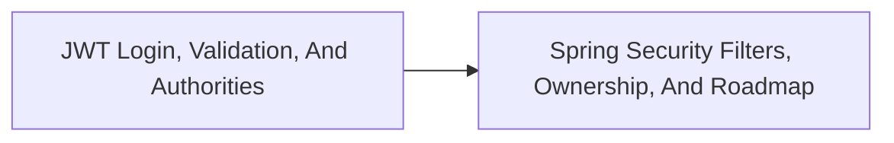

<!-- split-guide-index -->
# JWT, OAuth2, And Spring Security

<DocLabels items={[{label: 'Focused guides', tone: 'advanced'}, {label: 'Shopverse', tone: 'shopverse'}, {label: 'Architect route', tone: 'production'}]} />

Understand Shopverse token validation, filter chains, authorization, and security roadmap. The original long-form material is preserved without duplication across the focused pages below.

<TopicCards items={[
  {title: 'JWT Login, Validation, And Authorities', href: '/security/JWT-LOGIN-VALIDATION-AUTHORITIES', description: 'Part 1 of the focused JWT, OAuth2, And Spring Security learning route.', icon: 'route', tags: ['Focused', 'Advanced']},
  {title: 'Spring Security Filters, Ownership, And Roadmap', href: '/security/SPRING-SECURITY-FILTERS-OWNERSHIP-ROADMAP', description: 'Part 2 of the focused JWT, OAuth2, And Spring Security learning route.', icon: 'security', tags: ['Focused', 'Advanced']},
]} />

<DocCallout type="tip" title="Use the index as the stable entry point">

Each focused page owns one concern. Cross-links point to the canonical explanation instead of repeating the same material.

</DocCallout>

## Recommended Learning Order

1. [JWT Login, Validation, And Authorities](./JWT-LOGIN-VALIDATION-AUTHORITIES.md)
2. [Spring Security Filters, Ownership, And Roadmap](./SPRING-SECURITY-FILTERS-OWNERSHIP-ROADMAP.md)

## Reading Strategy

Use **JWT, OAuth2, And Spring Security** as a decision and verification guide inside **JWT, OAuth2, And Spring Security**. Start by naming the invariant or operational outcome, then follow the runtime flow and identify the owning component. For every example, record the expected success evidence, the most important failure mode, and the metric or test that proves recovery. This keeps the material useful for implementation reviews, production incidents, and architect interviews instead of treating it as isolated syntax.

Within **JWT, OAuth2, And Spring Security**, apply the Shopverse guidance incrementally: verify the current behavior, introduce one bounded change, test the unhappy path, and preserve a rollback or reconciliation route. Follow links to canonical pages when a concept belongs to another track; do not copy that explanation into this page. This ownership rule keeps the focused guides short while retaining technical depth and traceability.

## Official References

- [Spring Security reference](https://docs.spring.io/spring-security/reference/)
- [OAuth 2.0 Security Best Current Practice](https://www.rfc-editor.org/rfc/rfc9700)
