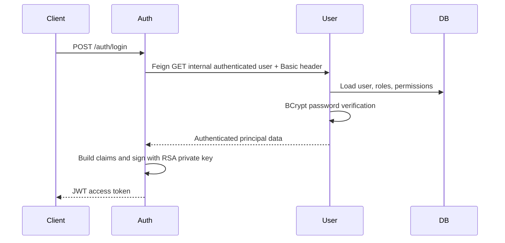
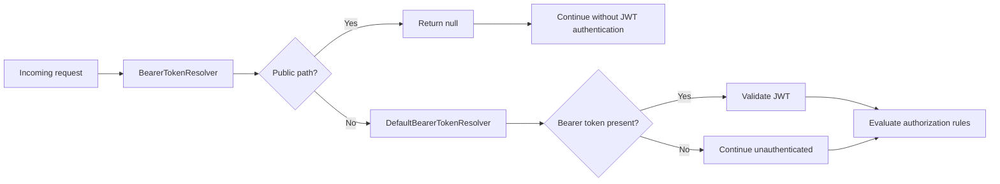
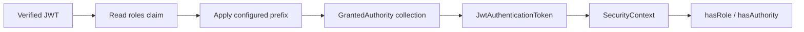
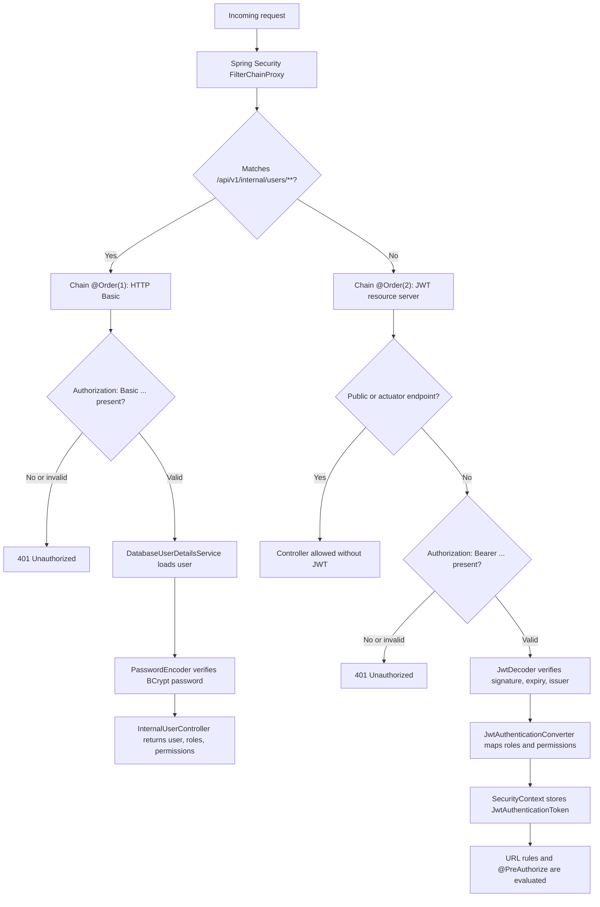

# JWT, OAuth2, And Spring Security

For generic Spring Security architecture, authentication providers, form
login, HTTP Basic, database authentication, JWT internals, OAuth2 flows,
method-security proxies, RBAC/ABAC, policy engines, token revocation, required
dependencies, and production practices, see
[Spring Security](SPRING-SECURITY-GENERIC.md). This guide maps those concepts
to Shopverse.

This guide distinguishes Shopverse's current custom JWT login/resource-server
implementation from OAuth2/OIDC features that are planned or generic security
practice. Use the status table below and the implementation matrix before
treating a security capability as implemented.

## What Shopverse Uses

Shopverse uses JWT bearer access tokens and Spring Security's OAuth2 Resource Server support. Auth Service performs a custom username/password login; it is not currently a full OAuth2 Authorization Server and does not implement authorization-code, client-credentials, or refresh-token grants.

## Login Flow



The Basic credentials are used only on the internal Auth-to-User endpoint. Public APIs use bearer JWTs.

Relevant Shopverse components:

| Step | Component |
|---|---|
| receive login | `AuthController` |
| call User Service | `AuthService` and `UserServiceClient` |
| create Basic header | `UserServiceClient.basicAuth(...)` |
| authenticate database user | User Service Basic `SecurityFilterChain` |
| load user and authorities | `DatabaseUserDetailsService` |
| verify password | configured `PasswordEncoder` through DAO authentication |
| create claims | `JwtService` |
| sign token | `NimbusJwtEncoder` |
| publish public key | Auth JWKS endpoint |

## JWT Structure

```text
base64url(header).base64url(payload).base64url(signature)
```

- Header: algorithm and key ID.
- Payload: `iss`, `sub`, `iat`, `exp`, `jti`, roles, and permissions.
- Signature: RSA signature over header and payload.

JWT payloads are encoded, not encrypted. Do not place secrets in claims.

Auth Service signs with `JwtEncoder`. Resource services obtain the public RSA key from `/auth/.well-known/jwks.json` and verify with `NimbusJwtDecoder`.

Shopverse tokens are signed JWS tokens. They are not encrypted JWE tokens.
The private RSA key stays in Auth Service; resource services need only public
key material.

## Validation

Resource services validate:

- RSA signature against JWKS;
- expiration and not-before timestamps through default validators;
- endpoint and method authorities.

Every Shopverse resource server validates issuer equal to
`shopverse-auth-service`:

```java
decoder.setJwtValidator(JwtValidators.createDefaultWithIssuer(issuer));
```

Gateway uses the reactive decoder equivalent. Auth, User, Order, Inventory, and
Payment use `NimbusJwtDecoder`. A token signed by the trusted key is still
rejected when its `iss` claim does not match the configured issuer.

## Claims And Authorities

Auth Service emits:

- `roles`: space-separated role names;
- `permissions`: a list of permission names.

The custom `JwtAuthenticationConverter` maps these claims into Spring authorities. `hasRole("ADMIN")` checks for `ROLE_ADMIN`; `hasAuthority("USER_READ")` checks the exact permission string.

```java
@PreAuthorize("hasAuthority('USER_CREATE')")
public UserResponse createUser(...) { ... }
```

To avoid Spring's default `SCOPE_` or `ROLE_` prefix, configure the granted-authority converter explicitly and use `hasAuthority`.

Shopverse currently stores roles as a space-separated string and permissions
as a list. This is a private token contract between Auth Service and resource
services, not an OAuth2 standard claim shape.

## Bearer Token Resolution On Public Endpoints

Inventory, Order, and Payment use a custom `BearerTokenResolver`:

```java
@Bean
public BearerTokenResolver publicEndpointBearerTokenResolver() {
    DefaultBearerTokenResolver delegate =
            new DefaultBearerTokenResolver();

    return request -> {
        String path = request.getRequestURI();

        if (path.startsWith(InventoryConstants.PUBLIC_API + "/")
                || isPublicActuatorEndpoint(path)) {
            return null;
        }

        return delegate.resolve(request);
    };
}
```

`BearerTokenResolver` decides whether the current request contains a bearer
token and returns the token string to Spring Security.

`DefaultBearerTokenResolver` normally reads:

```http
Authorization: Bearer eyJ...
```

The custom lambda first checks the request path:

```java
if (path.startsWith(InventoryConstants.PUBLIC_API + "/")
        || isPublicActuatorEndpoint(path)) {
    return null;
}
```

Returning `null` means:

```text
Do not attempt bearer-token authentication for this request.
```

This is useful for endpoints that must remain public even if a caller sends an
expired or malformed `Authorization` header. Without this resolver, the bearer
filter can detect that header, attempt authentication, and return `401` before
the later `permitAll()` authorization rule is evaluated.

For protected paths, resolution is delegated to Spring's standard behavior:

```java
return delegate.resolve(request);
```

The resulting lifecycle is:



The path checks in the resolver and the `permitAll()` request matchers must
remain consistent. Otherwise an endpoint can unexpectedly require or ignore a
token. Public paths should be narrowly defined; this resolver must not be used
to bypass authentication for sensitive APIs.

## JWT Role Conversion In Resource Services

Inventory uses:

```java
@Bean
public JwtAuthenticationConverter jwtAuthenticationConverter() {
    JwtGrantedAuthoritiesConverter converter =
            new JwtGrantedAuthoritiesConverter();

    converter.setAuthoritiesClaimName("roles");
    converter.setAuthorityPrefix("");

    JwtAuthenticationConverter jwtConverter =
            new JwtAuthenticationConverter();

    jwtConverter.setJwtGrantedAuthoritiesConverter(converter);

    return jwtConverter;
}
```

By default, `JwtGrantedAuthoritiesConverter` commonly reads the `scope` or
`scp` claim and prefixes each value with `SCOPE_`.

Shopverse changes the claim source:

```java
converter.setAuthoritiesClaimName("roles");
```

The converter now reads the custom `roles` claim instead of OAuth2 scopes.

Shopverse also disables automatic prefixing:

```java
converter.setAuthorityPrefix("");
```

Therefore, a token value is preserved exactly:

```text
JWT role: ROLE_ADMIN
Authority: ROLE_ADMIN
```

This is important because:

```java
hasRole("ADMIN")
```

internally checks for:

```text
ROLE_ADMIN
```

If the JWT contained only `ADMIN`, an empty converter prefix would produce the
authority `ADMIN`, and `hasRole("ADMIN")` would fail. Two valid strategies are:

```text
JWT contains ROLE_ADMIN + converter prefix is empty
```

or:

```text
JWT contains ADMIN + converter prefix is ROLE_
```

Do not apply both, because that would produce `ROLE_ROLE_ADMIN`.

Finally:

```java
jwtConverter.setJwtGrantedAuthoritiesConverter(converter);
```

connects the claim converter to `JwtAuthenticationConverter`. After JWT
verification, Spring uses it to create the authorities stored in the resulting
`JwtAuthenticationToken` and `SecurityContext`.



Inventory, Order, and Payment currently convert roles only. User Service uses
a custom converter that combines both `roles` and `permissions`, which is why
permission expressions such as `hasAuthority("USER_CREATE")` are available
there.

## Security Context

After token validation, Spring stores a `JwtAuthenticationToken` in `SecurityContextHolder`. Controllers receive `Authentication`, and method-security interceptors evaluate `@PreAuthorize` before invoking the method.

Gateway uses the reactive equivalent, `ReactiveSecurityContextHolder`.

## Why User Service Has Two Filter Chains

User Service has:

1. a higher-priority Basic-auth chain restricted to `/api/v1/internal/users/**`;
2. a JWT resource-server chain for public and administrative APIs.

The implementation is in
`user-service/src/main/java/io/shopverse/user_service/security/SecurityConfig.java`:

```java
@Bean
@Order(1)
public SecurityFilterChain internalUserSecurityFilterChain(HttpSecurity http)
        throws Exception {
    http
            .securityMatcher(ApiConstants.INTERNAL_USERS + "/**")
            .csrf(AbstractHttpConfigurer::disable)
            .sessionManagement(session ->
                    session.sessionCreationPolicy(SessionCreationPolicy.STATELESS))
            .authorizeHttpRequests(auth -> auth.anyRequest().authenticated())
            .httpBasic(Customizer.withDefaults());

    return http.build();
}
```

```java
@Bean
@Order(2)
public SecurityFilterChain securityFilterChain(
        HttpSecurity http,
        JwtAuthenticationConverter jwtAuthenticationConverter
) throws Exception {
    http
            .csrf(AbstractHttpConfigurer::disable)
            .sessionManagement(session ->
                    session.sessionCreationPolicy(SessionCreationPolicy.STATELESS))
            .authorizeHttpRequests(auth -> auth
                    .requestMatchers("/actuator/health", "/actuator/info",
                            "/actuator/prometheus").permitAll()
                    .requestMatchers(ApiConstants.PUBLIC_API + "/**").permitAll()
                    .requestMatchers(ApiConstants.USERS + "/**")
                            .hasAnyRole("CUSTOMER", "ADMIN")
                    .requestMatchers(ApiConstants.ROLES + "/**")
                            .hasRole("ADMIN")
                    .anyRequest().authenticated())
            .oauth2ResourceServer(oauth -> oauth.jwt(jwt ->
                    jwt.jwtAuthenticationConverter(jwtAuthenticationConverter)));

    return http.build();
}
```

`securityMatcher(...)` scopes a chain to matching request paths. `@Order(1)`
is evaluated before `@Order(2)`, so the internal Basic chain gets the first
chance to handle `/api/v1/internal/users/**`. If the request does not match
that path, Spring Security evaluates the JWT chain.



### Internal Login Flow Through The Basic Chain

Auth Service calls the internal User Service endpoint during login:

```text
POST /auth/login
  -> Auth Service
  -> Feign call to User Service /api/v1/internal/users/authenticated/{username}
  -> Authorization: Basic base64(username:password)
```

Because the path starts with `/api/v1/internal/users/`, Spring selects the
`@Order(1)` chain. That chain uses HTTP Basic only for this internal lookup.
Spring delegates to `DatabaseUserDetailsService`, which loads the user,
roles, and permissions from MySQL. The configured `PasswordEncoder` verifies
the submitted password against the stored BCrypt hash.

If authentication succeeds, User Service returns user details to Auth Service.
Auth Service then signs a JWT containing roles and permissions.

### Public And User APIs Through The JWT Chain

Requests such as these do not match the Basic chain:

```text
GET  /api/v1/users
POST /api/v1/users
GET  /api/v1/roles
```

They fall through to the `@Order(2)` chain. That chain uses OAuth2 Resource
Server support:

1. `BearerTokenAuthenticationFilter` reads the `Authorization: Bearer ...`
   header.
2. `NimbusJwtDecoder` fetches the public key from JWKS and verifies the RSA
   signature.
3. `JwtValidators.createDefaultWithIssuer(issuer)` verifies expiry and issuer.
4. `JwtAuthenticationConverter` converts `roles` and `permissions` claims into
   Spring `GrantedAuthority` values.
5. request-level rules such as `.hasRole("ADMIN")` are checked.
6. method-level rules such as `@PreAuthorize("hasAuthority('USER_CREATE')")`
   are checked before the controller method runs.

The internal endpoint cannot accidentally fall through to the bearer policy,
and the Basic policy does not apply to the rest of the API.

## Ownership Authorization

Order timeline and payment lookup allow either:

- an administrator; or
- the authenticated owner identified by token subject.

```java
@PreAuthorize("hasRole('ADMIN') or @orderAuthorization.isOwner(#id, authentication.name)")
```

Authentication alone does not authorize access to every identifier a caller
can place in a URL. Shopverse therefore checks the persisted owner before
returning customer Order timelines and Payment records, while administrators
retain cross-customer access. See
[Resource Ownership Authorization](../reliability/problems/runtime/RESOURCE-OWNERSHIP-AUTHORIZATION.md)
for the complete code flow and tests.

This is stronger than checking only whether a caller has a generic read permission.

## OAuth2 Terms

| Term | Shopverse status |
|---|---|
| JWT access token | Implemented |
| Resource Server | Implemented |
| JWKS | Implemented |
| Custom password login | Implemented |
| OAuth2 Authorization Server | Not implemented |
| Authorization Code + PKCE | Planned for browser/mobile clients |
| Client Credentials | Planned for service identities |
| Refresh token rotation | Not implemented |
| Session/cookie login | Not used by service APIs |
| API keys | Not used |

Shopverse's `/auth/login` endpoint is custom authentication followed by JWT
issuance. It should not be described as an OAuth2 password grant.

## Current Security Gaps And Roadmap

- audience validation is not consistently configured.
- JWT deny-list, user security version, and opaque-token introspection are not
  implemented.
- refresh tokens and rotation are not implemented.
- Basic authentication is used as a POC internal boundary; production
  service identity should use mTLS or standards-based workload/client
  credentials.
- key rotation currently uses a fixed `kid` and does not document overlapping
  current/retiring keys.

## Security Practices

- Keep private keys and credentials outside source control.
- Use HTTPS in non-local environments.
- Use short access-token lifetime and key rotation.
- Validate issuer, audience, timestamps, and algorithm in every resource service.
- Apply least privilege through roles and permissions.
- Parameterize database access through JPA; never concatenate untrusted SQL.
- Rate-limit at the edge and service boundary.
- Use CORS allowlists; disable CSRF only for stateless bearer APIs.
- Avoid token logging and sanitize error responses.
- Protect internal service endpoints with workload identity or mTLS in production; Basic auth is a POC boundary.

## Official References

- [Spring Security OAuth2 Resource Server JWT](https://docs.spring.io/spring-security/reference/servlet/oauth2/resource-server/jwt.html)
- [Spring Security method security](https://docs.spring.io/spring-security/reference/servlet/authorization/method-security.html)
- [Spring Authorization Server](https://docs.spring.io/spring-authorization-server/reference/)
