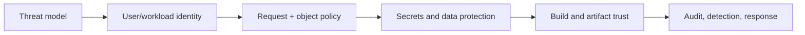

# Application And Platform Security Learning Guide

<DocLabels items={[
  {label: 'Foundation to architect', tone: 'foundation'},
  {label: 'Zero trust boundaries', tone: 'production'},
  {label: 'Shopverse security', tone: 'shopverse'},
]} />

Security is a chain of identity, authorization, data, software-supply-chain, and
operational controls. A valid JWT or gateway check is one control—not the boundary.

<TopicCards items={[
  {title: 'Security Principles', href: './principles/SECURITY-PRINCIPLES', description: 'Apply least privilege, defense in depth and explicit trust boundaries.', icon: 'security', tags: ['Start here', 'Threats']},
  {title: 'Security Architect Path', href: './platform/SECURITY-ARCHITECT-PATH', description: 'Connect identity, authorization, data, supply chain and operations.', icon: 'layers', tags: ['Lead', 'Governance']},
  {title: 'Service Identity And Zero Trust', href: './platform/SERVICE-IDENTITY-ZERO-TRUST', description: 'Authenticate workloads and authorize every service boundary.', icon: 'network', tags: ['mTLS', 'OAuth2']},
  {title: 'Spring Security', href: './SPRING-SECURITY-GENERIC', description: 'Implement filters, JWT, OAuth2/OIDC and method policy.', icon: 'code', tags: ['Spring', 'Runtime']},
  {title: 'Security Incident Response', href: './platform/SECURITY-INCIDENT-RESPONSE', description: 'Contain token, key, credential and authorization incidents.', icon: 'experiment', tags: ['Runbook', 'Recovery']},
  {title: 'Security Interview Workbook', href: './platform/SECURITY-INTERVIEW-WORKBOOK', description: 'Practise expandable lead and architect scenarios.', icon: 'brain', tags: ['Interview', 'Scenarios']},
]} />

## Canonical Boundaries

| Concern | Canonical track |
|---|---|
| principles, API and service controls | this security section |
| Spring filters, providers and method security | [Spring Security](./SPRING-SECURITY-GENERIC.md) |
| concrete Shopverse configuration | [Platform security starter](../platform/SECURITY-STARTER.md) |
| OAuth2/OIDC protocols | [OAuth2 fundamentals](./oauth/OAUTH2-FUNDAMENTALS.md) |
| supply chain and privacy | [Supply-chain and privacy](./SUPPLY-CHAIN-PRIVACY.md) |

<DocCallout type="production" title="Default deny at every reachable boundary">

Gateway policy reduces exposure, but services must validate caller identity and
enforce endpoint plus object ownership. Internal routing is not proof of trust.

</DocCallout>

## Official References

- [OWASP ASVS](https://owasp.org/www-project-application-security-verification-standard/)
- [NIST Zero Trust Architecture](https://csrc.nist.gov/publications/detail/sp/800-207/final)

## Recommended Next

Start with [Security Principles](./principles/SECURITY-PRINCIPLES.md), then follow the
[Security Architect Path](./platform/SECURITY-ARCHITECT-PATH.md).
