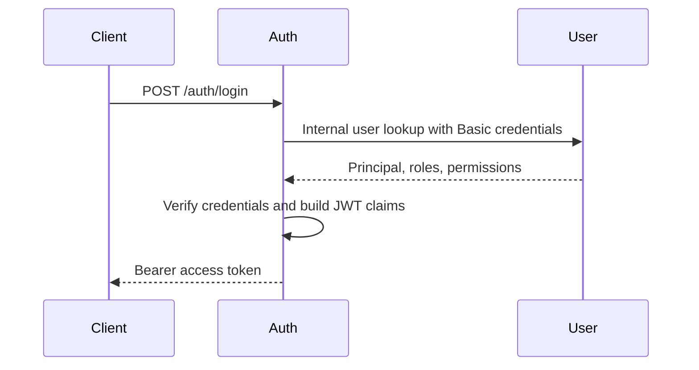

# Security Implementation Guide

This guide explains how Shopverse security is implemented step by step. For
general Spring Security theory, see [Spring Security](SPRING-SECURITY-GENERIC.md).
For the project-specific security architecture, see
[JWT, OAuth2, and Spring Security](JWT-OAUTH2-SPRING-SECURITY.md).

## Shopverse Security Stack

| Component | Role |
|---|---|
| Auth Service | Handles login, creates JWTs, signs them with an RSA private key, and exposes JWKS. |
| User Service | Owns users, password hashes, roles, and permissions. |
| API Gateway | Validates bearer tokens at the edge and routes requests. |
| Resource services | Validate JWTs independently and enforce endpoint/domain authorization. |
| JWKS | Publishes Auth Service public keys so services can verify JWT signatures. |
| Spring Security OAuth2 Resource Server | Validates bearer tokens, issuer, expiry, and authorities. |

Shopverse uses JWT bearer access tokens. Auth Service is not currently a full
OAuth2 Authorization Server with authorization-code, refresh-token, or
client-credentials grants.

For the next implementation layer covering refresh-token rotation and API keys,
see [Access Token, Refresh Token, And API Key Implementation Guide](ACCESS-REFRESH-API-KEY-IMPLEMENTATION-GUIDE.md).


## Step 1: Add Security Dependencies

Typical resource service dependencies:

```gradle
implementation 'org.springframework.boot:spring-boot-starter-security'
implementation 'org.springframework.boot:spring-boot-starter-oauth2-resource-server'
implementation 'org.springframework.security:spring-security-oauth2-jose'
```

Auth Service also needs JWT encoder/decoder support through Spring Security's
OAuth2 JOSE modules.

## Step 2: Store Users, Roles, And Permissions

User Service owns identity data:

```text
users
roles
permissions
user_roles
role_permissions
```

Passwords must be stored as hashes, not plain text. Shopverse uses Spring
Security password encoding, with BCrypt-style one-way verification.

## Step 3: Authenticate Login

Login flow:



The internal Basic credentials are only for Auth-to-User communication. Public
client APIs use bearer JWTs.

## Step 4: Sign JWTs With RSA

Auth Service signs access tokens with a private RSA key. Resource services only
need the public key through JWKS.

JWT shape:

```text
base64url(header).base64url(payload).base64url(signature)
```

Common claims:

```json
{
  "iss": "shopverse-auth-service",
  "sub": "customer@example.com",
  "roles": "CUSTOMER",
  "permissions": ["ORDER_CREATE"],
  "iat": 1782460800,
  "exp": 1782464400
}
```

JWT payloads are encoded, not encrypted. Do not put secrets or sensitive data
inside claims.

## Step 5: Expose JWKS

Auth Service exposes its public key set:

```text
/auth/.well-known/jwks.json
```

Resource services use this URL to verify token signatures. Key rotation should
keep old public keys available until existing tokens expire.

## Step 6: Configure Resource Servers

Each protected service validates JWTs independently:

```java
@Bean
JwtDecoder jwtDecoder() {
    NimbusJwtDecoder decoder =
            NimbusJwtDecoder.withJwkSetUri(jwkSetUri).build();
    decoder.setJwtValidator(
            JwtValidators.createDefaultWithIssuer(issuer)
    );
    return decoder;
}
```

Services should validate:

- signature;
- issuer;
- expiration;
- not-before/issued-at constraints where applicable;
- mapped roles and permissions.

Do not rely only on gateway validation. A service should reject invalid tokens
even if someone bypasses the gateway.

## Step 7: Map Claims To Authorities

Shopverse maps role and permission claims into Spring authorities:

```java
jwtConverter.setJwtGrantedAuthoritiesConverter(jwt -> {
    Collection<GrantedAuthority> authorities = new ArrayList<>();
    // map roles to ROLE_* and permissions to exact authorities
    return authorities;
});
```

Use:

```java
@PreAuthorize("hasAuthority('USER_CREATE')")
```

or:

```java
@PreAuthorize("hasRole('ADMIN')")
```

Keep the token claim contract consistent across Auth Service, Gateway, and
resource services.

## Step 8: Permit Public And Actuator Endpoints Deliberately

Public endpoints and observability endpoints should be explicit:

```java
requestMatchers(
        "/actuator/health",
        "/actuator/health/**",
        "/actuator/info",
        "/actuator/prometheus"
).permitAll()
```

Some services use a custom `BearerTokenResolver` so a malformed or expired
token on a public endpoint does not cause an early `401` before `permitAll()`
is evaluated.

## Step 9: Secure Service-To-Service Calls

For internal calls:

- prefer service discovery names instead of hard-coded hostnames;
- forward correlation IDs;
- never forward customer tokens to an internal endpoint unless that endpoint is
  designed to accept delegated user identity;
- use explicit internal credentials or service identity where required.

Shopverse currently uses internal Basic credentials for Auth-to-User login
lookup and bearer JWTs for public resource access.

## Step 10: Verify Security

Verification checklist:

1. Login returns a signed JWT.
2. JWKS endpoint returns the public key.
3. A valid JWT can access protected endpoints.
4. An expired, malformed, or wrong-issuer JWT is rejected.
5. Missing permissions produce `403`, not `500`.
6. Public endpoints work without a JWT.
7. Actuator health and Prometheus endpoints remain reachable where needed.
8. Direct service access still validates JWTs.
9. Logs never include raw tokens, passwords, or private keys.

## Related Guides

- [JWT, OAuth2, and Spring Security](JWT-OAUTH2-SPRING-SECURITY.md)
- [Keycloak and Spring OAuth2 implementation](spring-security/OAUTH2-KEYCLOAK-SPRING-IMPLEMENTATION.md)
- [Distributed authorization at permission scale](spring-security/DISTRIBUTED-AUTHORIZATION-PERMISSION-SCALE.md)
- [Access token, refresh token, and API key implementation](ACCESS-REFRESH-API-KEY-IMPLEMENTATION-GUIDE.md)
- [Spring Security](SPRING-SECURITY-GENERIC.md)
- [JWT fundamentals](jwt/JWT-FUNDAMENTALS.md)
- [JWKS asymmetric JWT](jwt/JWKS-ASYMMETRIC-JWT.md)
- [API security principles](principles/API-SECURITY-PRINCIPLES.md)
- [Service-to-service security](principles/SERVICE-TO-SERVICE-SECURITY.md)
