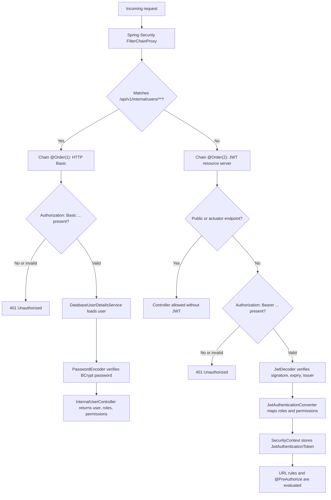

# Spring Security Filters, Ownership, And Roadmap

<DocLabels items={[{label: 'Advanced', tone: 'advanced'}, {label: 'Shopverse', tone: 'shopverse'}, {label: 'Production', tone: 'production'}]} />

## Security Context

After token validation, Spring stores a `JwtAuthenticationToken` in `SecurityContextHolder`. Controllers receive `Authentication`, and method-security interceptors evaluate `@PreAuthorize` before invoking the method.

Gateway uses the reactive equivalent, `ReactiveSecurityContextHolder`.

## Why User Service Has Two Filter Chains

User Service has:

1. a higher-priority Basic-auth chain restricted to `/api/v1/internal/users/**`;
2. a JWT resource-server chain for public and administrative APIs.

The implementation is in
`user-service/src/main/java/io/shopverse/user_service/security/SecurityConfig.java`:

```java
@Bean
@Order(1)
public SecurityFilterChain internalUserSecurityFilterChain(HttpSecurity http)
        throws Exception {
    http
            .securityMatcher(ApiConstants.INTERNAL_USERS + "/**")
            .csrf(AbstractHttpConfigurer::disable)
            .sessionManagement(session ->
                    session.sessionCreationPolicy(SessionCreationPolicy.STATELESS))
            .authorizeHttpRequests(auth -> auth.anyRequest().authenticated())
            .httpBasic(Customizer.withDefaults());

    return http.build();
}
```

```java
@Bean
@Order(2)
public SecurityFilterChain securityFilterChain(
        HttpSecurity http,
        JwtAuthenticationConverter jwtAuthenticationConverter
) throws Exception {
    http
            .csrf(AbstractHttpConfigurer::disable)
            .sessionManagement(session ->
                    session.sessionCreationPolicy(SessionCreationPolicy.STATELESS))
            .authorizeHttpRequests(auth -> auth
                    .requestMatchers("/actuator/health", "/actuator/info",
                            "/actuator/prometheus").permitAll()
                    .requestMatchers(ApiConstants.PUBLIC_API + "/**").permitAll()
                    .requestMatchers(ApiConstants.USERS + "/**")
                            .hasAnyRole("CUSTOMER", "ADMIN")
                    .requestMatchers(ApiConstants.ROLES + "/**")
                            .hasRole("ADMIN")
                    .anyRequest().authenticated())
            .oauth2ResourceServer(oauth -> oauth.jwt(jwt ->
                    jwt.jwtAuthenticationConverter(jwtAuthenticationConverter)));

    return http.build();
}
```

`securityMatcher(...)` scopes a chain to matching request paths. `@Order(1)`
is evaluated before `@Order(2)`, so the internal Basic chain gets the first
chance to handle `/api/v1/internal/users/**`. If the request does not match
that path, Spring Security evaluates the JWT chain.



### Internal Login Flow Through The Basic Chain

Auth Service calls the internal User Service endpoint during login:

```text
POST /auth/login
  -> Auth Service
  -> Feign call to User Service /api/v1/internal/users/authenticated/{username}
  -> Authorization: Basic base64(username:password)
```

Because the path starts with `/api/v1/internal/users/`, Spring selects the
`@Order(1)` chain. That chain uses HTTP Basic only for this internal lookup.
Spring delegates to `DatabaseUserDetailsService`, which loads the user,
roles, and permissions from MySQL. The configured `PasswordEncoder` verifies
the submitted password against the stored BCrypt hash.

If authentication succeeds, User Service returns user details to Auth Service.
Auth Service then signs a JWT containing roles and permissions.

### Public And User APIs Through The JWT Chain

Requests such as these do not match the Basic chain:

```text
GET  /api/v1/users
POST /api/v1/users
GET  /api/v1/roles
```

They fall through to the `@Order(2)` chain. That chain uses OAuth2 Resource
Server support:

1. `BearerTokenAuthenticationFilter` reads the `Authorization: Bearer ...`
   header.
2. `NimbusJwtDecoder` fetches the public key from JWKS and verifies the RSA
   signature.
3. `JwtValidators.createDefaultWithIssuer(issuer)` verifies expiry and issuer.
4. `JwtAuthenticationConverter` converts `roles` and `permissions` claims into
   Spring `GrantedAuthority` values.
5. request-level rules such as `.hasRole("ADMIN")` are checked.
6. method-level rules such as `@PreAuthorize("hasAuthority('USER_CREATE')")`
   are checked before the controller method runs.

The internal endpoint cannot accidentally fall through to the bearer policy,
and the Basic policy does not apply to the rest of the API.

## Ownership Authorization

Order timeline and payment lookup allow either:

- an administrator; or
- the authenticated owner identified by token subject.

```java
@PreAuthorize("hasRole('ADMIN') or @orderAuthorization.isOwner(#id, authentication.name)")
```

Authentication alone does not authorize access to every identifier a caller
can place in a URL. Shopverse therefore checks the persisted owner before
returning customer Order timelines and Payment records, while administrators
retain cross-customer access. See
[Resource Ownership Authorization](../reliability/problems/runtime/RESOURCE-OWNERSHIP-AUTHORIZATION.md)
for the complete code flow and tests.

This is stronger than checking only whether a caller has a generic read permission.

## OAuth2 Terms

| Term | Shopverse status |
|---|---|
| JWT access token | Implemented |
| Resource Server | Implemented |
| JWKS | Implemented |
| Custom password login | Implemented |
| OAuth2 Authorization Server | Not implemented |
| Authorization Code + PKCE | Planned for browser/mobile clients |
| Client Credentials | Planned for service identities |
| Refresh token rotation | Not implemented |
| Session/cookie login | Not used by service APIs |
| API keys | Not used |

Shopverse's `/auth/login` endpoint is custom authentication followed by JWT
issuance. It should not be described as an OAuth2 password grant.

## Current Security Gaps And Roadmap

- audience validation is not consistently configured.
- JWT deny-list, user security version, and opaque-token introspection are not
  implemented.
- refresh tokens and rotation are not implemented.
- Basic authentication is used as a POC internal boundary; production
  service identity should use mTLS or standards-based workload/client
  credentials.
- key rotation currently uses a fixed `kid` and does not document overlapping
  current/retiring keys.

## Security Practices

- Keep private keys and credentials outside source control.
- Use HTTPS in non-local environments.
- Use short access-token lifetime and key rotation.
- Validate issuer, audience, timestamps, and algorithm in every resource service.
- Apply least privilege through roles and permissions.
- Parameterize database access through JPA; never concatenate untrusted SQL.
- Rate-limit at the edge and service boundary.
- Use CORS allowlists; disable CSRF only for stateless bearer APIs.
- Avoid token logging and sanitize error responses.
- Protect internal service endpoints with workload identity or mTLS in production; Basic auth is a POC boundary.

## Official References

- [Spring Security OAuth2 Resource Server JWT](https://docs.spring.io/spring-security/reference/servlet/oauth2/resource-server/jwt.html)
- [Spring Security method security](https://docs.spring.io/spring-security/reference/servlet/authorization/method-security.html)
- [Spring Authorization Server](https://docs.spring.io/spring-authorization-server/reference/)

## Recommended Next

Return to [JWT, OAuth2, And Spring Security](./JWT-OAUTH2-SPRING-SECURITY.md) to select the next focused guide.
