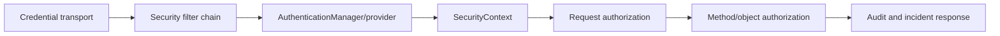

---
title: Spring Security Learning Guide
description: Dependency-ordered Spring Security route through authentication, filters, JWT, OAuth2/OIDC, authorization, browser controls, testing, and production threats.
difficulty: Intermediate
page_type: Learning Path
status: Generic
prerequisites: [HTTP, Spring web fundamentals]
learning_objectives: [Trace authentication and authorization, Secure browser and API boundaries, Defend architecture decisions]
technologies: [Spring Security 7, Spring Boot 4, OAuth2, OIDC, JWT]
last_reviewed: "2026-07-13"
---

# Spring Security Learning Guide

<DocLabels items={[
  {label: 'Authentication to architecture', tone: 'foundation'},
  {label: 'Spring Security 7', tone: 'intermediate'},
  {label: 'Production threats', tone: 'production'},
  {label: 'Shopverse examples', tone: 'shopverse'},
]} />

Spring Security material is split into focused pages for authentication basics, servlet filter internals, JWT/JWKS, authorization, OAuth2, and production security practices.

<TopicCards items={[
  {title: 'Authentication', href: './spring-security/AUTHENTICATION-BASICS', description: 'Credentials, managers, providers, password storage and user details.', icon: 'security', tags: ['Start here', 'Identity']},
  {title: 'Filter And Context Runtime', href: './spring-security/SERVLET-FILTER-CHAIN', description: 'Trace filter-chain selection, context persistence and exception translation.', icon: 'route', tags: ['Servlet', 'Runtime']},
  {title: 'JWT And Resource Server', href: './spring-security/JWT-JWKS-RESOURCE-SERVER', description: 'Validate JWT/JWKS, claims, rotation and stateless resource access.', icon: 'code', tags: ['Tokens', 'APIs']},
  {title: 'OAuth2 And OIDC', href: './spring-security/OAUTH2-OIDC-FLOWS', description: 'Choose user, service and device authorization flows correctly.', icon: 'network', tags: ['PKCE', 'Federation']},
  {title: 'CSRF, CORS And Browsers', href: './spring-security/CSRF-CORS-BROWSER-SECURITY', description: 'Secure session, bearer and mixed browser credential boundaries.', icon: 'security', tags: ['Browser', 'Threats']},
  {title: 'Threat And Interview Lab', href: './spring-security/THREAT-MODELING-INTERVIEW-LAB', description: 'Work through Shopverse threats and expandable architect answers.', icon: 'brain', tags: ['Architect', 'Interview']},
]} />

## Shopverse Implementation Path

After reading the generic security pages, use these Shopverse pages for the
actual implementation:

| Concept | Shopverse page |
|---|---|
| Servlet JWT resource-server shared setup | [Security Starter](../platform/SECURITY-STARTER.md) |
| Current JWT/OAuth2 mapping | [JWT, OAuth2, And Spring Security](JWT-OAUTH2-SPRING-SECURITY.md) |
| Security starter properties and troubleshooting | [Platform Config Properties](../platform/CONFIG-PROPERTIES.md) and [Platform Troubleshooting](../platform/TROUBLESHOOTING.md) |
| Resource ownership authorization problems | [Resource Ownership Authorization](../reliability/problems/runtime/RESOURCE-OWNERSHIP-AUTHORIZATION.md) |

Important boundary: the current platform security starter is servlet-based.
`api-gateway` uses WebFlux and keeps reactive security configuration local.

For generic security study material, start with:

- [Security principles](principles/SECURITY-PRINCIPLES.md)
- [Microservices security principles](principles/MICROSERVICES-SECURITY-PRINCIPLES.md)
- [JWT fundamentals](jwt/JWT-FUNDAMENTALS.md)
- [OAuth2 fundamentals](oauth/OAUTH2-FUNDAMENTALS.md)
- [Token lifecycle](oauth/TOKEN-LIFECYCLE.md)

## Focused Pages

| Page | Covers |
|---|---|
| [Spring Security Authentication Basics](spring-security/AUTHENTICATION-BASICS.md) | Authentication, authorization, dependencies, authentication managers, providers, form login, HTTP Basic, database-backed users, and UserDetails. |
| [Username Password Authentication Internals](spring-security/AUTHENTICATION-INTERNALS.md) | Complete request flow through filters, ProviderManager, DaoAuthenticationProvider, UserDetailsService, password verification, SecurityContextHolder, in-memory users, failures, and context cleanup. |
| [Password Authentication Provider Runtime](spring-security/PASSWORD-AUTHENTICATION-RUNTIME.md) | Focused manager/provider, user-lookup, password verification, upgrade and failure path. |
| [SecurityContext Lifecycle](spring-security/SECURITY-CONTEXT-LIFECYCLE.md) | Context creation, persistence, cleanup, session/stateless behavior and async boundaries. |
| [Spring Security Servlet Filter Chain](spring-security/SERVLET-FILTER-CHAIN.md) | Servlet security architecture, core classes, SecurityContext, multiple chains, exceptions, sessions, CSRF, and CORS. |
| [JWT JWKS And Resource Server Security](spring-security/JWT-JWKS-RESOURCE-SERVER.md) | Bearer JWT authentication, JWT parts, JWS/JWE/JWK/JWKS, symmetric/asymmetric signing, Shopverse encoding/decoding, claims, revocation, and production practices. |
| [Spring Security Authorization And Method Security](spring-security/AUTHORIZATION-METHOD-SECURITY.md) | Scopes, roles, groups, authorities, JWT authority conversion, RBAC/policy models, method security, URL security, and Shopverse summary. |
| [OAuth2 OIDC And Token Flows](spring-security/OAUTH2-OIDC-FLOWS.md) | OAuth2 roles, authorization code with PKCE, client credentials, device flow, refresh tokens, password grant, and OIDC. |
| [CSRF, CORS And Browser Security](spring-security/CSRF-CORS-BROWSER-SECURITY.md) | Credential transport, CSRF decisions, CORS ownership, mixed authentication and verification. |
| [Threat-Modelling And Interview Lab](spring-security/THREAT-MODELING-INTERVIEW-LAB.md) | Trust boundaries, Shopverse threats, operational controls and expandable architect scenarios. |
| [Spring Security Production Practices](spring-security/PRODUCTION-PRACTICES.md) | Password security, related guides, and official references. |

## Compatibility Anchors

The original long page was split into focused pages. These headings are kept so older links have a stable landing point.

## Authentication And Authorization

Moved to [Spring Security Authentication Basics](spring-security/AUTHENTICATION-BASICS.md).

## Core Dependencies

Moved to [Spring Security Authentication Basics](spring-security/AUTHENTICATION-BASICS.md).

## Servlet Security Architecture

Moved to [Spring Security Servlet Filter Chain](spring-security/SERVLET-FILTER-CHAIN.md).

## Important Interfaces And Classes

Moved to [Spring Security Servlet Filter Chain](spring-security/SERVLET-FILTER-CHAIN.md).

## AuthenticationManager And Providers

Moved to [Spring Security Authentication Basics](spring-security/AUTHENTICATION-BASICS.md).

## Common Authentication Providers

Moved to [Spring Security Authentication Basics](spring-security/AUTHENTICATION-BASICS.md).

## Form Login

Moved to [Spring Security Authentication Basics](spring-security/AUTHENTICATION-BASICS.md).

## HTTP Basic Authentication

Moved to [Spring Security Authentication Basics](spring-security/AUTHENTICATION-BASICS.md).

## Database-Backed Authentication

Moved to [Spring Security Authentication Basics](spring-security/AUTHENTICATION-BASICS.md).

## UserDetails And Authorities

Moved to [Spring Security Authentication Basics](spring-security/AUTHENTICATION-BASICS.md).

## SecurityContext And SecurityContextHolder

Moved to [Spring Security Servlet Filter Chain](spring-security/SERVLET-FILTER-CHAIN.md).

## Stateless Bearer JWT Authentication

Moved to [JWT JWKS And Resource Server Security](spring-security/JWT-JWKS-RESOURCE-SERVER.md).

## JWT Structure

Moved to [JWT JWKS And Resource Server Security](spring-security/JWT-JWKS-RESOURCE-SERVER.md).

## JWS, JWE, JWK, And JWKS

Moved to [JWT JWKS And Resource Server Security](spring-security/JWT-JWKS-RESOURCE-SERVER.md).

## Symmetric And Asymmetric JWT Signing

Moved to [JWT JWKS And Resource Server Security](spring-security/JWT-JWKS-RESOURCE-SERVER.md).

## Shopverse JWT Encoding

Moved to [JWT JWKS And Resource Server Security](spring-security/JWT-JWKS-RESOURCE-SERVER.md).

## JWKS Publication

Moved to [JWT JWKS And Resource Server Security](spring-security/JWT-JWKS-RESOURCE-SERVER.md).

## Shopverse JWT Decoding

Moved to [JWT JWKS And Resource Server Security](spring-security/JWT-JWKS-RESOURCE-SERVER.md).

## Claim Types

Moved to [JWT JWKS And Resource Server Security](spring-security/JWT-JWKS-RESOURCE-SERVER.md).

## Scope, Role, Group, And Authority

Moved to [Spring Security Authorization And Method Security](spring-security/AUTHORIZATION-METHOD-SECURITY.md).

## JWT Authority Conversion

Moved to [Spring Security Authorization And Method Security](spring-security/AUTHORIZATION-METHOD-SECURITY.md).

## Authorization Models

Moved to [Spring Security Authorization And Method Security](spring-security/AUTHORIZATION-METHOD-SECURITY.md).

## Method Security

Moved to [Spring Security Authorization And Method Security](spring-security/AUTHORIZATION-METHOD-SECURITY.md).

## URL Security Versus Method Security

Moved to [Spring Security Authorization And Method Security](spring-security/AUTHORIZATION-METHOD-SECURITY.md).

## OAuth2 Roles

Moved to [OAuth2 OIDC And Token Flows](spring-security/OAUTH2-OIDC-FLOWS.md).

## Authorization Code With PKCE

Moved to [OAuth2 OIDC And Token Flows](spring-security/OAUTH2-OIDC-FLOWS.md).

## Client Credentials

Moved to [OAuth2 OIDC And Token Flows](spring-security/OAUTH2-OIDC-FLOWS.md).

## Device Authorization

Moved to [OAuth2 OIDC And Token Flows](spring-security/OAUTH2-OIDC-FLOWS.md).

## Refresh Tokens

Moved to [OAuth2 OIDC And Token Flows](spring-security/OAUTH2-OIDC-FLOWS.md).

## OAuth2 Resource Owner Password Grant

Moved to [OAuth2 OIDC And Token Flows](spring-security/OAUTH2-OIDC-FLOWS.md).

## OAuth2 And OIDC

Moved to [OAuth2 OIDC And Token Flows](spring-security/OAUTH2-OIDC-FLOWS.md).

## JWT Revocation And Blocking

Moved to [JWT JWKS And Resource Server Security](spring-security/JWT-JWKS-RESOURCE-SERVER.md).

## Multiple SecurityFilterChains

Moved to [Spring Security Servlet Filter Chain](spring-security/SERVLET-FILTER-CHAIN.md).

## Exceptions

Moved to [Spring Security Servlet Filter Chain](spring-security/SERVLET-FILTER-CHAIN.md).

## Session And Stateless Security

Moved to [Spring Security Servlet Filter Chain](spring-security/SERVLET-FILTER-CHAIN.md).

## CSRF And CORS

Moved to [Spring Security Servlet Filter Chain](spring-security/SERVLET-FILTER-CHAIN.md).

## Password Security

Moved to [Spring Security Production Practices](spring-security/PRODUCTION-PRACTICES.md).

## Recommended Next

Start with [Authentication Basics](spring-security/AUTHENTICATION-BASICS.md), then
use the [Threat-Modelling And Interview Lab](spring-security/THREAT-MODELING-INTERVIEW-LAB.md)
to verify the complete security boundary.

## JWT And OAuth2 Production Practices

Moved to [JWT JWKS And Resource Server Security](spring-security/JWT-JWKS-RESOURCE-SERVER.md).

## Shopverse Security Summary

Moved to [Spring Security Authorization And Method Security](spring-security/AUTHORIZATION-METHOD-SECURITY.md).

## Related Guides

Moved to [Spring Security Production Practices](spring-security/PRODUCTION-PRACTICES.md).

## Official References

Moved to [Spring Security Production Practices](spring-security/PRODUCTION-PRACTICES.md).
