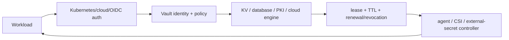

# Vault And Kubernetes Secrets Architect Path

Secrets management is an identity and lifecycle system, not a safe place to paste static passwords.
The design must answer how the workload authenticates before receiving a secret, how access is scoped,
how leases rotate/revoke, how outages behave and how audit/recovery avoid exposing plaintext.

## Vault Internals And Operations

- barrier encryption, storage backend and TLS boundary;
- initialization, recovery/unseal keys and auto-unseal trust;
- active/standby HA, integrated storage quorum and performance limits;
- auth methods, entities/aliases, groups, token types and policy paths;
- KV versioning, dynamic database/cloud credentials and PKI;
- leases, TTL, renewal, revocation and orphan/token hierarchy;
- audit devices, namespaces/tenancy where available, telemetry and capacity;
- snapshots, disaster recovery, upgrades, seal events and credential compromise.

## Kubernetes Delivery Choices

| Pattern | Strength | Risk |
|---|---|---|
| application calls Vault | freshest control and renewal | SDK/runtime coupling and bootstrap |
| Vault Agent/injector | templating and renewal beside app | webhook/sidecar lifecycle and files |
| Secrets Store CSI | mounted secret integration | driver/provider availability and refresh semantics |
| External Secrets | syncs provider data into Kubernetes Secret | secret copied into API/etcd and controller delay |
| native Secret only | simple platform API | static lifecycle and etcd/RBAC exposure |

Choose from application reload ability, revocation SLA, outage behavior, audit, Kubernetes API exposure and
operational ownership. Never assume a synchronized Secret instantly updates an environment variable.

## Production Standard

Use workload identity, short TTL/dynamic credentials, least-privilege policy, encrypted transport/storage,
multiple audit devices where appropriate, bounded client caching, rotation overlap, alerting before expiry,
and tested break-glass/recovery. Protect auto-unseal KMS rights and snapshot encryption separately.

## Official References

- [Vault concepts](https://developer.hashicorp.com/vault/docs/concepts)
- [Vault auth methods](https://developer.hashicorp.com/vault/docs/auth)
- [Vault on Kubernetes](https://developer.hashicorp.com/vault/docs/deploy/kubernetes)

## Recommended Next

Continue with [Secrets Implementation, Rotation, Incidents, Labs, And Interviews](./secrets/SECRETS-IMPLEMENTATION-OPERATIONS-INTERVIEW.md).

