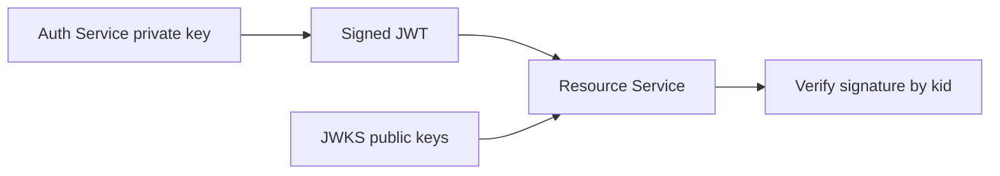

# JWKS And Asymmetric JWT

Asymmetric JWT signing uses a private key to sign tokens and a public key to
verify them.



## Why Asymmetric Signing

| Benefit | Explanation |
|---|---|
| private key stays in auth service | resource services only need public keys |
| safer distribution | public keys can be shared widely |
| rotation support | `kid` selects the active verification key |
| decentralized verification | services validate tokens without calling auth service each request |

## JWKS

JWKS means JSON Web Key Set. It exposes public verification keys:

```json
{
  "keys": [
    {
      "kty": "RSA",
      "kid": "shopverse-key-1",
      "use": "sig",
      "alg": "RS256",
      "n": "...",
      "e": "AQAB"
    }
  ]
}
```

Resource services cache keys and select the right key by `kid`.

## Related Guides

- [JWT fundamentals](JWT-FUNDAMENTALS.md)
- [JWT best practices](JWT-BEST-PRACTICES.md)
- [Shopverse JWT implementation](../JWT-OAUTH2-SPRING-SECURITY.md)

