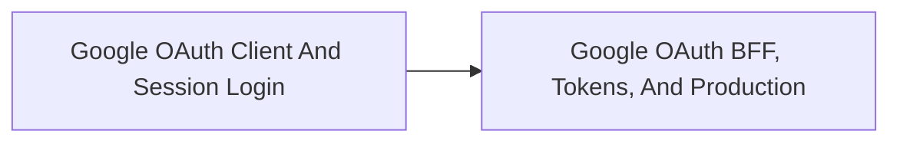

<!-- split-guide-index -->
# Google Authentication With Spring

<DocLabels items={[{label: 'Focused guides', tone: 'advanced'}, {label: 'Shopverse', tone: 'shopverse'}, {label: 'Architect route', tone: 'production'}]} />

Choose and implement secure Google authentication boundaries for Shopverse. The original long-form material is preserved without duplication across the focused pages below.

<TopicCards items={[
  {title: 'Google OAuth Client And Session Login', href: '/security/oauth/GOOGLE-OAUTH-CLIENT-SESSION', description: 'Part 1 of the focused Google Authentication With Spring learning route.', icon: 'route', tags: ['Focused', 'Advanced']},
  {title: 'Google OAuth BFF, Tokens, And Production', href: '/security/oauth/GOOGLE-OAUTH-BFF-TOKEN-PRODUCTION', description: 'Part 2 of the focused Google Authentication With Spring learning route.', icon: 'security', tags: ['Focused', 'Advanced']},
]} />

<DocCallout type="tip" title="Use the index as the stable entry point">

Each focused page owns one concern. Cross-links point to the canonical explanation instead of repeating the same material.

</DocCallout>

## Recommended Learning Order

1. [Google OAuth Client And Session Login](./GOOGLE-OAUTH-CLIENT-SESSION.md)
2. [Google OAuth BFF, Tokens, And Production](./GOOGLE-OAUTH-BFF-TOKEN-PRODUCTION.md)

## Reading Strategy

Use **Google Authentication With Spring** as a decision and verification guide inside **Google Authentication With Spring**. Start by naming the invariant or operational outcome, then follow the runtime flow and identify the owning component. For every example, record the expected success evidence, the most important failure mode, and the metric or test that proves recovery. This keeps the material useful for implementation reviews, production incidents, and architect interviews instead of treating it as isolated syntax.

Within **Google Authentication With Spring**, apply the Shopverse guidance incrementally: verify the current behavior, introduce one bounded change, test the unhappy path, and preserve a rollback or reconciliation route. Follow links to canonical pages when a concept belongs to another track; do not copy that explanation into this page. This ownership rule keeps the focused guides short while retaining technical depth and traceability.

## Official References

- [Spring Security reference](https://docs.spring.io/spring-security/reference/)
- [OAuth 2.0 Security Best Current Practice](https://www.rfc-editor.org/rfc/rfc9700)
