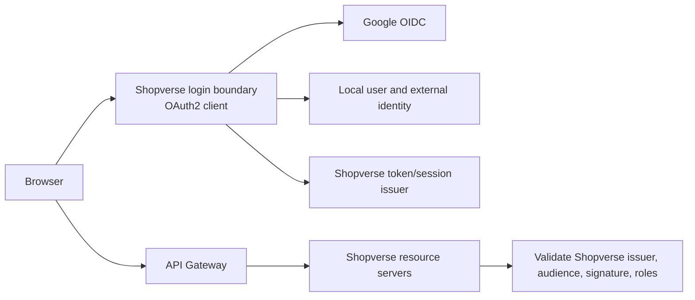

# Google Authentication With Spring Boot

This guide shows how a user can select **Sign in with Google**, authenticate on
Google's domain, and return to a Spring Boot service as an authenticated local
user. Shopverse never receives the user's Google password.

:::info Current Shopverse status

This is a **reference implementation**, not a claim about the current runtime.
The current `auth-service` contains OAuth2 **resource-server** JWT validation and
uses stateless sessions. Google login requires the OAuth2 **client** dependency,
a browser callback, and a deliberate session or Shopverse-token design.

:::

## Recommended Shopverse Boundary



Google authenticates the external identity. Shopverse owns account status,
roles, tenant membership, authorization, sessions, and API tokens. Internal
services should normally trust Shopverse tokens, not Google access tokens.

## 1. Create The Google Client

In Google Cloud:

1. Create or select a project.
2. Configure the Google Auth Platform branding/consent information.
3. Select the intended audience. During development, add permitted test users.
4. Create an OAuth client of type **Web application**.
5. Add exact authorized redirect URIs:

```text
http://localhost:8080/login/oauth2/code/google
https://auth.shopverse.example/login/oauth2/code/google
```

Production redirect URIs must use HTTPS; localhost is the development exception.
Scheme, host, port, path, and trailing slash must match. A mismatch produces
`redirect_uri_mismatch`.

Keep separate OAuth clients/projects for local, staging, and production where
practical. Never commit the client secret or downloaded credential JSON.

For sign-in only, request the smallest useful scopes:

```text
openid profile email
```

Do not request Gmail, Drive, Calendar, or other Google API scopes merely to log
the user in. Sensitive or restricted scopes introduce additional consent,
verification, data-handling, and security obligations.

## 2. Add The OAuth2 Client Dependency

Gradle:

```groovy
dependencies {
    implementation 'org.springframework.boot:spring-boot-starter-security'
    implementation 'org.springframework.boot:spring-boot-starter-oauth2-client'
}
```

`spring-boot-starter-oauth2-resource-server` validates bearer tokens sent to an
API. It does not implement the browser login redirect/callback. An application
that performs Google login and also exposes bearer-token APIs may need both.

## 3. Configure Client Registration

`application.yml`:

```yaml
spring:
  security:
    oauth2:
      client:
        registration:
          google:
            client-id: ${GOOGLE_CLIENT_ID}
            client-secret: ${GOOGLE_CLIENT_SECRET}
            scope:
              - openid
              - profile
              - email
```

Because the registration ID is `google`, Spring Boot supplies Google's standard
provider endpoints. Explicit discovery configuration can instead use the issuer
when required by the deployed Spring Boot version.

Local environment variables:

```powershell
$env:GOOGLE_CLIENT_ID = "your-client-id.apps.googleusercontent.com"
$env:GOOGLE_CLIENT_SECRET = "set-this-outside-source-control"
```

Use the deployment platform's secret manager in production. Avoid placing
secrets in `.env` files that may be committed, container images, frontend code,
URLs, logs, or build output.

## 4A. Simplest Server-Session Login

Use this model when Spring serves the web application or acts as a BFF. Browser
authentication is represented by a secure server session.

```java
package io.shopverse.auth.config;

import static org.springframework.security.config.Customizer.withDefaults;

import org.springframework.context.annotation.Bean;
import org.springframework.context.annotation.Configuration;
import org.springframework.security.config.annotation.web.builders.HttpSecurity;
import org.springframework.security.web.SecurityFilterChain;

@Configuration
class GoogleLoginSecurityConfig {

    @Bean
    SecurityFilterChain webSecurity(HttpSecurity http) throws Exception {
        return http
                .authorizeHttpRequests(authorize -> authorize
                        .requestMatchers("/", "/error", "/assets/**").permitAll()
                        .requestMatchers("/oauth2/**", "/login/**").permitAll()
                        .anyRequest().authenticated())
                .oauth2Login(withDefaults())
                .logout(logout -> logout.logoutSuccessUrl("/"))
                .build();
    }
}
```

Start login by navigating—not AJAX posting—to:

```html
<a href="/oauth2/authorization/google">Sign in with Google</a>
```

Spring Security then owns:

- the authorization request and `state` correlation;
- redirect to Google;
- callback at `/login/oauth2/code/google`;
- code exchange and ID-token verification;
- creation of an authenticated `OidcUser` and HTTP session.

Do not disable CSRF globally for this cookie-authenticated design. CSRF remains
necessary for state-changing application requests after login.

## Read The Authenticated User

```java
package io.shopverse.auth.web;

import java.util.Map;

import org.springframework.security.core.annotation.AuthenticationPrincipal;
import org.springframework.security.oauth2.core.oidc.user.OidcUser;
import org.springframework.web.bind.annotation.GetMapping;
import org.springframework.web.bind.annotation.RestController;

@RestController
class CurrentUserController {

    @GetMapping("/api/me")
    Map<String, Object> me(@AuthenticationPrincipal OidcUser user) {
        return Map.of(
                "subject", user.getSubject(),
                "name", user.getFullName(),
                "email", user.getEmail(),
                "emailVerified", Boolean.TRUE.equals(user.getEmailVerified()));
    }
}
```

Do not return the full ID token, access token, or every provider claim to the
browser. Return only the local profile fields the UI needs.

## 4B. SPA And Microservices: BFF Cookie Model

For a browser SPA, the safest default is often a BFF:

1. The browser navigates to the BFF's Google authorization endpoint.
2. The BFF completes code exchange and stores provider/application tokens on
   the server.
3. The browser receives only a secure, HTTP-only session cookie.
4. The BFF calls downstream APIs or exchanges for narrowly scoped application
   access tokens.

This avoids exposing long-lived tokens to JavaScript and reduces token theft
through XSS. Configure CORS for exact trusted origins, keep CSRF protection, and
set proxy/forwarded-header handling so Spring computes the public HTTPS callback
instead of an internal container URL.

## 4C. Shopverse-Issued Access And Refresh Tokens

If Shopverse APIs already use Shopverse JWTs, treat successful Google login as
one credential type accepted by the Shopverse authorization boundary:

```text
Google login succeeds
  -> find external_identity by (issuer, subject)
  -> create/link local user under explicit policy
  -> load local roles, tenant, status, and permissions
  -> issue Shopverse access token + rotated refresh-token family
  -> internal APIs validate only the Shopverse issuer/audience
```

Prefer returning tokens through secure HTTP-only cookies or a one-time code
redeemed by the frontend. Do not place access or refresh tokens in a query
string; URLs leak into browser history, proxy logs, analytics, and referrers.

Illustrative success handler:

```java
@Component
final class GoogleLoginSuccessHandler implements AuthenticationSuccessHandler {

    private final LocalLoginService localLoginService;

    GoogleLoginSuccessHandler(LocalLoginService localLoginService) {
        this.localLoginService = localLoginService;
    }

    @Override
    public void onAuthenticationSuccess(
            HttpServletRequest request,
            HttpServletResponse response,
            Authentication authentication) throws IOException {

        OidcUser googleUser = (OidcUser) authentication.getPrincipal();
        LocalSession session = localLoginService.loginWithOidc(
                googleUser.getIdToken().getIssuer().toString(),
                googleUser.getSubject(),
                googleUser.getEmail(),
                Boolean.TRUE.equals(googleUser.getEmailVerified()));

        ResponseCookie cookie = ResponseCookie.from("__Host-shopverse_refresh", session.refreshToken())
                .httpOnly(true)
                .secure(true)
                .sameSite("Strict")
                .path("/")
                .maxAge(session.refreshTtl())
                .build();

        response.addHeader("Set-Cookie", cookie.toString());
        response.sendRedirect("/login/complete"); // fixed allow-listed path
    }
}
```

This is a shape, not drop-in token code. The local service must hash stored
refresh tokens, rotate them on every use, detect reuse, bind them to a session
family, revoke on logout/risk, and perform the identity mapping transactionally.

Attach it explicitly:

```java
http.oauth2Login(oauth -> oauth
        .successHandler(googleLoginSuccessHandler));
```

## 5. Map Google Identity To A Local User

Use `(issuer, subject)` as the unique provider identity:

```java
@Transactional
public LocalUser loginWithOidc(
        String issuer,
        String subject,
        String email,
        boolean emailVerified) {

    return externalIdentityRepository.findByIssuerAndSubject(issuer, subject)
            .map(ExternalIdentity::user)
            .map(user -> {
                user.requireActive();
                user.recordLogin();
                return user;
            })
            .orElseGet(() -> registerOrLink(issuer, subject, email, emailVerified));
}
```

Safe policy for `registerOrLink`:

1. Require the trusted Google issuer and nonblank subject.
2. Decide whether self-registration is permitted for this tenant/environment.
3. Require `email_verified=true` before using email as supporting evidence.
4. If no local account has that email, create the user and external identity in
   one transaction, subject to normal registration policy.
5. If an account already exists, do not silently link solely by matching email.
   Require login to the existing account or another explicit reauthentication
   ceremony, then add the Google identity.
6. Enforce unique constraints on `(issuer, subject)` and normalized email.
7. Derive roles from local policy, never from display name or arbitrary claims.

## 6. Restrict Google Workspace Domain When Required

The optional `hd` claim can help optimize or enforce a Workspace-domain login,
but validate it from the verified ID token; do not trust an `hd` request
parameter or the email suffix alone.

```java
String hostedDomain = oidcUser.getClaimAsString("hd");
if (!"example.com".equals(hostedDomain)) {
    throw new BadCredentialsException("Google Workspace domain is not allowed");
}
```

Domain restriction is an organization policy, not a universal Google-login
requirement. Consumer Gmail accounts will not satisfy a Workspace domain rule.

## 7. Frontend Flow

Minimal browser flow:

```javascript
function loginWithGoogle() {
  window.location.assign(
    "https://auth.shopverse.example/oauth2/authorization/google"
  );
}
```

Use full-page navigation so redirects, provider login, and callback cookies work
normally. After the fixed post-login redirect, request the local user endpoint:

```javascript
const response = await fetch("https://auth.shopverse.example/api/me", {
  credentials: "include"
});

if (!response.ok) throw new Error("Not authenticated");
const currentUser = await response.json();
```

Do not accept an arbitrary `returnUrl` and redirect to it. Store a server-side
allow-listed destination or validate that it is a local path.

## 8. Reverse Proxy And Gateway Configuration

The default Spring callback template is:

```text
{baseUrl}/login/oauth2/code/{registrationId}
```

Behind a gateway, `{baseUrl}` must resolve to the browser-visible HTTPS origin.
Forward only trusted proxy headers and configure forwarded-header handling. If
Spring constructs `http://auth-service:8080/...`, Google will reject it because
it differs from the registered public URI.

An explicit callback can remove ambiguity:

```yaml
spring:
  security:
    oauth2:
      client:
        registration:
          google:
            redirect-uri: "https://auth.shopverse.example/login/oauth2/code/google"
```

Use an environment-specific value; never make staging and production share
secrets or callback ownership accidentally.

## 9. Tests

Controller test with an OIDC principal:

```java
import static org.springframework.security.test.web.servlet.request.SecurityMockMvcRequestPostProcessors.oidcLogin;
import static org.springframework.test.web.servlet.request.MockMvcRequestBuilders.get;
import static org.springframework.test.web.servlet.result.MockMvcResultMatchers.jsonPath;
import static org.springframework.test.web.servlet.result.MockMvcResultMatchers.status;

@Test
void returnsMappedGoogleUser() throws Exception {
    mockMvc.perform(get("/api/me").with(oidcLogin().idToken(token -> token
                    .issuer("https://accounts.google.com")
                    .subject("google-subject-123")
                    .claim("email", "user@example.com")
                    .claim("email_verified", true))))
            .andExpect(status().isOk())
            .andExpect(jsonPath("$.subject").value("google-subject-123"))
            .andExpect(jsonPath("$.emailVerified").value(true));
}
```

Test at four levels:

- unit-test account linking, disabled users, duplicate identities, and roles;
- MVC-test protected endpoints with `oidcLogin()`;
- integration-test session/token issuance with a stub OIDC provider;
- manually test Google's real consent flow using a non-production client and
  test user.

Never make the normal CI suite depend on Google's live availability or real user
credentials.

## 10. Common Failures

| Symptom | Likely cause | Check |
|---|---|---|
| `redirect_uri_mismatch` | Callback differs from Google registration | Scheme, host, port, path, slash, proxy headers |
| Login link returns 404 | OAuth2 client starter or registration missing | Dependency and `google` registration ID |
| User not permitted | Consent app is in testing or audience is restricted | Test-user list and Google Auth Platform audience |
| Redirect loop | Session cookie not stored/sent or wrong proxy scheme | Cookie domain/path/SameSite/Secure and forwarded headers |
| Works locally, fails in production | HTTP callback or internal hostname generated | Public HTTPS base URL and trusted proxy config |
| Existing account duplicated | Email used as identity key | Persist and query `(issuer, subject)`; explicit linking |
| CSRF vulnerability | CSRF disabled for cookie session | Re-enable CSRF and send token on state-changing calls |
| Internal APIs reject login | Google token passed where Shopverse JWT expected | Exchange/map identity and issue local token/session |

## 11. Production Checklist

- Exact HTTPS redirect URIs and separate environment credentials.
- Client secret stored and rotated through a secret manager.
- Minimal `openid profile email` scopes.
- Verified issuer, audience, signature, time, state, and nonce through maintained libraries.
- Local identity keyed by `(issuer, subject)` with database uniqueness.
- Explicit registration and account-linking policy.
- Local authorization derived from Shopverse data.
- Secure cookie, CSRF, CORS, and trusted-proxy configuration.
- No tokens or authorization codes in application logs, URLs, or analytics.
- Login success/failure metrics without sensitive claim values.
- Rate limits and anomaly monitoring around login/link/refresh endpoints.
- Session/refresh rotation, revocation, logout, and incident procedures.
- Consent branding, privacy policy, terms, support contact, audience, and
  verification status ready for production.

## Official References

- [Google OpenID Connect](https://developers.google.com/identity/openid-connect/openid-connect)
- [Google OAuth 2.0 For Web Server Applications](https://developers.google.com/identity/protocols/oauth2/web-server)
- [Spring Security OAuth2 Login](https://docs.spring.io/spring-security/reference/servlet/oauth2/login/)
- [Spring Security OAuth2 Login Core Configuration](https://docs.spring.io/spring-security/reference/servlet/oauth2/login/core.html)
- [Google OAuth App Verification](https://support.google.com/cloud/answer/13461325)
