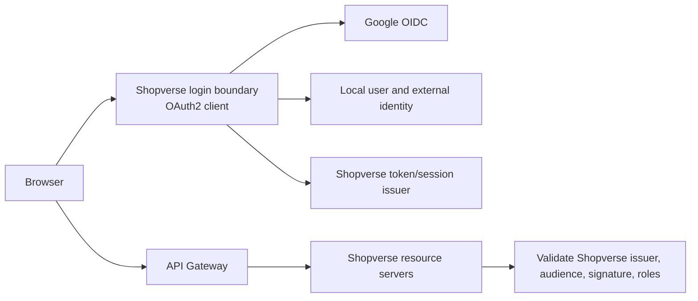

# Google OAuth Client And Session Login

<DocLabels items={[{label: 'Advanced', tone: 'advanced'}, {label: 'Shopverse', tone: 'shopverse'}, {label: 'Production', tone: 'production'}]} />

## Recommended Shopverse Boundary



Google authenticates the external identity. Shopverse owns account status,
roles, tenant membership, authorization, sessions, and API tokens. Internal
services should normally trust Shopverse tokens, not Google access tokens.

## 1. Create The Google Client

In Google Cloud:

1. Create or select a project.
2. Configure the Google Auth Platform branding/consent information.
3. Select the intended audience. During development, add permitted test users.
4. Create an OAuth client of type **Web application**.
5. Add exact authorized redirect URIs:

```text
http://localhost:8080/login/oauth2/code/google
https://auth.shopverse.example/login/oauth2/code/google
```

Production redirect URIs must use HTTPS; localhost is the development exception.
Scheme, host, port, path, and trailing slash must match. A mismatch produces
`redirect_uri_mismatch`.

Keep separate OAuth clients/projects for local, staging, and production where
practical. Never commit the client secret or downloaded credential JSON.

For sign-in only, request the smallest useful scopes:

```text
openid profile email
```

Do not request Gmail, Drive, Calendar, or other Google API scopes merely to log
the user in. Sensitive or restricted scopes introduce additional consent,
verification, data-handling, and security obligations.

## 2. Add The OAuth2 Client Dependency

Gradle:

```groovy
dependencies {
    implementation 'org.springframework.boot:spring-boot-starter-security'
    implementation 'org.springframework.boot:spring-boot-starter-oauth2-client'
}
```

`spring-boot-starter-oauth2-resource-server` validates bearer tokens sent to an
API. It does not implement the browser login redirect/callback. An application
that performs Google login and also exposes bearer-token APIs may need both.

## 3. Configure Client Registration

`application.yml`:

```yaml
spring:
  security:
    oauth2:
      client:
        registration:
          google:
            client-id: ${GOOGLE_CLIENT_ID}
            client-secret: ${GOOGLE_CLIENT_SECRET}
            scope:
              - openid
              - profile
              - email
```

Because the registration ID is `google`, Spring Boot supplies Google's standard
provider endpoints. Explicit discovery configuration can instead use the issuer
when required by the deployed Spring Boot version.

Local environment variables:

```powershell
$env:GOOGLE_CLIENT_ID = "your-client-id.apps.googleusercontent.com"
$env:GOOGLE_CLIENT_SECRET = "<set-in-secret-manager>"
```

Use the deployment platform's secret manager in production. Avoid placing
secrets in `.env` files that may be committed, container images, frontend code,
URLs, logs, or build output.

## 4A. Simplest Server-Session Login

Use this model when Spring serves the web application or acts as a BFF. Browser
authentication is represented by a secure server session.

```java
package io.shopverse.auth.config;

@Configuration
class GoogleLoginSecurityConfig {

    @Bean
    SecurityFilterChain webSecurity(HttpSecurity http) throws Exception {
        return http
                .authorizeHttpRequests(authorize -> authorize
                        .requestMatchers("/", "/error", "/assets/**").permitAll()
                        .requestMatchers("/oauth2/**", "/login/**").permitAll()
                        .anyRequest().authenticated())
                .oauth2Login(withDefaults())
                .logout(logout -> logout.logoutSuccessUrl("/"))
                .build();
    }
}
```

Start login by navigating—not AJAX posting—to:

```html
<a href="/oauth2/authorization/google">Sign in with Google</a>
```

Spring Security then owns:

- the authorization request and `state` correlation;
- redirect to Google;
- callback at `/login/oauth2/code/google`;
- code exchange and ID-token verification;
- creation of an authenticated `OidcUser` and HTTP session.

Do not disable CSRF globally for this cookie-authenticated design. CSRF remains
necessary for state-changing application requests after login.

## Read The Authenticated User

```java
package io.shopverse.auth.web;

@RestController
class CurrentUserController {

    @GetMapping("/api/me")
    Map<String, Object> me(@AuthenticationPrincipal OidcUser user) {
        return Map.of(
                "subject", user.getSubject(),
                "name", user.getFullName(),
                "email", user.getEmail(),
                "emailVerified", Boolean.TRUE.equals(user.getEmailVerified()));
    }
}
```

Do not return the full ID token, access token, or every provider claim to the
browser. Return only the local profile fields the UI needs.

## Recommended Next

Return to [Google Authentication With Spring](./GOOGLE-AUTHENTICATION-SPRING.md) to select the next focused guide.


## Official References

- [Spring Security reference](https://docs.spring.io/spring-security/reference/)
- [OAuth 2.0 Security Best Current Practice](https://www.rfc-editor.org/rfc/rfc9700)
