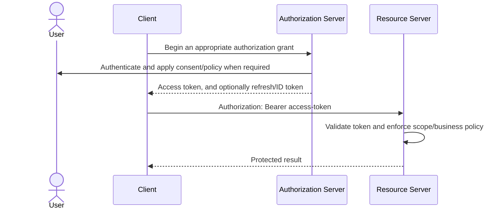

# OAuth2 Fundamentals

OAuth2 is an authorization framework for delegated access. It lets a client
obtain limited access to a protected API without receiving the resource owner's
password. The authorization server governs how tokens are issued; the resource
server decides whether a presented token permits an operation.

OAuth2 is not a token format and is not, by itself, a user-authentication
protocol. JWT is one possible access-token format. OpenID Connect (OIDC) adds an
identity layer for login.

## The Problem OAuth2 Solves

Without delegation, a calendar application might ask for a user's email-provider
password. That gives the application excessive authority, makes revocation
difficult, and exposes a reusable credential.

OAuth2 replaces password sharing with bounded authorization:

- the user authenticates only to the authorization server;
- the client receives a token instead of the password;
- scopes and audience restrict where and how the token can be used;
- expiry limits the lifetime of stolen access;
- consent, policy, and revocation remain under the authorization server's control.

OAuth2 is useful even when no user participates. Client Credentials lets a
workload obtain a token representing itself for machine-to-machine access.

## Actors

| Actor | Responsibility | Shopverse-style example |
|---|---|---|
| Resource owner | Can grant access to protected data | customer |
| Client | Requests and uses an access token | Angular SPA, BFF, or Order Service |
| Authorization server | Authenticates, collects consent/policy decisions, and issues tokens | Keycloak or Spring Authorization Server |
| Resource server | Validates tokens and protects APIs | Order or Payment Service |

The same application can play more than one role. A backend can be a resource
server for incoming requests and an OAuth2 client when calling another API.

## Basic Delegation Flow



The grant controls **how the client obtains a token**. It does not decide every
business authorization rule. The resource service must still enforce ownership,
tenant, amount, state-transition, and other domain constraints.

## OAuth2, OIDC, And JWT

| Concept | What it defines | Can exist independently? |
|---|---|---|
| OAuth2 | Delegated authorization and token acquisition | Yes; tokens can be opaque |
| OIDC | Authentication and identity claims layered on OAuth2 | Uses OAuth2 flows |
| JWT | A signed or encrypted compact claims format | Yes; it need not be an OAuth2 token |

An OAuth2 authorization server may issue:

- a self-contained JWT access token validated locally by the API;
- an opaque reference token validated through introspection;
- an OIDC ID Token for the client to establish the authenticated user session.

An ID Token is for the client. It must not be used as an access token to call an
API. The API accepts the access token intended for its audience.

## Token Types And Ownership

| Token | Consumer | Purpose | Typical property |
|---|---|---|---|
| Authorization code | Client token endpoint | One-time input to obtain tokens | short-lived and bound with PKCE |
| Access token | Resource server | Authorize API access | short-lived, audience and scopes |
| Refresh token | Authorization server | Continue an existing grant | longer-lived, rotated and reuse-detected |
| ID Token | OIDC client | Describe the authentication event and subject | validated by the client |

Bearer means possession is enough to use a token. Protect bearer tokens with
TLS, minimal storage, log redaction, short lifetimes, narrow audience, and safe
browser architecture. Sender-constrained approaches such as mTLS or DPoP can be
considered for higher-risk environments.

## Scopes, Roles, And Business Permissions

- **Scopes** express authority delegated to a client for an API, such as
  `orders.read` or `payments.execute`.
- **Roles** group responsibilities such as `SUPPORT_AGENT`.
- **Permissions** represent domain actions such as `ORDER_CANCEL`.
- **Policies** combine identity, resource, tenant, ownership, amount, and context.

Do not turn every database permission into an OAuth2 scope. Keep protocol scopes
stable and meaningful to clients; enforce fine-grained domain rules inside the
owning service or a governed policy-decision system. See
[Distributed Authorization At Permission Scale](../spring-security/DISTRIBUTED-AUTHORIZATION-PERMISSION-SCALE.md).

## OAuth2 In Distributed Systems

```text
User-facing login:
Client -> Authorization Code + PKCE/OIDC -> access token -> Gateway/API

Machine operation:
Order Service -> Client Credentials -> service access token -> Payment API

Delegated downstream call:
Gateway/Service -> validated user token or governed Token Exchange -> target API
```

The gateway can reject invalid traffic early, but every independently reachable
resource service validates the token and enforces its own authorization. Internal
routing is not proof of trust. Audience validation prevents a token issued for
one API from becoming a universal internal credential.

JWT validation reduces per-request calls to the authorization server, but it
also makes claims stale until token expiry or another revocation/version control
takes effect. Opaque-token introspection provides a more current centralized
decision at the cost of network availability and latency.

## Benefits And Costs

| Benefit | Associated cost |
|---|---|
| No password sharing with clients | More protocol and redirect complexity |
| Short-lived, scoped, audience-bound access | Token lifecycle and key management |
| Central client and consent policy | Authorization-server availability matters during token acquisition |
| Standard federation and service identity | Misconfiguration can create broad trust |
| Local JWT verification | Revocation and permission changes are not immediate |
| Opaque introspection | Adds a runtime network dependency |

OAuth2 does not automatically provide least privilege, secure token storage,
business authorization, logout, or audit. Those are architectural controls built
around the framework.

## Choosing A Grant

| Context | Preferred choice |
|---|---|
| Browser or mobile user login | Authorization Code with PKCE, normally with OIDC |
| Server-rendered web app/BFF | Authorization Code; PKCE is still useful |
| Service with no user | Client Credentials |
| TV, CLI, or limited-input device | Device Authorization |
| Continue an existing session | Refresh Token with rotation |
| Narrow a user/service token for another API | Token Exchange under explicit policy |

Do not use Implicit or Resource Owner Password for new applications. PKCE proves
that the client redeeming a code is the client that initiated the flow; `state`
still protects the browser authorization response from request-forgery and mix-up
risks. OIDC `nonce` binds the ID Token to the authentication request.

The detailed selection matrix is in
[OAuth2 OIDC And Token Flows](../spring-security/OAUTH2-OIDC-FLOWS.md).

## Production Security Checklist

- Use TLS at every browser, gateway, token, and service boundary.
- Register exact redirect URIs; do not use production wildcards.
- Use Authorization Code with PKCE for public clients and never ship a client
  secret in an SPA or mobile binary.
- Validate signature or introspection result, issuer, audience, timestamps,
  authorized party/client, token type, and required scopes.
- Keep access tokens short-lived; rotate refresh tokens and detect reuse.
- Pin allowed algorithms and rotate signing keys through JWKS overlap.
- Never log authorization codes, access tokens, refresh tokens, client secrets,
  or sensitive claims.
- Treat gateway authentication as defense in depth, not a replacement for
  resource-server validation.
- Test denial paths: wrong issuer/audience, expired token, missing scope, stale
  role, disabled client, key rotation, and authorization-server outage.

## Interview Checks

**Is OAuth2 authentication?**

No. OAuth2 is delegated authorization. OIDC adds authentication and an ID Token.

**Can OAuth2 work without JWT?**

Yes. An access token can be opaque and introspected.

**Can JWT work without OAuth2?**

Yes. JWT is a general claims format, although custom token protocols must still
define issuance, validation, revocation, and threat controls.

**Why does a resource service validate a token after the gateway did?**

Because the service owns its trust boundary and domain authorization, may be
reachable through another path, and must validate the token's audience.

**Why are Client Credentials and user-token forwarding different?**

Client Credentials represents the workload. A user token represents delegated
user access. Forwarding one when the other is required loses actor context or
grants the wrong authority.

## Related Guides

- [OAuth2 grant types](OAUTH2-GRANT-TYPES.md)
- [OIDC fundamentals](OIDC-FUNDAMENTALS.md)
- [Spring Security OAuth2 flows](../spring-security/OAUTH2-OIDC-FLOWS.md)
- [Keycloak And Spring OAuth2 Implementation](../spring-security/OAUTH2-KEYCLOAK-SPRING-IMPLEMENTATION.md)
- [JWT, JWKS, and resource-server internals](../spring-security/JWT-JWKS-RESOURCE-SERVER.md)

## Official References

- [OAuth 2.0 Security Best Current Practice](https://www.rfc-editor.org/rfc/rfc9700)
- [OAuth 2.0 Authorization Framework](https://www.rfc-editor.org/rfc/rfc6749)
- [OpenID Connect Core](https://openid.net/specs/openid-connect-core-1_0.html)
- [Spring Security OAuth2](https://docs.spring.io/spring-security/reference/servlet/oauth2/index.html)

