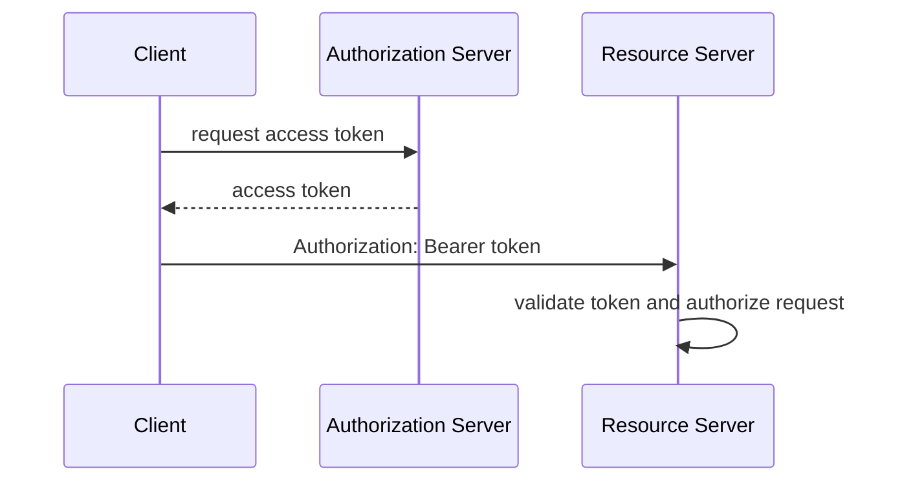

# OAuth2 Fundamentals

OAuth2 is an authorization framework. It defines how a client obtains an
access token and uses it to call a protected resource.

JWT is a token format. OAuth2 is the authorization protocol. OAuth2 access
tokens may be JWTs or opaque reference tokens.

## Actors

| Actor | Responsibility |
|---|---|
| Resource Owner | user or entity that owns protected data |
| Client | application requesting access |
| Authorization Server | authenticates, grants consent, and issues tokens |
| Resource Server | API that validates tokens and protects resources |

## Flow Shape

## Related Guides

- [OAuth2 grant types](OAUTH2-GRANT-TYPES.md)
- [OIDC fundamentals](OIDC-FUNDAMENTALS.md)
- [Spring Security OAuth2 flows](../spring-security/OAUTH2-OIDC-FLOWS.md)

