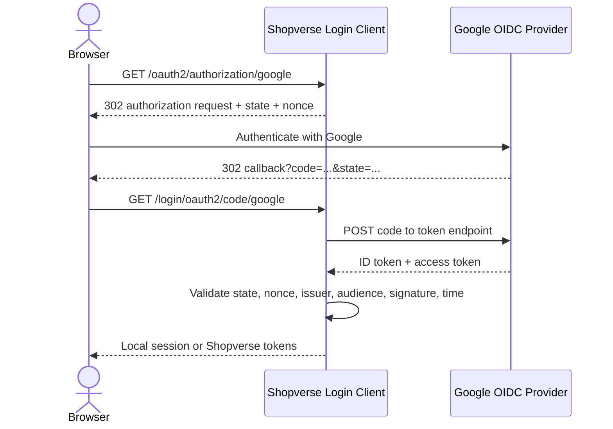

# SSO And OpenID Connect

Single sign-on (SSO) lets a user authenticate with one identity provider and
access multiple relying applications without entering credentials separately
for each one. The applications do not receive the user's provider password.

OpenID Connect (OIDC) is an identity layer on OAuth 2.0. OAuth answers whether a
client may access a resource; OIDC adds a standard way for the client to verify
who authenticated.

## Roles

| Role | OIDC name | Example |
|---|---|---|
| User | End user | Customer signing into Shopverse |
| Identity provider | OpenID Provider (OP) | Google |
| Application requesting login | Relying Party (RP)/OAuth client | Shopverse auth or BFF service |
| Protected API | Resource Server | Order or inventory API |

An application can be both an OIDC client for login and an OAuth resource
server for API requests. These are separate Spring Security capabilities.

## SSO Is A User Experience, Not A Token Type

SSO may be implemented using OIDC, SAML, Kerberos, or another federation
protocol. OIDC is normally the best fit for modern web, mobile, and API-based
applications. SAML remains common for enterprise browser SSO.

```mermaid
sequenceDiagram
    actor User
    participant AppA as Application A
    participant IdP as Identity Provider
    participant AppB as Application B
    User->>AppA: Open protected page
    AppA-->>User: Redirect to IdP
    User->>IdP: Authenticate and consent
    IdP-->>AppA: Authorization response
    AppA->>IdP: Exchange code and validate tokens
    AppA-->>User: Create Application A session
    User->>AppB: Open protected page
    AppB-->>User: Redirect to same IdP
    IdP-->>AppB: Existing IdP session; return authorization response
    AppB-->>User: Create Application B session
```

The IdP session enables SSO. Each application still creates and controls its own
local session or application tokens.

## Authorization Code Login

For a server-side web application:

1. The application creates a random `state` value and OIDC `nonce`.
2. It redirects the browser to the provider's authorization endpoint with
   `client_id`, exact `redirect_uri`, `scope=openid profile email`, `state`, and
   `nonce`.
3. The provider authenticates the user and obtains consent where required.
4. The provider redirects the browser to the registered callback with a short-
   lived authorization code and the original `state`.
5. The application rejects a mismatched `state`, then exchanges the code at the
   token endpoint using its client authentication.
6. The application validates the ID token and creates or links the local user.
7. The application creates its own session or issues its own tokens.



Authorization codes travel through the browser, but token exchange occurs
server to server. Never put a confidential client secret in browser JavaScript
or a mobile application.

## OAuth Tokens Versus Application Session

| Artifact | Audience and purpose | Should Shopverse APIs accept it directly? |
|---|---|---|
| Google ID token | The registered Google client; proves Google authentication | Usually no; consume it at the login boundary |
| Google access token | Google APIs requested by the client | No; it is for Google resource servers |
| Shopverse access token | Shopverse APIs and authorization claims | Yes, after normal issuer/audience/signature validation |
| Shopverse refresh token | Shopverse token endpoint/session rotation | Only at the designated refresh endpoint |
| Server session cookie | The server/BFF session | Only at the owning web boundary |

Do not forward a Google access token through internal microservices as the
application's authorization model. Map the external identity to a local account,
roles, tenant, status, and policy.

## ID Token Validation

The client library should validate at least:

- signature against the provider's current keys;
- exact trusted issuer (`iss`);
- client ID in audience (`aud`) and authorized-party rules where applicable;
- expiration and acceptable clock skew;
- `nonce` when it was sent in the request;
- authentication context or time when policy requires it.

Claims describe identity evidence, not local authorization. Never turn an email
domain or a self-asserted profile field into an administrator role without an
explicit controlled policy.

## Stable Account Identity

Use `(issuer, subject)` as the external identity key. OIDC `sub` is the stable
provider-side identifier for that client context. Email can change and should
not be the database primary key.

```text
external_identity
  provider_issuer = https://accounts.google.com
  provider_subject = OIDC sub
  user_id = local Shopverse UUID
  email_at_link_time = normalized email
  created_at, last_login_at

unique(provider_issuer, provider_subject)
```

Email may help a carefully designed account-linking flow, but automatic linking
can enable account takeover when verification state, tenant policy, or existing
credentials are not handled correctly. Require reauthentication for sensitive
link/unlink actions.

## Session And Logout

Local logout terminates the application's session or refresh-token family. It
does not necessarily terminate the provider's browser session, so the next login
may complete without a password. OIDC also defines provider-initiated and
RP-initiated logout capabilities, but provider support and semantics vary.

For browser sessions:

- use `Secure`, `HttpOnly`, and appropriate `SameSite` cookies;
- rotate the session after authentication;
- keep CSRF protection for cookie-authenticated state-changing requests;
- expire local sessions and revoke refresh-token families on risk events;
- provide recent-authentication checks for payments, password changes, and
  identity linking.

## Threat Checklist

| Threat | Control |
|---|---|
| Login CSRF/callback injection | Cryptographically random `state`, bound to initiating browser |
| Token replay | `nonce`, TLS, short lifetimes, correct audience, secure storage |
| Authorization-code interception | Exact redirect URI; PKCE for public clients and useful defense in depth |
| Open redirect after login | Allow-list local destinations; never trust an arbitrary return URL |
| Account takeover through linking | Match `(iss, sub)`; require verified evidence and reauthentication |
| Token substitution | Validate token type, issuer, audience, signature, and authorized party |
| Secret leak | Server-side secret store, rotation, no source control or browser delivery |
| Excess provider access | Request only `openid profile email` unless a Google API is genuinely required |

## Related Guides

- [OAuth2 Fundamentals](./OAUTH2-FUNDAMENTALS.md)
- [OIDC Fundamentals](./OIDC-FUNDAMENTALS.md)
- [Google Authentication With Spring Boot](./GOOGLE-AUTHENTICATION-SPRING.md)
- [Token Lifecycle](./TOKEN-LIFECYCLE.md)
- [Spring Security OAuth2 And OIDC Flows](../spring-security/OAUTH2-OIDC-FLOWS.md)

## Official References

- [OpenID Connect Core 1.0](https://openid.net/specs/openid-connect-core-1_0.html)
- [Spring Security OAuth2 Login](https://docs.spring.io/spring-security/reference/servlet/oauth2/login/)
- [Google OpenID Connect](https://developers.google.com/identity/openid-connect/openid-connect)
