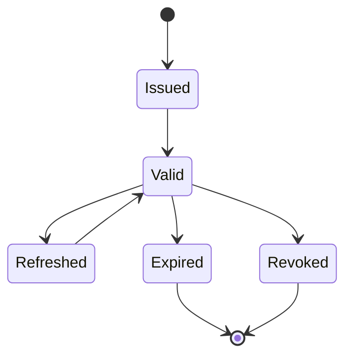

# Token Lifecycle

Token lifecycle covers issuance, validation, renewal, revocation, rotation, and
expiry.

## Access Tokens

- short-lived;
- sent to APIs;
- validated by resource services;
- should contain only necessary claims.

## Refresh Tokens

- longer-lived than access tokens;
- stored more securely;
- rotated on use;
- revoked on logout, compromise, or suspicious reuse.

## Operational Signals

Monitor:

- invalid signature failures;
- expired token counts;
- issuer/audience mismatches;
- refresh token reuse;
- denied authorization decisions;
- unusual token volume per client.

## Related Guides

- [JWT best practices](../jwt/JWT-BEST-PRACTICES.md)
- [OAuth2 grant types](OAUTH2-GRANT-TYPES.md)

## Rotation And Reuse Detection

On refresh, issue a new refresh token and invalidate or supersede the old member
of that token family atomically. Reuse of an already-rotated token can indicate
theft: revoke the affected family, require reauthentication, record a security
event, and notify or investigate according to policy. Hash stored opaque refresh
tokens so a database read does not immediately expose bearer credentials.

Key rotation needs overlap. Publish the new verification key, begin signing new
tokens with it, retain the previous public key through the longest accepted token
lifetime and clock-skew window, then retire it. Emergency compromise response can
shorten this sequence but may force sessions to reauthenticate.

## Failure Modes

- refresh races create multiple valid descendants unless family state is atomic;
- long access-token lifetime delays revocation and role/permission changes;
- accepting an incorrect issuer, audience, algorithm, or token type crosses trust boundaries;
- logging bearer tokens turns logs into credential stores;
- relying only on local logout cannot revoke a token already copied elsewhere.

## Official References

- [RFC 9700 — OAuth 2.0 Security Best Current Practice](https://www.rfc-editor.org/rfc/rfc9700)
- [RFC 7009 — OAuth 2.0 Token Revocation](https://www.rfc-editor.org/rfc/rfc7009)
- [OpenID Connect Core](https://openid.net/specs/openid-connect-core-1_0.html)

## Recommended Next Page

Continue with [JWT Best Practices](../jwt/JWT-BEST-PRACTICES.md).
