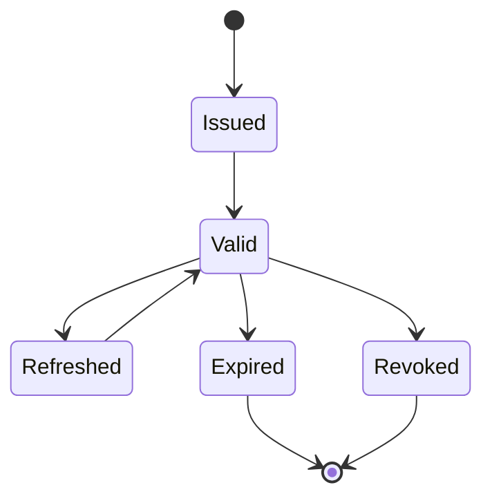

# Token Lifecycle

Token lifecycle covers issuance, validation, renewal, revocation, rotation, and
expiry.

## Access Tokens

- short-lived;
- sent to APIs;
- validated by resource services;
- should contain only necessary claims.

## Refresh Tokens

- longer-lived than access tokens;
- stored more securely;
- rotated on use;
- revoked on logout, compromise, or suspicious reuse.

## Operational Signals

Monitor:

- invalid signature failures;
- expired token counts;
- issuer/audience mismatches;
- refresh token reuse;
- denied authorization decisions;
- unusual token volume per client.

## Related Guides

- [JWT best practices](../jwt/JWT-BEST-PRACTICES.md)
- [OAuth2 grant types](OAUTH2-GRANT-TYPES.md)

