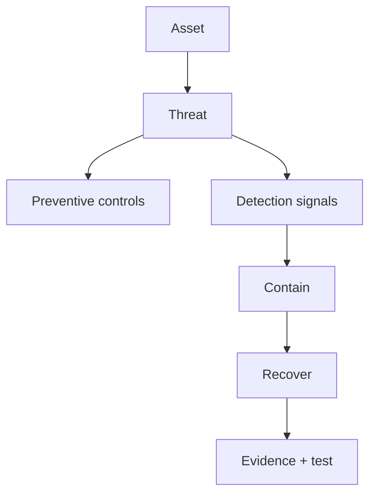

# Security Architect Path

<DocLabels items={[
  {label: 'Security architecture', tone: 'advanced'},
  {label: 'Defense in depth', tone: 'production'},
  {label: 'Evidence and ownership', tone: 'shopverse'},
]} />

| Layer | Decision | Evidence |
|---|---|---|
| threat | assets, actors, abuse cases, boundaries | reviewed threat model |
| identity | user, client, workload, operator | issuer/client inventory |
| authorization | route, method, object, data policy | denied-path tests and audit |
| credential | issuance, storage, rotation, revocation | rotation drill and access log |
| data | classification, minimization, retention | field inventory and deletion proof |
| supply chain | source, build and artifact trust | SBOM, provenance, signature policy |
| operations | detection, containment, recovery | runbook exercise and ownership |

## Review Questions

- Can every reachable path authenticate the intended caller type?
- Is object ownership enforced behind every adapter, not only the gateway?
- What happens when issuer, JWKS, policy, or secret systems are unavailable?
- Which credential can be revoked, and how fast?
- Can operators investigate without exposing credentials or personal data?

**What does zero trust change inside a microservice platform?**

<ExpandableAnswer title="Expand architect answer">

Network location stops being authorization. Every workload receives strong,
rotatable identity; each request is authenticated and authorized for resource and
context; access is least privilege; and compromise is contained with segmentation,
short-lived credentials and observable decisions.

</ExpandableAnswer>

## Official References

- [NIST Zero Trust Architecture](https://csrc.nist.gov/publications/detail/sp/800-207/final)
- [OWASP Threat Modeling](https://owasp.org/www-community/Threat_Modeling)

## Recommended Next

Design workload boundaries in [Service Identity And Zero Trust](./SERVICE-IDENTITY-ZERO-TRUST.md).
