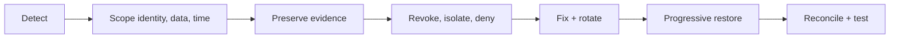

# Security Incident Response Runbook

<DocLabels items={[
  {label: 'Incident response', tone: 'production'},
  {label: 'Credential containment', tone: 'advanced'},
  {label: 'Shopverse runbook', tone: 'shopverse'},
]} />

| Incident | Immediate containment | Recovery proof |
|---|---|---|
| access-token theft | revoke/deny, protect account, narrow exposure | no accepted use after control SLA |
| signing-key exposure | stop signer, publish new key, rotate issuer access | new tokens work; compromised key rejected |
| authorization bypass | disable route, add service-side deny, preserve traces | wrong-owner and alternate-path tests deny |
| workload leak | revoke identity, isolate workload, rotate access | clean workload has least-privilege identity |
| secret in repository | revoke first, investigate history and use | scanners clean; dependants rotated |

## First Thirty Minutes

Assign incident command and security lead; record an immutable timeline; identify
credential, issuer, audience, subject and reachable data; preserve audit/deployment/key
events; contain through the narrowest reliable control; notify required owners;
avoid deleting evidence or publishing sensitive indicators broadly.

<DocCallout type="production" title="Rotation needs rejection evidence">

Prove old credentials fail at every reachable verifier, caches refreshed, new
issuance works, dependent services recovered, and ambiguous actions reconciled.

</DocCallout>

**A JWT private signing key leaked. Is shortening expiry enough?**

<ExpandableAnswer title="Expand architect answer">

No. An attacker can mint tokens until the compromised public key is no longer
trusted. Stop signing, rotate, remove or revoke the old key under emergency policy,
investigate forged use, and manage availability impact for legitimate old tokens.

</ExpandableAnswer>

## Official References

- [NIST incident response guidance](https://csrc.nist.gov/pubs/sp/800/61/r2/final)

## Recommended Next

Practise decisions in [Security Interview Workbook](./SECURITY-INTERVIEW-WORKBOOK.md).
