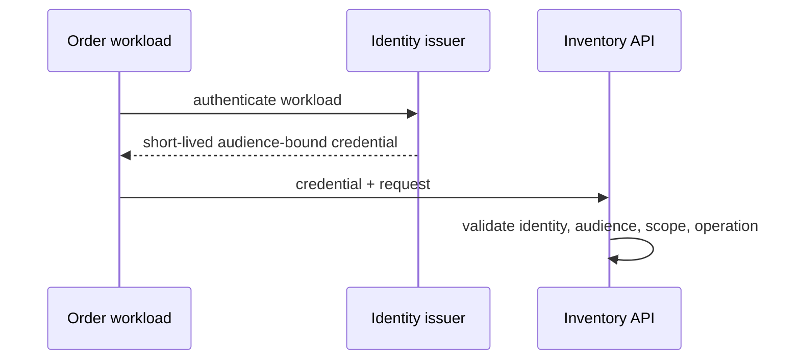

# Service Identity And Zero-Trust Boundaries

<DocLabels items={[
  {label: 'Workload identity', tone: 'advanced'},
  {label: 'Zero trust', tone: 'production'},
  {label: 'Service authorization', tone: 'shopverse'},
]} />

| Mechanism | Strong fit | Main caution |
|---|---|---|
| OAuth2 Client Credentials | API scopes and centralized issuance | bearer theft and audience control |
| mTLS | mutual channel/workload authentication | lifecycle and application policy remain |
| signed service JWT | portable short-lived claims | key custody and replay policy |
| platform workload identity | no static pod/job secret | platform coupling and federation |

## Prevent The Confused Deputy

Do not treat “Order called me” as permission to act for any customer. Inventory
must distinguish workload from delegated user context, authorize Order’s operations,
and validate trusted delegation claims when user identity changes policy.

## Migration

Inventory callers and static credentials; introduce one workload issuer; issue
short-lived audience-bound identity; enforce in report-only mode; add denied and
rotation tests; then remove static secrets and network-location exceptions.

## Authorization Contract

For every service operation record the accepted workload identities, audience,
required service scope, delegated-user requirements, tenant/resource rule, maximum
credential age, and audit fields. Keep workload and user decisions separate: the
Order workload may call `reserve`, while the delegated customer determines which
cart/order may be reserved. Administrative workloads need distinct credentials
and stronger audit—not a shared broad `internal` role.

## Failure And Rotation Tests

| Test | Expected result |
|---|---|
| valid identity, wrong audience | reject before business code |
| expired or not-yet-valid credential | reject and emit safe reason metric |
| valid workload, missing operation scope | deny and audit policy decision |
| wrong tenant delegation | deny object-level operation |
| issuer temporarily unavailable | use validated cache only within policy; fail closed afterward |
| certificate/key rotation overlap | old and new accepted only for planned window |
| revoked workload | rejected on every direct and gateway path within the revocation SLA |

<DocCallout type="production" title="Identity control planes need an availability design">

Use short-lived credentials, bounded issuer/JWKS calls, safe cache lifetimes and
rotation overlap. Do not respond to a control-plane outage by accepting unsigned,
unknown, wrong-audience, or expired identity.

</DocCallout>

**Does mTLS provide authorization?**

<ExpandableAnswer title="Expand architect answer">

mTLS authenticates peers and protects the channel. The receiver still decides
whether that workload may perform this operation for this tenant/resource. Map
identity to explicit policy and maintain rotation, revocation and observability.

</ExpandableAnswer>

**Should an external user access token be forwarded through every service?**

<ExpandableAnswer title="Expand architect answer">

Not automatically. Forwarding preserves user context but widens token audience and
exposure. Prefer audience-restricted token exchange or a trusted delegation contract
when downstream policy needs the user; otherwise authenticate the calling workload
and pass only minimal, integrity-protected business context.

</ExpandableAnswer>

## Official References

- [SPIFFE overview](https://spiffe.io/docs/latest/spiffe-about/overview/)
- [OAuth 2.0 Security BCP](https://www.rfc-editor.org/rfc/rfc9700)

## Recommended Next

Prepare containment in [Security Incident Response](./SECURITY-INCIDENT-RESPONSE.md).
