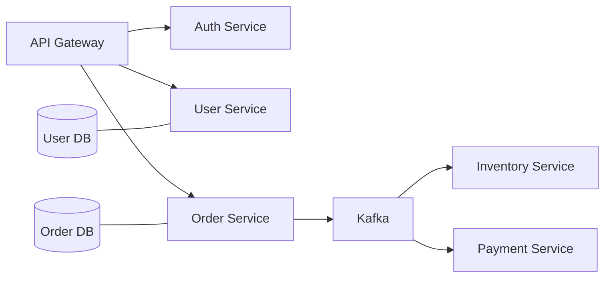

# Microservices Security Principles

In microservices, the gateway is useful but not sufficient. Every service
boundary is a security boundary because traffic crosses process, network,
database, or message-broker ownership.

## Principles

| Principle | Production meaning |
|---|---|
| Zero trust between services | do not assume internal traffic is automatically trusted |
| Authenticate service identity | use client credentials, mTLS, signed service tokens, or workload identity |
| Authorize at the service | each service checks whether the caller can perform the operation |
| Keep data ownership local | one service should not bypass another service's authorization by reading its database |
| Validate tokens locally | resource services validate signature, expiry, issuer, and audience |
| Propagate correlation, not trust | correlation IDs help debugging; they do not prove identity |
| Narrow service credentials | a compromised service credential should have limited permissions |
| Protect async consumers | Kafka consumers need idempotency, validation, and authorization of event sources |

## Shopverse Mapping

Shopverse demonstrates:

- Gateway routing and correlation propagation;
- JWT validation in protected services;
- method-level authorization for user/order ownership;
- SAGA events with correlation IDs and business keys;
- service-owned databases.

## Common Mistakes

| Mistake | Risk |
|---|---|
| only securing the gateway | internal service endpoint can be abused |
| sharing one database user across all services | one compromise reads or writes all data |
| trusting caller-provided roles | privilege escalation |
| logging bearer tokens | token theft from logs |
| using long-lived service secrets | harder incident containment |

## Related Guides

- [Service-to-service security](SERVICE-TO-SERVICE-SECURITY.md)
- [JWT claims roles and scopes](../jwt/JWT-CLAIMS-ROLES-SCOPES.md)
- [Shopverse security implementation](../JWT-OAUTH2-SPRING-SECURITY.md)

