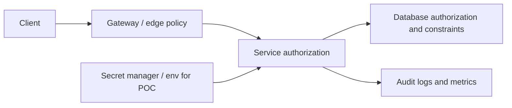

# Security Principles

<DocLabels items={[
  {label: 'Security foundation', tone: 'foundation'},
  {label: 'Defense in depth', tone: 'production'},
  {label: 'Trust boundaries', tone: 'advanced'},
]} />

Security design starts with boundaries, least privilege, and failure behavior.
Tools such as JWT, OAuth2, Spring Security, gateways, mTLS, and secret stores
are implementation choices that support these principles.

## Core Principles

| Principle | Meaning |
|---|---|
| Least privilege | give users, services, and jobs only the permissions they need |
| Defense in depth | do not rely on one control such as only the API Gateway |
| Secure by default | default deny; explicitly allow trusted operations |
| Fail closed | when security state is unclear, reject the request |
| Explicit trust boundaries | know where identity, network, and data ownership change |
| Strong identity | authenticate users, services, jobs, and automation distinctly |
| Separation of duties | separate admin, customer, service, and operational privileges |
| Auditability | record security-relevant events without leaking secrets |
| Key rotation | assume keys and credentials will eventually need replacement |
| Minimized blast radius | one compromised component should not compromise everything |

## Security Architecture Flow

## Practical Checklist

- Validate input at API boundaries.
- Authenticate every caller.
- Authorize every protected operation.
- Prefer short-lived access tokens.
- Keep secrets out of Git.
- Use parameterized SQL and ORM binding.
- Rate-limit abusive callers.
- Log security decisions without logging credentials.
- Monitor failed logins, denied requests, token errors, and suspicious traffic.
- Test allowed and denied authorization cases.

## Related Guides

- [Microservices security principles](MICROSERVICES-SECURITY-PRINCIPLES.md)
- [API security principles](API-SECURITY-PRINCIPLES.md)
- [Spring Security](../SPRING-SECURITY-GENERIC.md)

## Interview Check

**Why is “internal traffic” not a security control?**

<ExpandableAnswer title="Expand answer">

Networks are shared, misconfigured, and reachable after workload compromise. Use
network policy to reduce paths, but authenticate workload identity and authorize
the operation at the receiving service. Defense in depth assumes one control fails.

</ExpandableAnswer>

## Recommended Next

Continue with the [Security Architect Path](../platform/SECURITY-ARCHITECT-PATH.md).
