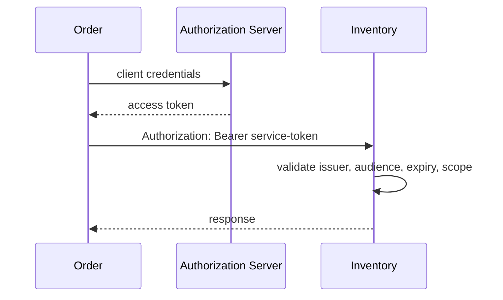

# Service-To-Service Security

Service-to-service security answers two questions:

1. Which service is calling?
2. What is that service allowed to do?

## Common Options

| Option | Use case | Notes |
|---|---|---|
| mTLS | strong workload identity in Kubernetes/service mesh | validates both client and server certificates |
| OAuth2 client credentials | machine-to-machine API access | token represents the client service |
| signed internal JWT | lightweight service identity | validate issuer, audience, expiry, and signature |
| API key | simple partner/internal access | rotate frequently; do not use as the only control for high-risk APIs |
| network policy | restrict reachable services | defense in depth, not authentication |

## Request Flow

## Design Rules

- Use different identities for users and services.
- Do not forward a user token to a downstream service unless that service must
  act on behalf of the user and validates it correctly.
- Prefer service tokens with narrow scopes for backend automation.
- Validate `aud` so a token meant for one service is not accepted everywhere.
- Rotate keys and credentials.
- Log caller service identity and correlation ID.

## Related Guides

- [OAuth2 grant types](../oauth/OAUTH2-GRANT-TYPES.md)
- [JWT best practices](../jwt/JWT-BEST-PRACTICES.md)
- [Spring Cloud OpenFeign](../../spring/SPRING-OPENFEIGN.md)

