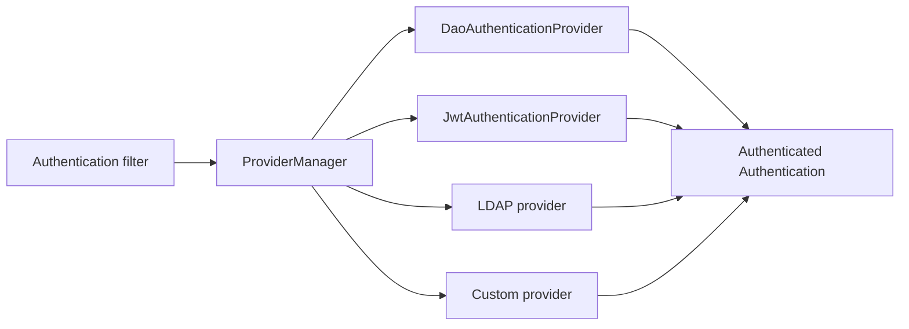
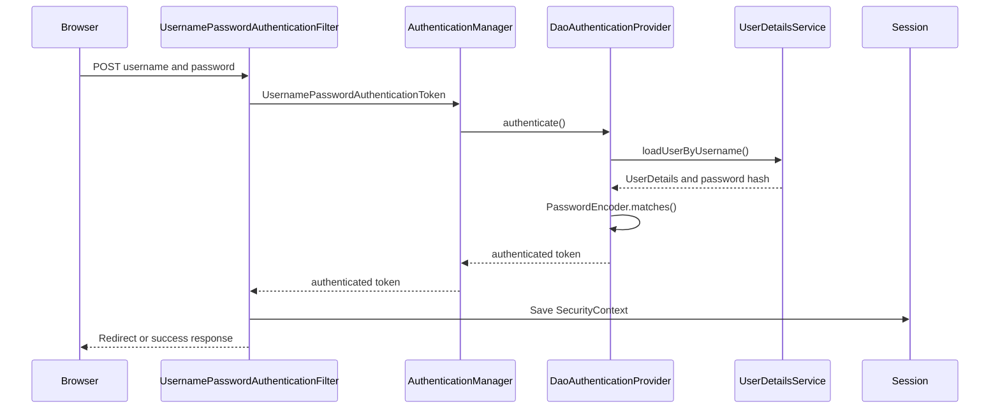
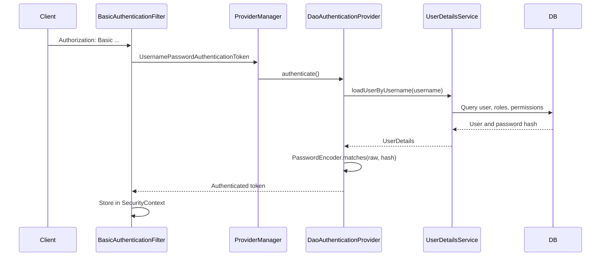

---
title: Spring Security Authentication Basics
---

# Spring Security Authentication Basics

Authentication, authorization, dependencies, authentication managers, providers, form login, HTTP Basic, database-backed users, and UserDetails.

Back to [Spring Security](../SPRING-SECURITY-GENERIC.md).

For the complete call-by-call lifecycle, password matching internals, default
wiring, in-memory users, and SecurityContext persistence, continue to
[Username Password Authentication Internals](AUTHENTICATION-INTERNALS.md).

## Authentication And Authorization

Authentication answers:

```text
Who is the caller?
```

Authorization answers:

```text
What is the authenticated caller allowed to do?
```

Examples:

- username/password authenticates a user;
- a JWT authenticates the token subject;
- `USER_CREATE` authorizes user creation;
- an ownership rule authorizes a customer to read only their own order.


## Core Dependencies

Basic Spring Security:

```gradle
implementation 'org.springframework.boot:spring-boot-starter-security'
```

Servlet applications:

```gradle
implementation 'org.springframework.boot:spring-boot-starter-web'
```

Reactive applications:

```gradle
implementation 'org.springframework.boot:spring-boot-starter-webflux'
```

Database-backed users:

```gradle
implementation 'org.springframework.boot:spring-boot-starter-data-jpa'
runtimeOnly 'com.mysql:mysql-connector-j'
```

JWT Resource Server:

```gradle
implementation 'org.springframework.boot:spring-boot-starter-oauth2-resource-server'
implementation 'org.springframework.security:spring-security-oauth2-jose'
```

Method-security testing:

```gradle
testImplementation 'org.springframework.security:spring-security-test'
```

OAuth2 client login, such as Google or an enterprise OIDC provider, uses:

```gradle
implementation 'org.springframework.boot:spring-boot-starter-oauth2-client'
```

A standards-based token issuer should use Spring Authorization Server rather
than building all OAuth2 protocol endpoints manually. Shopverse does not
currently use Spring Authorization Server.


## AuthenticationManager And Providers



An authentication filter creates an unauthenticated `Authentication` token
and passes it to `AuthenticationManager`.

`ProviderManager` checks its `AuthenticationProvider` instances. A provider
declares whether it supports that token type and either:

- returns an authenticated result;
- throws an authentication exception;
- returns `null` so another provider can try.


## Common Authentication Providers

### DAO/Database Provider

`DaoAuthenticationProvider` uses `UserDetailsService` and `PasswordEncoder`.
It supports username/password authentication backed by a database or another
user store.

### JWT Provider

`JwtAuthenticationProvider` uses `JwtDecoder` to verify and validate a bearer
JWT, then converts claims into an authenticated principal and authorities.

### In-Memory Provider

An `InMemoryUserDetailsManager` is useful for examples, tests, and limited
administration tools. It is not a scalable account database.

### LDAP Provider

Authenticates against LDAP or Active Directory and maps directory groups to
authorities.

### OAuth2/OIDC Login Provider

Delegates user login to an external Authorization Server or identity provider.
OIDC adds identity claims and an ID Token on top of OAuth2.

### Custom Provider

A custom `AuthenticationProvider` can validate an API key, hardware
credential, legacy token, or another protocol. Custom credentials require
careful rotation, revocation, audit, and error handling.


## Form Login

Form login is normally session-based:



Configuration:

```java
http
    .authorizeHttpRequests(auth -> auth
        .requestMatchers("/login", "/css/**").permitAll()
        .anyRequest().authenticated())
    .formLogin(Customizer.withDefaults());
```

Because browsers automatically send session cookies, CSRF protection should
normally remain enabled for state-changing form/session requests.

Shopverse APIs do not use form login.


## HTTP Basic Authentication

HTTP Basic sends:

```http
Authorization: Basic base64(username:password)
```

Base64 is encoding, not encryption. Basic authentication must use HTTPS
outside local development.

Generic flow:



### Shopverse Basic Header Creation

Auth Service creates the header:

```java
private String basicAuth(String username, String password) {
    String credentials = username + ":" + password;
    String encodedCredentials = Base64.getEncoder()
            .encodeToString(credentials.getBytes(StandardCharsets.UTF_8));

    return "Basic " + encodedCredentials;
}
```

It forwards that header through Feign:

```java
@FeignClient(name = "USER-SERVICE")
public interface UserClient {

    @GetMapping("/api/v1/internal/users/authenticated")
    User loadAuthenticatedUser(
            @RequestHeader("Authorization") String authorization
    );
}
```

This is a Shopverse POC design: Auth Service receives the login request and
User Service performs database-backed Basic authentication on one internal
endpoint.

### Shopverse Basic Security Chain

```java
@Bean
@Order(1)
public SecurityFilterChain internalUserSecurityFilterChain(
        HttpSecurity http
) throws Exception {
    http
        .securityMatcher("/api/v1/internal/users/**")
        .csrf(AbstractHttpConfigurer::disable)
        .sessionManagement(session -> session
            .sessionCreationPolicy(SessionCreationPolicy.STATELESS))
        .authorizeHttpRequests(auth -> auth
            .anyRequest().authenticated())
        .httpBasic(Customizer.withDefaults());

    return http.build();
}
```

`securityMatcher(...)` scopes this chain. `@Order(1)` gives it priority over
the general JWT chain. The first matching `SecurityFilterChain` is used.

Stateless mode prevents an authenticated HTTP session from being used for
later requests; credentials are evaluated on each Basic request.


## Database-Backed Authentication

Shopverse adapts its JPA user model to Spring Security through
`UserDetailsService`:

```java
@Service
@RequiredArgsConstructor
public class DatabaseUserDetailsService implements UserDetailsService {

    private final UserRepository userRepository;

    @Override
    @Transactional(readOnly = true)
    public UserDetails loadUserByUsername(String username) {
        User user = userRepository.findByUsername(username)
                .orElseThrow(() ->
                        new UsernameNotFoundException("User not found"));

        return org.springframework.security.core.userdetails.User
                .withUsername(user.getUsername())
                .password(user.getPassword())
                .authorities(toAuthorities(user))
                .accountExpired(!isTrue(user.getAccountNonExpired()))
                .accountLocked(!isTrue(user.getAccountNonLocked()))
                .credentialsExpired(!isTrue(user.getCredentialsNonExpired()))
                .disabled(!isTrue(user.getEnabled())
                        || user.getStatus() != UserStatus.ACTIVE)
                .build();
    }
}
```

The repository uses an entity graph:

```java
@EntityGraph(attributePaths = {"roles", "roles.permissions"})
Optional<User> findByUsername(String username);
```

This loads the user, roles, and permissions for authentication without a
separate lazy query for each relationship.

Spring Boot can assemble a DAO provider when a `UserDetailsService` and
`PasswordEncoder` are available:

```java
@Bean
PasswordEncoder passwordEncoder() {
    return PasswordEncoderFactories.createDelegatingPasswordEncoder();
}
```

`DaoAuthenticationProvider` calls:

```java
passwordEncoder.matches(rawPassword, storedPasswordHash)
```

The raw password should never be stored or logged.


## UserDetails And Authorities

`UserDetails` is a security-facing representation, not necessarily the JPA
entity itself. It contains:

- username;
- password hash;
- enabled/locked/expired state;
- granted authorities.

Shopverse maps both roles and permissions:

```java
authorities.add(new SimpleGrantedAuthority(role.getRoleName()));

role.getPermissions().forEach(permission ->
    authorities.add(
        new SimpleGrantedAuthority(permission.getPermissionName())
    )
);
```

This permits coarse role checks and finer permission checks.


