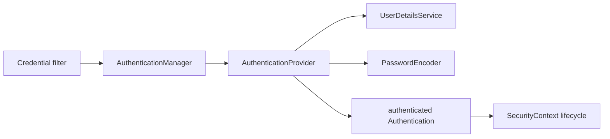

# Username And Password Authentication Internals

<DocLabels items={[
  {label: 'Focused guide', tone: 'advanced'},
  {label: 'Compatibility route', tone: 'foundation'},
  {label: 'Spring Security 7', tone: 'production'},
]} />

The former long authentication-internals page is divided by runtime boundary.

<TopicCards items={[
  {title: 'Password Authentication Runtime', href: './PASSWORD-AUTHENTICATION-RUNTIME', description: 'Providers, user lookup, password matching, wiring and failure stages.', icon: 'security', tags: ['AuthenticationManager', 'DAO']},
  {title: 'SecurityContext Lifecycle', href: './SECURITY-CONTEXT-LIFECYCLE', description: 'Context creation, persistence, cleanup, sessions, stateless requests and async propagation.', icon: 'route', tags: ['Context', 'Threads']},
  {title: 'Servlet Filter Chain', href: './SERVLET-FILTER-CHAIN', description: 'FilterChainProxy selection, exception translation, CSRF and request authorization.', icon: 'layers', tags: ['Filters', 'HTTP']},
]} />

## Compatibility Anchors

### The Main Objects

Moved to [Password Authentication Runtime](./PASSWORD-AUTHENTICATION-RUNTIME.md#runtime-objects).

### UserDetailsService And UserDetails

Moved to [Password Authentication Runtime](./PASSWORD-AUTHENTICATION-RUNTIME.md#user-lookup-boundary).

### DaoAuthenticationProvider Under The Hood

Moved to [Password Authentication Runtime](./PASSWORD-AUTHENTICATION-RUNTIME.md#dao-provider-call-path).

### Passwords Are Encoded Never Decoded

Moved to [Password Authentication Runtime](./PASSWORD-AUTHENTICATION-RUNTIME.md#password-storage-and-upgrade).

### In-Memory Users And Provider Wiring

Moved to [Password Authentication Runtime](./PASSWORD-AUTHENTICATION-RUNTIME.md#configuration-and-wiring).

### Complete HTTP Basic Request Flow

Moved to [Password Authentication Runtime](./PASSWORD-AUTHENTICATION-RUNTIME.md#complete-request-flow).

### SecurityContextHolder Lifecycle

Moved to [SecurityContext Lifecycle](./SECURITY-CONTEXT-LIFECYCLE.md).

## Official References

- [Servlet authentication architecture](https://docs.spring.io/spring-security/reference/servlet/authentication/architecture.html)
- [Authentication persistence](https://docs.spring.io/spring-security/reference/servlet/authentication/persistence.html)

### Session Stateless And Async Requests

Moved to [SecurityContext Lifecycle](./SECURITY-CONTEXT-LIFECYCLE.md#session-stateless-and-async-boundaries).

## Recommended Next

Start with [Password Authentication Runtime](./PASSWORD-AUTHENTICATION-RUNTIME.md).
