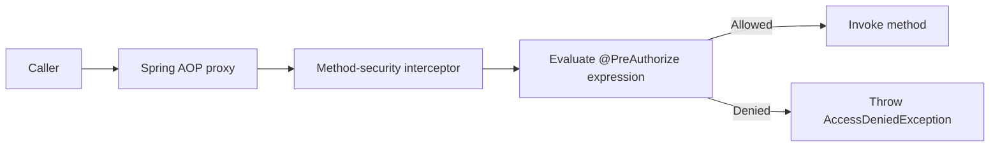

# Spring Security Authorization And Method Security

<DocLabels items={[
  {label: 'Authorization', tone: 'intermediate'},
  {label: 'Method security', tone: 'advanced'},
  {label: 'Object ownership', tone: 'production'},
]} />

Scopes, roles, groups, authorities, JWT authority conversion, RBAC/policy models, method security, URL security, and Shopverse summary.

Back to [Spring Security](../SPRING-SECURITY-GENERIC.md).

## Scope, Role, Group, And Authority

| Concept | Typical meaning |
|---|---|
| Scope | Capability delegated to an OAuth2 client/token |
| Role | Coarse organizational or application responsibility |
| Permission | Fine-grained action |
| Group | Identity-provider or directory membership |
| Authority | Spring Security's normalized authorization value |

Spring Security authorization ultimately evaluates `GrantedAuthority`
objects.

OAuth2 scopes commonly become authorities such as:

```text
SCOPE_orders.read
SCOPE_orders.write
```

Roles often use:

```text
ROLE_ADMIN
ROLE_CUSTOMER
```

Permissions can remain exact:

```text
USER_READ
USER_CREATE
```


## JWT Authority Conversion

Shopverse converts roles and permissions:

```java
jwtConverter.setJwtGrantedAuthoritiesConverter(jwt -> {
    LinkedHashSet<GrantedAuthority> authorities =
            new LinkedHashSet<>();

    String roles = jwt.getClaimAsString("roles");
    if (roles != null) {
        Arrays.stream(roles.split(" "))
                .filter(role -> !role.isBlank())
                .map(SimpleGrantedAuthority::new)
                .forEach(authorities::add);
    }

    var permissions = jwt.getClaimAsStringList("permissions");
    if (permissions != null) {
        permissions.stream()
                .map(SimpleGrantedAuthority::new)
                .forEach(authorities::add);
    }

    return authorities;
});
```

`hasRole("ADMIN")` checks for `ROLE_ADMIN`.

`hasAuthority("USER_CREATE")` checks the exact value.

Claims are not authorization until they are mapped into authorities and a rule
evaluates them.

For the exact Shopverse `BearerTokenResolver` and role-converter code,
including empty-prefix behavior with `hasRole`, see
[Bearer token resolution on public endpoints](../JWT-LOGIN-VALIDATION-AUTHORITIES.md#bearer-token-resolution-on-public-endpoints).


## Authorization Models

### RBAC

Role-Based Access Control assigns permissions through roles:

```text
User -> Role -> Permission
```

Shopverse uses roles and permissions.

### ABAC

Attribute-Based Access Control evaluates attributes such as:

- user department;
- resource owner;
- environment;
- amount;
- time;
- device trust.

### Ownership Authorization

Shopverse combines roles with resource ownership:

```java
@PreAuthorize(
    "hasRole('ADMIN') or " +
    "@orderAuthorization.isOwner(#id, authentication.name)"
)
```

The authorization component performs a targeted query:

```java
public boolean isOwner(Long orderId, String username) {
    return username != null
            && orderRepository
                .existsByIdAndCustomerUsername(orderId, username);
}
```

This prevents an authenticated customer from changing an Order ID or order
number in a URL to read another customer's timeline or Payment record. The
complete Shopverse threat model, controller expressions, authorization beans,
repository queries, request flow, outcomes, and tests are documented in
[Resource Ownership Authorization](../../reliability/problems/runtime/RESOURCE-OWNERSHIP-AUTHORIZATION.md).

### Policy Engines

External policy engines such as Open Policy Agent or Cedar can evaluate
centralized policies using identity, action, resource, and context.

They are useful when policies span many languages or services, but add network,
availability, policy-versioning, and audit complexity. Shopverse does not
currently use an external policy engine.

For role explosion, oversized JWTs, tenant-scoped bindings, authorization
versions, permission caches, invalidation, and policy-decision failure behavior,
see [Distributed Authorization At Permission Scale](DISTRIBUTED-AUTHORIZATION-PERMISSION-SCALE.md).


## Method Security

Enable it:

```java
@EnableMethodSecurity
```

Protect methods:

```java
@PreAuthorize("hasAuthority('USER_CREATE')")
public UserResponse createUser(...) {
    ...
}
```

Internal lifecycle:



The proxy intercepts calls made through the Spring bean reference. A method
calling another protected method on `this` can bypass proxy interception.

Method security is valuable because the rule remains attached to the business
operation even when another controller or scheduled path calls it.


## URL Security Versus Method Security

URL rules protect HTTP routes:

```java
.requestMatchers("/api/v1/roles/**").hasRole("ADMIN")
```

Method rules protect Java operations:

```java
@PreAuthorize("hasAuthority('ADMIN_ACCESS')")
```

Use both:

- URL security provides an early boundary;
- method security protects the operation itself;
- ownership checks often belong at method level.


## Shopverse Security Summary

Implemented:

- custom Auth Service username/password endpoint;
- internal Basic authentication against User Service database users;
- `UserDetailsService` with roles and permissions;
- delegated password encoding;
- RSA JWT signing;
- JWKS publication;
- JWT resource-server validation;
- custom role and permission authority mapping;
- URL and method security;
- customer ownership checks.

Not currently implemented:

- Spring Authorization Server;
- OAuth2 Authorization Code with PKCE;
- Client Credentials service identities;
- OIDC login;
- refresh-token rotation;
- JWT deny list or security version;
- external policy engine;
- explicit JWT audience validation in every resource service. Timestamp and
  issuer validation are already applied by Gateway, Auth, User, Order,
  Inventory, and Payment through `JwtValidators.createDefaultWithIssuer(...)`.

## Interview Check

**Why is `hasRole("ADMIN")` insufficient for customer order access?**

<ExpandableAnswer title="Expand answer">

A role expresses coarse capability, not ownership of a particular order. The
service must also verify that the authenticated subject owns the resource or has
an explicit privileged permission. Enforce it at the business method or policy
boundary so alternate controllers and messaging adapters cannot bypass it.

</ExpandableAnswer>

## Recommended Next

Practise combined policies in [Threat-Modelling And Interview Lab](./THREAT-MODELING-INTERVIEW-LAB.md).


