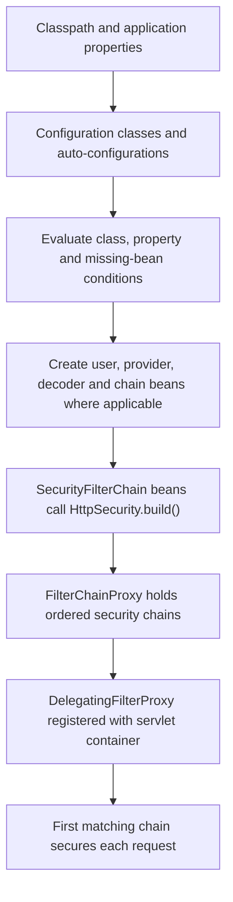

# Spring Boot Security Auto-Configuration Lifecycle

<DocLabels items={[
  {label: 'Auto-configuration', tone: 'advanced'},
  {label: 'Bean lifecycle', tone: 'intermediate'},
  {label: 'Troubleshooting', tone: 'production'},
]} />

Spring Boot supplies sensible security beans only when the application has not
already supplied the relevant boundary. Spring Security then turns those beans
and the `HttpSecurity` DSL into runtime filters.

## Startup Timeline



The servlet container knows about `DelegatingFilterProxy`. That proxy delegates
to Spring Security's `FilterChainProxy`, whose chains and filters were assembled
as Spring beans during application startup.

## What Triggers The Defaults

The exact condition classes evolve between Boot releases, so reason from these
stable rules rather than memorizing internal auto-configuration class names:

| Input | Typical result when no user override exists |
|---|---|
| Security starter on a servlet application | default authenticated web boundary, generated development user and form login or HTTP Basic |
| A `UserDetailsService` and `PasswordEncoder` | DAO-style username/password authentication can be assembled |
| Resource-server starter plus `issuer-uri` | issuer metadata/JWKS-backed `JwtDecoder` and JWT resource-server support |
| Resource-server starter plus `jwk-set-uri` | JWKS-backed `JwtDecoder`; issuer validation still needs an explicit issuer/validator policy |
| User-defined `SecurityFilterChain` | Boot's default web chain backs off; the application owns route and mechanism rules |
| User-defined `JwtDecoder` | decoder auto-configuration backs off; the application owns signature and claim validation |
| User-defined user store or authentication beans | matching default user/authentication configuration backs off |

For a resource server, properties commonly establish trust:

```yaml
spring:
  security:
    oauth2:
      resourceserver:
        jwt:
          issuer-uri: https://identity.example.com
```

Boot makes components available; the resource-server DSL inserts the bearer
authentication machinery into the selected chain. A `JwtDecoder` bean alone
does not define endpoint authorization, and a custom chain must still call the
resource-server DSL when bearer authentication is required.

## Back-Off Is Per Boundary

Defining one security bean does not mean that every security auto-configuration
is disabled. Boot evaluates missing-bean conditions independently.

| Application defines | Application now owns | Boot may still supply |
|---|---|---|
| `SecurityFilterChain` | request matching, mechanisms, session, CSRF/CORS and URL authorization | decoder or user service when their conditions match |
| `JwtDecoder` | accepted algorithms, key source and token validators | other web infrastructure and unrelated authentication support |
| `UserDetailsService` | user lookup and account state | password encoder or web chain, depending on other conditions |
| `AuthenticationProvider` | that provider's authentication contract | compatible providers and filter-chain infrastructure |
| `AuthenticationManager` | provider orchestration exposed through that manager | filter chains unless they are also overridden |

This is why troubleshooting must inspect the actual bean report and filter
chain rather than assuming that custom security disables Boot security.

## Configuration To Runtime Objects

`HttpSecurity` is a builder shared by configurers. Form login, HTTP Basic,
CSRF, authorization and resource-server configuration contribute filters,
shared objects, handlers and providers. `build()` produces one
`SecurityFilterChain`.

At runtime:

1. `DelegatingFilterProxy` enters the Spring-managed security boundary.
2. `FilterChainProxy` selects the first matching `SecurityFilterChain`.
3. Context, exploit-protection and authentication filters run in framework order.
4. An authentication filter submits a token to its `AuthenticationManager`.
5. A compatible `AuthenticationProvider` authenticates it.
6. The authenticated result is stored in the request's `SecurityContext`.
7. Request authorization runs; method authorization may run later through a proxy.
8. The context is saved when configured and cleared from the current thread.

## JWT Resource Server Assembly

With JWT resource-server support, the effective object graph is:

```text
BearerTokenAuthenticationFilter
  -> AuthenticationManager
    -> JwtAuthenticationProvider
      -> JwtDecoder
      -> Converter<Jwt, AbstractAuthenticationToken>
```

The default converter normally turns `scope` or `scp` into `SCOPE_*`
authorities. A custom `JwtAuthenticationConverter` changes principal/authority
mapping without replacing token verification or provider orchestration.

## Common Back-Off Failures

| Symptom | Likely cause | Investigation |
|---|---|---|
| Every endpoint redirects to login | default chain is active or form login was enabled unexpectedly | list `SecurityFilterChain` beans and inspect startup logs |
| Bearer token is ignored | selected chain did not enable resource-server support, or another chain matched first | inspect matchers, `@Order`, and filter-chain debug output |
| `JwtDecoder` missing | no issuer/JWKS property and no decoder bean | check effective configuration and dependencies |
| Wrong API audience accepted | issuer validation lacks application-specific audience policy | attach an audience validator to the decoder |
| Custom converter has no effect | it was not connected to the resource-server JWT configurer | inspect the provider's JWT converter |
| Generated password appears unexpectedly | no application user store/provider satisfied the relevant conditions | inspect authentication beans and condition report |

Enable security debug output only in a controlled environment because request
details can expose sensitive metadata. Prefer the Boot condition evaluation
report, bean inventory, filter-chain startup logs and focused integration tests.

## Interview Check

**Does declaring a custom `SecurityFilterChain` disable all Spring Boot security auto-configuration?**

<ExpandableAnswer title="Expand answer">

No. It normally makes the default web chain back off, so the application owns
HTTP security rules. Other conditional beans, such as a JWT decoder, can still
be auto-configured. Back-off is evaluated per bean and condition, not as a
single global switch.

</ExpandableAnswer>

## Recommended Next

Follow the request after startup in [Spring Security Servlet Filter Chain](./SERVLET-FILTER-CHAIN.md), then choose JWT extension points in [JWT JWKS And Resource Server Security](./JWT-JWKS-RESOURCE-SERVER.md#jwt-customization-decision-guide).

## Official References

- [Spring Boot Security](https://docs.spring.io/spring-boot/reference/web/spring-security.html)
- [Spring Security Servlet Architecture](https://docs.spring.io/spring-security/reference/servlet/architecture.html)
- [Spring Security OAuth2 Resource Server JWT](https://docs.spring.io/spring-security/reference/servlet/oauth2/resource-server/jwt.html)
