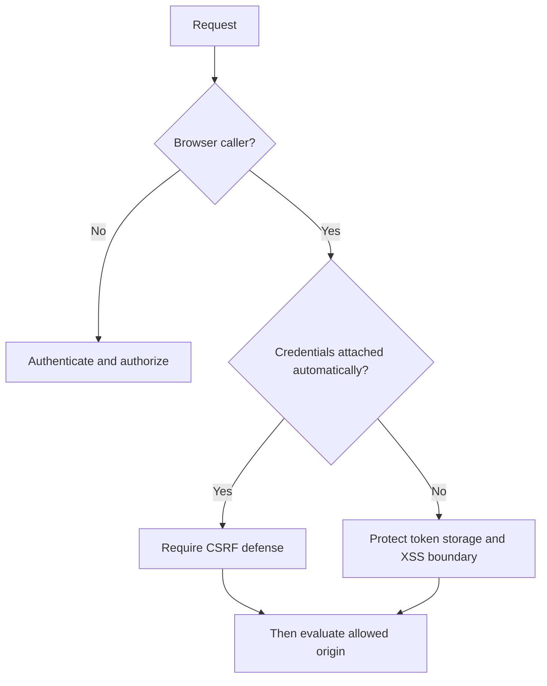

# CSRF, CORS And Browser Security

<DocLabels items={[
  {label: 'Browser boundary', tone: 'advanced'},
  {label: 'Threat control', tone: 'production'},
  {label: 'Spring Security 7', tone: 'intermediate'},
]} />

## Start With Credential Transport

CSRF matters when a browser automatically attaches credentials, such as a
session cookie, to a cross-site request. A bearer token explicitly added to an
`Authorization` header is not automatically attached by the browser, but storage
and XSS risks still apply. CORS decides whether browser JavaScript may read/send
cross-origin requests; it is not authentication or authorization.

| Application boundary | CSRF posture | CORS posture |
|---|---|---|
| server-rendered session application | keep CSRF protection | same-origin unless explicitly needed |
| bearer-only API, no cookies accepted | CSRF can usually be disabled | explicit trusted origins for browser clients |
| mixed cookie and bearer authentication | protect cookie-authenticated mutations | test both credential paths carefully |
| machine-to-machine API | CSRF not relevant | CORS not a control for non-browser callers |



## Spring Configuration Shapes

For a bearer-only API, disable CSRF only after rejecting session/cookie
authentication and confirming browser clients send explicit bearer headers:

```java
http
    .sessionManagement(session -> session
        .sessionCreationPolicy(SessionCreationPolicy.STATELESS))
    .csrf(csrf -> csrf.disable())
    .cors(withDefaults())
    .oauth2ResourceServer(oauth2 -> oauth2.jwt(withDefaults()));
```

<!-- snippet-source: labs/spring-architect/src/main/java/io/shopverse/labs/security/SecurityConfiguration.java -->
<!-- snippet-test: labs/spring-architect/src/test/java/io/shopverse/labs/SecurityAuthorizationTest.java -->

For a browser session application, keep CSRF enabled. Expose the token using the
framework-supported repository appropriate to the client; do not create a custom
header scheme without testing login, logout, expiry and multiple tabs.

## CORS Ownership

Define allowed origins as exact configuration values, not `*` with credentials.
Allow only required methods and headers, expose the minimum response headers,
and set a reviewed preflight cache duration. Keep one canonical policy at the
edge or application security boundary and test that downstream services cannot
be reached through a broader alternate path.

<DocCallout type="mistake" title="A successful preflight is not authorization">

CORS is enforced by browsers. `curl`, mobile applications and compromised
backends ignore it. Every request still requires authentication, object-level
authorization, validation and rate controls.

</DocCallout>

## Verification Matrix

Test trusted/untrusted origin, simple/preflight request, allowed/denied method,
with/without credentials, valid/invalid CSRF token, and authenticated user without
resource ownership. Assert status and response headers; do not test only controller
success.

## Tricky Interview Questions

**When is disabling CSRF unsafe for a “stateless” API?**

<ExpandableAnswer title="Expand answer">

When the API still accepts credentials a browser attaches automatically, such as
cookies or HTTP authentication, or when another filter creates a session. The
label “stateless” is insufficient; inspect every accepted credential transport
and mutation endpoint.

</ExpandableAnswer>

**Can CORS prevent CSRF?**

<ExpandableAnswer title="Expand answer">

Not reliably. Some cross-site requests do not require preflight, and the browser
may send them even when it blocks JavaScript from reading the response. Use CSRF
tokens or same-site credential controls for browser-attached credentials; use
CORS as a separate cross-origin read/request policy.

</ExpandableAnswer>

## Official References

- [Spring Security CSRF](https://docs.spring.io/spring-security/reference/servlet/exploits/csrf.html)
- [Spring Security CORS](https://docs.spring.io/spring-security/reference/servlet/integrations/cors.html)

## Recommended Next

Apply these controls in [Spring Security Threat-Modelling Workbook](./THREAT-MODELING-INTERVIEW-LAB.md).
