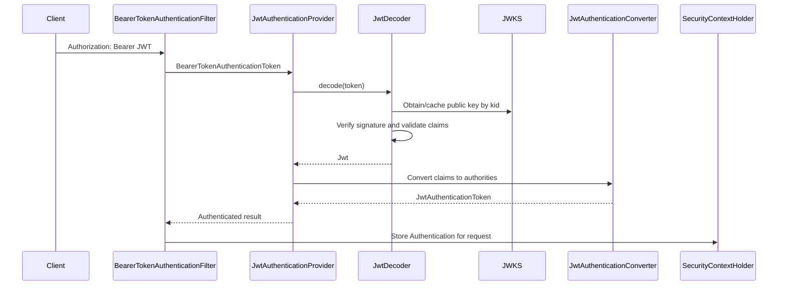

# JWT JWKS And Resource Server Security

<DocLabels items={[
  {label: 'Resource server', tone: 'intermediate'},
  {label: 'JWT and JWKS', tone: 'advanced'},
  {label: 'Key operations', tone: 'production'},
]} />

Bearer JWT authentication, JWT parts, JWS/JWE/JWK/JWKS, symmetric/asymmetric signing, Shopverse encoding/decoding, claims, revocation, and production practices.

Back to [Spring Security](../SPRING-SECURITY-GENERIC.md).

## Shopverse Links

Shopverse shares servlet resource-server infrastructure through:

- [Security Starter](../../platform/SECURITY-STARTER.md) for issuer validation, JWKS-backed decoding, and authority conversion;
- [JWT, OAuth2, And Spring Security](../JWT-OAUTH2-SPRING-SECURITY.md) for the current Auth Service and resource-service flow;
- [Platform Troubleshooting](../../platform/TROUBLESHOOTING.md) for missing bean, wrong issuer, JWKS, and servlet/WebFlux mismatch failures.

The starter does not own endpoint authorization. Each service keeps its own
`SecurityFilterChain`, `@PreAuthorize` rules, and resource-ownership checks.

## Stateless Bearer JWT Authentication



No password lookup is required for each resource request. The token signature
and claims are the authentication evidence.

### BearerTokenResolver

`BearerTokenResolver` extracts a bearer token from an HTTP request before
`BearerTokenAuthenticationFilter` attempts authentication.

The default implementation reads the `Authorization: Bearer` header. A custom
resolver can support another trusted location or deliberately ignore bearer
headers for narrowly defined public endpoints.

Returning `null` means no bearer token was resolved. It does not itself grant
access; the later authorization rules still decide whether an anonymous
request is permitted.

Be careful when combining a custom resolver with `permitAll()`. The resolver
and authorization matchers should describe the same public surface.


## JWT Structure

JWT compact serialization has three Base64URL-encoded parts:

```text
header.payload.signature
```

### Header

```json
{
  "alg": "RS256",
  "kid": "key-1",
  "typ": "JWT"
}
```

- `alg`: signing algorithm;
- `kid`: key identifier;
- `typ`: optional media type.

### Payload

```json
{
  "iss": "shopverse-auth-service",
  "sub": "alice",
  "aud": ["shopverse-api"],
  "iat": 1781160000,
  "exp": 1781163600,
  "jti": "token-id",
  "roles": "ROLE_CUSTOMER",
  "permissions": ["ORDER_READ"]
}
```

The payload is encoded, not encrypted. Anyone holding the token can decode the
claims. Do not put passwords, secrets, or unnecessary personal data inside it.

### Signature

The signature protects integrity and authenticity:

```text
sign(
  base64url(header) + "." + base64url(payload),
  signing key
)
```

Changing the header or payload causes signature verification to fail.


## JWS, JWE, JWK, And JWKS

| Term | Meaning |
|---|---|
| JWT | Token format containing claims |
| JWS | Signed content; common bearer JWT form |
| JWE | Encrypted content |
| JWK | One cryptographic key represented as JSON |
| JWKS | A JSON Web Key Set containing one or more public keys |

Shopverse uses signed JWTs/JWS, not encrypted JWE tokens.


## Symmetric And Asymmetric JWT Signing

### Symmetric HMAC

The same secret signs and verifies:

```text
Auth Server -- shared secret --> Resource Server
```

Advantages:

- simple;
- fast.

Risks:

- every verifier that has the secret can also mint tokens;
- secret distribution and rotation become difficult across many services.

### Asymmetric RSA Or EC

The issuer signs with a private key; resource servers verify with the public
key:

```text
Private key: Auth Server only
Public key: Resource Servers
```

Advantages:

- verifiers cannot sign tokens;
- public keys can be distributed through JWKS;
- better fit for microservices.

Shopverse uses RSA.


## Shopverse JWT Encoding

Auth Service creates a signing JWK:

```java
JWK jwk = new RSAKey.Builder(rsaKeys.publicKey())
        .privateKey(rsaKeys.privateKey())
        .keyID("key-1")
        .build();

JWKSource<SecurityContext> jwks =
        new ImmutableJWKSet<>(new JWKSet(jwk));

return new NimbusJwtEncoder(jwks);
```

`NimbusJwtEncoder` selects a signing key and uses the private key to create the
signature.

Shopverse builds claims:

```java
JwtClaimsSet claims = JwtClaimsSet.builder()
        .id(UUID.randomUUID().toString())
        .issuer(issuer)
        .issuedAt(Instant.now())
        .expiresAt(Instant.now().plus(1, ChronoUnit.HOURS))
        .subject(user.username())
        .claim("roles", roles)
        .claim("permissions", permissions)
        .build();

String token = jwtEncoder.encode(
        JwtEncoderParameters.from(claims)
).getTokenValue();
```

The private key must remain only in the issuer.

### When To Customize JwtEncoder

Customize encoding only in a component that issues tokens. Typical reasons are
selecting a signing key during rotation, choosing approved headers/algorithms,
or standardizing claims. Resource services that only validate incoming tokens
do not need a `JwtEncoder`. Refresh tokens are often opaque random values; do
not assume that every refresh token should be a JWT.


## JWKS Publication

Shopverse exposes only the public JWK:

```java
@GetMapping("/.well-known/jwks.json")
public Map<String, Object> keys() {
    return new JWKSet(rsaKey.toPublicJWK()).toJSONObject();
}
```

Resource services use `kid` to find the matching public key. A production
JWKS can contain both current and retiring public keys during rotation.

Never publish a JWK containing private-key parameters.


## Shopverse JWT Decoding

User Service creates a decoder from the JWKS endpoint:

```java
NimbusJwtDecoder jwtDecoder =
        NimbusJwtDecoder.withJwkSetUri(jwkSetUri).build();

jwtDecoder.setJwtValidator(
        JwtValidators.createDefaultWithIssuer(issuer)
);
```

The decoder:

1. parses the compact token;
2. obtains the public key;
3. verifies the signature;
4. validates timestamps;
5. validates the configured issuer;
6. returns a `Jwt` containing trusted claims.

Every resource service should also validate expected audience and restrict
accepted algorithms.

## JWT Customization Decision Guide

Choose the narrowest extension point that owns the required behavior:

| Requirement | Customize | Do not replace merely for this reason |
|---|---|---|
| Different JWKS URI, public key, algorithm policy or claim validation | `JwtDecoder` and `OAuth2TokenValidator<Jwt>` | `JwtAuthenticationProvider` |
| Validate `aud`, tenant, token type or a required custom claim | compose token validators on the decoder | authority converter |
| Read roles/permissions from custom claims | `JwtAuthenticationConverter` or its granted-authorities converter | decoder or provider |
| Use `email`, `preferred_username` or another claim as principal name | `JwtAuthenticationConverter` | encoder or provider |
| Read bearer credentials from an approved non-default location | `BearerTokenResolver` | decoder |
| Select issuer/decoder from request or token metadata in a multi-tenant system | `AuthenticationManagerResolver<HttpServletRequest>` or trusted-issuer resolver | one decoder that trusts arbitrary issuers |
| Issue and sign access tokens | `JwtEncoder` in the issuer | resource-server provider |
| Replace the entire JWT authentication contract or return a different authentication model not achievable by conversion | custom provider, only after narrower hooks prove insufficient | default provider as a first choice |

`JwtAuthenticationProvider` already coordinates decoding, validation and
conversion. Most applications should keep it and customize its collaborators.
A custom provider inherits responsibility for supported-token checks, error
translation, authenticated-state construction, credentials handling and tests.

### Audience Validation Shape

Issuer validation answers who minted the token. Audience validation answers
whether the token was minted for this API. A token from a trusted issuer but for
another service must be rejected. Compose the framework timestamp/issuer
validators with an application validator that requires the expected `aud` value;
do not replace the defaults accidentally.

### Multi-Tenant JWT Validation

For multiple trusted issuers, tenant selection is part of authentication, not
just authority mapping:

1. derive the tenant from a trusted request boundary or parse only enough token
   metadata to select a candidate issuer;
2. allowlist the issuer—never construct a decoder for any issuer supplied by the token;
3. select a tenant-specific authentication manager/decoder;
4. verify the signature and validate issuer, audience, timestamps and tenant claims;
5. map tenant-specific roles only after validation succeeds;
6. bound decoder/JWKS caches and define tenant removal and key-rotation behavior.

Use `AuthenticationManagerResolver` when authentication-manager selection must
happen per request. Separate `SecurityFilterChain` beans can be clearer when
tenants occupy distinct hostnames or paths and have materially different policy.

## JWT Decode And Verification Internals

Decoding is not the same as trusting. A Nimbus-based decoder conceptually:

1. splits the compact JWS into header, payload and signature segments;
2. Base64URL-decodes and parses the header and claims;
3. rejects disallowed structures and algorithms;
4. reads `kid` and selects a candidate verification key from the configured or cached JWKS;
5. verifies the JWS signature over the original encoded header and payload;
6. creates the `Jwt` value;
7. runs timestamp, issuer, audience and custom validators;
8. returns trusted claims only if all verification and validation succeeds.

Base64URL decoding alone proves nothing and does not require a key. Signature
verification proves integrity and possession of an approved signing key;
validators then enforce whether this otherwise valid token is acceptable in the
current service. Encryption is a separate JWE concern and is not provided by
ordinary signed-JWT resource-server configuration.

### Shared Resource-Server Boundary

A good shared resource-server module can own:

- JWT decoder construction;
- issuer and timestamp validation;
- JWKS location handling;
- claim-to-authority conversion;
- common actuator permit-list defaults when they are truly uniform.

It should not own:

- endpoint-specific URL rules;
- business ownership checks;
- token issuing;
- service-local Basic auth;
- reactive gateway security when the starter is servlet-based.

This separation keeps security plumbing consistent without hiding service API
authorization in a central library.


## Claim Types

### Registered Claims

Standard names include:

| Claim | Purpose |
|---|---|
| `iss` | issuer |
| `sub` | subject/principal |
| `aud` | intended audience |
| `exp` | expiry |
| `nbf` | not valid before |
| `iat` | issued at |
| `jti` | unique token identifier |

### Public Claims

Names defined through shared standards or collision-resistant namespaces.

### Private Claims

Application-specific claims such as Shopverse `roles` and `permissions`.
Issuer and resource servers must agree on their type and meaning.

Keep claims small. Large tokens increase every request header and proxy limit
risk.


## JWT Revocation And Blocking

Self-contained JWT validation is fast because a resource server does not call
the issuer for every request. The trade-off is that a valid token normally
remains usable until expiry.

Options for immediate or near-immediate blocking:

### Short-Lived Access Tokens

Limit the exposure window and use refresh-token rotation.

### `jti` Deny List

Store revoked token IDs until their expiry. This adds a lookup to resource
requests and requires shared storage.

### User Security Version

Include a version claim and compare it with current user state. Password reset,
role change, or account disable increments the version.

### Key Rotation

Remove a compromised signing key and stop accepting tokens signed with it.
This revokes many tokens at once and must be coordinated carefully.

### Opaque Tokens And Introspection

Resource servers call or cache an Authorization Server introspection result.
This supports centralized revocation but adds runtime dependency and latency.

### Gateway Deny List Only

Blocking only at the gateway is insufficient if services can be reached
directly. Enforcement must exist at every reachable security boundary.

Shopverse currently relies on token expiry and does not implement a JWT deny
list, security-version check, or opaque-token introspection.


## JWT And OAuth2 Production Practices

1. Use HTTPS everywhere.
2. keep private signing keys in a secret manager or HSM.
3. publish only public keys through JWKS.
4. rotate keys using stable `kid` values and overlap.
5. restrict accepted algorithms; never trust the token's algorithm blindly.
6. validate issuer, audience, expiry, not-before, and required claims.
7. keep access tokens short-lived.
8. minimize claims and never include secrets.
9. protect tokens from logs, URLs, browser storage exposure, and referrers.
10. use Authorization Code with PKCE for public user-facing clients.
11. use Client Credentials with narrow scopes for service identities.
12. rotate and revoke refresh tokens.
13. apply least privilege to roles, scopes, and permissions.
14. enforce authorization inside resource services, not only at the gateway.
15. audit authentication, role changes, key rotation, and denied operations.

## Interview Check

**What should happen when a resource server sees an unknown JWT `kid`?**

<ExpandableAnswer title="Expand answer">

Refresh JWKS through the configured cache/decoder path with bounded network
behavior, then reject the token if the key remains unknown. Never fall back to a
different algorithm or arbitrary key. Alert on sustained unknown-key failures
because they can indicate rotation drift, cache problems or forged tokens.

</ExpandableAnswer>

## Recommended Next

Review user and service flows in [OAuth2 And OIDC](./OAUTH2-OIDC-FLOWS.md).


