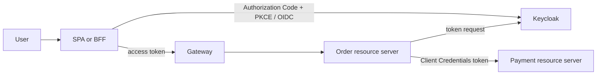

# Keycloak And Spring OAuth2 Implementation

This guide describes a standards-based target architecture. Current Shopverse
uses custom username/password login and RSA JWT issuance plus Spring OAuth2
Resource Server validation. It is **not currently a full OAuth2 Authorization
Server**, and the examples below do not claim that Keycloak is already deployed.



## Choose The Browser Architecture First

| Architecture | Token owner | Spring role | CSRF posture |
|---|---|---|---|
| SPA calls APIs | SPA uses Authorization Code with PKCE; no client secret | APIs are resource servers | bearer-only APIs are normally stateless; protect the SPA from XSS |
| BFF/server web app | Backend owns tokens and browser receives a secure session cookie | `oauth2Login()` client plus resource/API calls | retain CSRF protection for cookie-authenticated requests |

Never place a confidential client secret in browser JavaScript. A public SPA
client uses PKCE and exact redirect/origin registration. A BFF can authenticate
as a confidential client because the secret stays on the server.

## Step 1: Run A Pinned Local Keycloak

For local learning only, run a tested, pinned image tag rather than `latest`:

```yaml
services:
  keycloak:
    image: quay.io/keycloak/keycloak:${KEYCLOAK_VERSION}
    command: start-dev
    environment:
      KC_BOOTSTRAP_ADMIN_USERNAME: ${KEYCLOAK_ADMIN_USERNAME}
      KC_BOOTSTRAP_ADMIN_PASSWORD: ${KEYCLOAK_ADMIN_PASSWORD}
    ports:
      - "8080:8080"
```

`start-dev` is not a production configuration. Production requires a real
database, TLS/hostname policy, secret management, backups, health monitoring,
and a tested upgrade path.

## Step 2: Model Realm, Clients, Scopes, And Audience

Create a realm such as `shopverse`. Then register separate clients:

| Client | Type and grant | Essential policy |
|---|---|---|
| `shopverse-spa` | public, Authorization Code, PKCE S256 | exact redirects/origins; no secret; disable password/implicit grants |
| `shopverse-bff` | confidential, Authorization Code | server-held credential; exact redirects |
| `order-service` | confidential, Client Credentials | service account with only required scopes |
| `payment-api` | resource/audience representation | ensure Payment access tokens contain the Payment audience |

Prefer client roles for service-specific responsibilities and realm roles only
for truly realm-wide responsibilities. Use groups to assign role bundles to
people; do not encode organization charts into hundreds of near-duplicate roles.

Configure protocol/client-scope mappers deliberately:

- emit the audience expected by each resource server;
- emit only required roles/scopes;
- keep tokens small and avoid PII;
- document whether roles come from `realm_access.roles` or
  `resource_access.<client>.roles`.

## Step 3: Add Spring Dependencies

Resource APIs need:

```groovy
implementation 'org.springframework.boot:spring-boot-starter-security'
implementation 'org.springframework.boot:spring-boot-starter-oauth2-resource-server'
```

A BFF or a service obtaining outbound tokens also needs:

```groovy
implementation 'org.springframework.boot:spring-boot-starter-oauth2-client'
```

Use versions managed by the Spring Boot BOM.

## Step 4: Configure A JWT Resource Server

```yaml
spring:
  security:
    oauth2:
      resourceserver:
        jwt:
          issuer-uri: http://localhost:8080/realms/shopverse
          audiences: payment-api
```

`issuer-uri` enables provider metadata/JWKS discovery and issuer validation.
`audiences` prevents a token intended for another API from being accepted by
Payment Service. Container deployments use a reachable internal issuer/hostname
whose value exactly matches the token's `iss` claim; do not blindly replace it
with `localhost`.

```java
@Bean
SecurityFilterChain apiSecurity(
        HttpSecurity http,
        JwtAuthenticationConverter keycloakAuthorities) throws Exception {
    return http
        .csrf(csrf -> csrf.disable()) // only for a bearer-only stateless API
        .authorizeHttpRequests(auth -> auth
            .requestMatchers("/actuator/health").permitAll()
            .requestMatchers(HttpMethod.POST, "/payments/**")
                .hasAuthority("SCOPE_payments.execute")
            .anyRequest().authenticated())
        .oauth2ResourceServer(oauth2 -> oauth2.jwt(jwt ->
            jwt.jwtAuthenticationConverter(keycloakAuthorities)))
        .build();
}
```

Do not disable CSRF merely because JWTs exist. Disable it only when browser-
managed credentials such as cookies are not used for the protected endpoints.

## Step 5: Map Keycloak Roles Without Losing Scopes

Spring maps `scope`/`scp` to `SCOPE_*` by default. A custom converter should
retain those authorities and add only the Keycloak role locations the contract
allows:

```java
@Bean
JwtAuthenticationConverter keycloakAuthorities() {
    JwtGrantedAuthoritiesConverter scopes = new JwtGrantedAuthoritiesConverter();

    JwtAuthenticationConverter converter = new JwtAuthenticationConverter();
    converter.setPrincipalClaimName("preferred_username");
    converter.setJwtGrantedAuthoritiesConverter(jwt -> {
        Collection<GrantedAuthority> mapped = new ArrayList<>();
        Collection<GrantedAuthority> scopeAuthorities = scopes.convert(jwt);
        if (scopeAuthorities != null) {
            mapped.addAll(scopeAuthorities);
        }

        Map<String, Object> realmAccess = jwt.getClaim("realm_access");
        if (realmAccess != null && realmAccess.get("roles") instanceof Collection<?> roles) {
            roles.stream()
                .map(String::valueOf)
                .map(role -> new SimpleGrantedAuthority("ROLE_" + role))
                .forEach(mapped::add);
        }
        return mapped;
    });
    return converter;
}
```

For client roles, read only the expected entry under
`resource_access.<resource-client>.roles`; do not merge every client's roles into
every API. Normalize provider-specific claims at one shared, tested boundary.

## Step 6: Configure A BFF With OIDC Login

```yaml
spring:
  security:
    oauth2:
      client:
        provider:
          keycloak:
            issuer-uri: http://localhost:8080/realms/shopverse
        registration:
          shopverse-bff:
            provider: keycloak
            client-id: shopverse-bff
            client-secret: ${SHOPVERSE_BFF_CLIENT_SECRET}
            authorization-grant-type: authorization_code
            scope: [openid, profile, email]
```

```java
@Bean
SecurityFilterChain webSecurity(HttpSecurity http) throws Exception {
    return http
        .authorizeHttpRequests(auth -> auth
            .requestMatchers("/", "/assets/**").permitAll()
            .anyRequest().authenticated())
        .oauth2Login(Customizer.withDefaults())
        .oauth2Client(Customizer.withDefaults())
        .build();
}
```

Keep CSRF enabled for the BFF's session cookie. Configure `Secure`, `HttpOnly`,
and appropriate `SameSite` cookie policy, session fixation protection, logout,
and an exact post-logout redirect.

## Step 7: Implement Client Credentials For Service Calls

```yaml
spring:
  security:
    oauth2:
      client:
        provider:
          keycloak:
            issuer-uri: http://localhost:8080/realms/shopverse
        registration:
          payment-client:
            provider: keycloak
            client-id: order-service
            client-secret: ${ORDER_SERVICE_CLIENT_SECRET}
            client-authentication-method: client_secret_basic
            authorization-grant-type: client_credentials
            scope: [payments.execute]
```

For a service/background process, use the manager designed to work outside an
HTTP request:

```java
@Bean
OAuth2AuthorizedClientManager serviceAuthorizedClientManager(
        ClientRegistrationRepository registrations,
        OAuth2AuthorizedClientService clients) {
    OAuth2AuthorizedClientProvider provider =
        OAuth2AuthorizedClientProviderBuilder.builder()
            .clientCredentials()
            .build();

    var manager = new AuthorizedClientServiceOAuth2AuthorizedClientManager(
        registrations, clients);
    manager.setAuthorizedClientProvider(provider);
    return manager;
}
```

The manager obtains and reuses the authorized client and renews an expired
Client Credentials token through its provider. Do not request a new token for
every API call.

```java
@Service
public class PaymentClient {
    private final OAuth2AuthorizedClientManager manager;
    private final RestClient restClient;

    public PaymentClient(
            OAuth2AuthorizedClientManager manager,
            RestClient.Builder builder) {
        this.manager = manager;
        this.restClient = builder.baseUrl("http://payment-service:8080").build();
    }

    public PaymentResponse capture(PaymentRequest request) {
        OAuth2AuthorizeRequest authorizeRequest = OAuth2AuthorizeRequest
            .withClientRegistrationId("payment-client")
            .principal("order-service")
            .build();
        OAuth2AuthorizedClient client = manager.authorize(authorizeRequest);
        if (client == null) {
            throw new IllegalStateException("Payment OAuth2 client authorization failed");
        }

        return restClient.post()
            .uri("/internal/payments")
            .headers(headers -> headers.setBearerAuth(
                client.getAccessToken().getTokenValue()))
            .body(request)
            .retrieve()
            .body(PaymentResponse.class);
    }
}
```

Building `RestClient` from Spring's injected builder preserves observability and
other managed customizers. Spring Security also provides OAuth2 HTTP-client
integration when declarative token attachment is preferable; avoid a global
default that sends one token to unrelated hosts.

Client Credentials has no end-user identity. If Payment must enforce “the
current customer owns this order,” use a governed delegated user token or Token
Exchange rather than pretending the service token is the user.

## Step 8: Verification Matrix

| Test | Expected result |
|---|---|
| SPA authorization request | code flow uses PKCE S256 and an exact redirect URI |
| API receives no token | `401` |
| Valid token lacks scope | `403` |
| Wrong issuer or audience | `401` |
| Old and new signing keys overlap | both valid tokens verify during rotation window |
| Order Service calls Payment | service-account subject/client and `payments.execute` are present |
| Client secret is rotated | new secret works; old secret is rejected after bounded overlap |
| Authorization server unavailable | existing unexpired JWT API calls follow policy; new token acquisition fails visibly |
| Browser logout | local session ends and provider logout behavior matches the design |

Use discovery metadata and JWKS endpoints for diagnostics. Do not use the
Resource Owner Password grant as a shortcut for tests; exercise Authorization
Code with PKCE or Client Credentials according to the actor.

## Production Checklist

- Separate public, confidential, workload, and resource clients.
- Store client secrets in a secret manager; prefer `private_key_jwt` or mTLS for
  higher-assurance workload authentication where supported.
- Validate issuer, audience, timestamps, token type, and required scopes in every
  resource service.
- Bound JWKS/token endpoint timeouts and monitor key refresh and token failures.
- Rate-limit login and token endpoints and audit administrative changes.
- Keep roles/scopes small; use the permission-scale design for dynamic policy.
- Test realm export/restore, key rotation, client-secret rotation, and provider
  outage before production migration.

## Official References

- [Spring Security OAuth2 Client](https://docs.spring.io/spring-security/reference/servlet/oauth2/client/index.html)
- [Spring Security JWT Resource Server](https://docs.spring.io/spring-security/reference/servlet/oauth2/resource-server/jwt.html)
- [Keycloak securing applications](https://www.keycloak.org/securing-apps/overview)
- [Keycloak server administration](https://www.keycloak.org/docs/latest/server_admin/)
- [Authorization Code with PKCE](https://www.rfc-editor.org/rfc/rfc7636)

