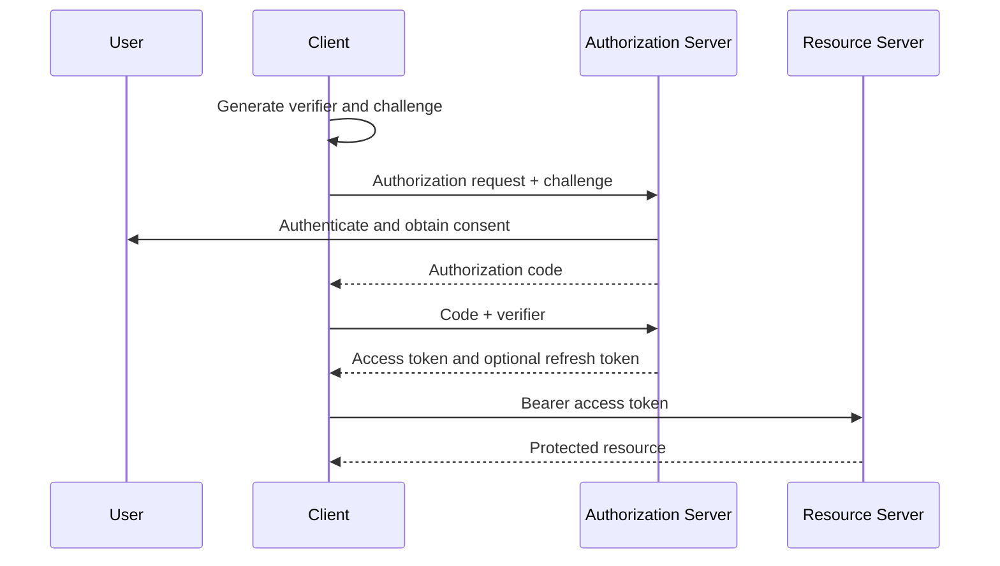

# OAuth2 OIDC And Token Flows

<DocLabels items={[
  {label: 'OAuth2', tone: 'intermediate'},
  {label: 'OIDC', tone: 'advanced'},
  {label: 'Flow selection', tone: 'production'},
]} />

OAuth2 roles, grant selection, Spring Security application roles, end-to-end
examples, legacy flows, token delegation, and OIDC.

Back to [Spring Security](../SPRING-SECURITY-GENERIC.md).

## OAuth2 Roles

OAuth2 has four main actors:

| Actor | Responsibility |
|---|---|
| Resource Owner | User who owns data or grants access |
| Client | Application requesting access |
| Authorization Server | Authenticates and issues tokens |
| Resource Server | API validating tokens and protecting resources |

JWT is a token format. OAuth2 is an authorization framework. OAuth2 access
tokens can be JWTs or opaque reference tokens.

## Choose The Application Role Before The Grant

Spring uses similar names for four different responsibilities:

| Spring capability | This application acts as | Typical example |
|---|---|---|
| `oauth2Login()` | OAuth2/OIDC client performing interactive login | Shopverse web application redirects a user to Google or Keycloak |
| `oauth2Client()` | OAuth2 client obtaining and attaching an access token to an outbound request | Order Service calls a partner shipping API |
| `oauth2ResourceServer()` | Resource server validating an incoming bearer token | Order Service protects `/api/v1/orders/**` |
| Spring Authorization Server | Authorization server implementing protocol endpoints and issuing tokens | Central identity service issues authorization-code and client-credentials tokens |

An application can have more than one role. A backend-for-frontend can use
`oauth2Login()` for the browser session, `oauth2Client()` for an outbound API,
and `oauth2ResourceServer()` on a separate machine-facing endpoint. Configure
each trust boundary deliberately; enabling OAuth2 login does not make the
application a resource server or token issuer.

## Grant Selection Matrix

| Situation | Grant or protocol | Identity represented by access token |
|---|---|---|
| Browser, SPA, desktop, or mobile user login | Authorization Code with PKCE | user plus authorized client |
| Confidential server-side web application | Authorization Code; use PKCE as defense in depth | user plus authorized client |
| Service, batch job, or daemon with no user | Client Credentials | client/service |
| Renew a user session without interactive login | Refresh Token | authorization associated with original grant |
| TV, console, or CLI with limited input | Device Authorization | user plus device client |
| Downstream service needs a narrower delegated token | Token Exchange | delegated user/service subject, according to policy |
| Trusted workload authenticates with a signed assertion | JWT Bearer assertion | assertion subject/client, according to server policy |
| Old browser flow returning a token from the authorization endpoint | Implicit | legacy user authorization; do not choose for new clients |
| Client collects the identity-provider password | Resource Owner Password | user; obsolete and unsafe for new systems |

Refresh Token is normally a continuation of another grant, not the initial
login choice. OIDC is layered on Authorization Code when the client also needs
authenticated identity through an ID Token.


## Authorization Code With PKCE

Recommended for browser and mobile user-facing applications:



PKCE protects an intercepted authorization code from being exchanged by a
different client.


## Client Credentials

Used for machine-to-machine access where no user is involved. The token
represents the client/service identity and should have narrow scopes.

Example: a reconciliation job needs read-only Payment access.

```http
POST /oauth2/token
Authorization: Basic <base64-client-id-and-secret>
Content-Type: application/x-www-form-urlencoded

grant_type=client_credentials&scope=payments.read
```

The authorization server returns an access token. The job calls Payment Service:

```http
GET /api/v1/payments/reconciliation
Authorization: Bearer <access-token>
```

Payment Service must validate issuer, audience, time claims and the
`SCOPE_payments.read` authority. There is no end user to place in the token or
audit record. Do not use Client Credentials merely to forward a user's identity;
use an explicit delegation design when user context matters.


## Device Authorization

Used by devices with limited input capability. The user completes
authentication on another device.

```text
CLI -> authorization server: request device_code and user_code
CLI <- authorization server: verification URI, codes, interval and expiry
CLI -> user: show URI and user_code
User -> browser: authenticate and approve
CLI -> token endpoint: poll with device_code at the required interval
CLI <- token endpoint: authorization_pending, slow_down, denial, expiry, or tokens
```

The device must respect the polling interval and stop on expiry or denial. A CLI
that can safely open a system browser and receive a loopback redirect can instead
use Authorization Code with PKCE.


## Refresh Tokens

Refresh tokens obtain new access tokens without asking the user to log in
again. They should be:

- stored more securely than access tokens;
- rotated on use;
- revocable;
- bound to the client;
- monitored for reuse.

Shopverse does not currently implement refresh tokens.

Example token renewal:

```http
POST /oauth2/token
Content-Type: application/x-www-form-urlencoded

grant_type=refresh_token&refresh_token=<refresh-token>&client_id=<client-id>
```

The authorization server validates the client and refresh-token state, rotates
the refresh token when configured, and returns a new short-lived access token.
Resource servers do not process refresh tokens; only the authorization server's
token endpoint does.

## Token Exchange

OAuth 2.0 Token Exchange is used when a trusted component presents a subject
token and requests a different token for a downstream audience. For example:

```text
customer token for gateway
  -> gateway requests exchange for inventory-api audience
  -> authorization server applies delegation policy
  -> gateway receives narrower inventory.read token
  -> Inventory Service validates its own audience and scopes
```

```http
POST /oauth2/token
Content-Type: application/x-www-form-urlencoded

grant_type=urn:ietf:params:oauth:grant-type:token-exchange
&subject_token=<incoming-access-token>
&subject_token_type=urn:ietf:params:oauth:token-type:access_token
&audience=inventory-api
&scope=inventory.read
```

Token Exchange is not automatically safer than forwarding a token. The
authorization server must restrict callers, requested audiences, delegation
depth and scopes, and audit both the original subject and acting client.

## JWT Bearer Assertion Grant

The JWT Bearer assertion profile lets a client or trusted workload present a
signed JWT assertion to the token endpoint instead of an authorization code or
user password:

```http
POST /oauth2/token
Content-Type: application/x-www-form-urlencoded

grant_type=urn:ietf:params:oauth:grant-type:jwt-bearer
&assertion=<signed-jwt-assertion>
```

The server validates the assertion signature, issuer, subject, audience,
expiry, replay identifier and its trust registration before issuing an access
token. This is useful for enterprise federation and workload authentication.
It is different from merely using a JWT-formatted access token.

## Implicit Grant

The legacy Implicit grant returned an access token through the browser-facing
authorization response. It lacks the protected code exchange and modern replay
protections of Authorization Code with PKCE. Do not select it for new SPAs or
browser clients; use Authorization Code with PKCE instead.


## OAuth2 Resource Owner Password Grant

The password grant is obsolete and should not be introduced for new systems.
Clients should not collect a user's identity-provider password.

Shopverse's custom `/auth/login` endpoint is a POC login design, not an OAuth2
password grant implementation.

## Worked Shopverse Choices

| Shopverse context | Recommended choice | Reason |
|---|---|---|
| Angular user signs in through a standards-based identity provider | Authorization Code with PKCE and OIDC | interactive user identity without giving the SPA the password |
| Order Service calls Payment Service for the current customer | forwarded audience-valid user token or governed Token Exchange | preserve user/actor context and least privilege |
| Nightly inventory synchronization | Client Credentials | workload acts without a user |
| CLI on a headless host | Device Authorization | complete login on a second device |
| Existing custom `/auth/login` POC | custom password authentication and JWT issuance | current implementation, but not an OAuth2 grant |

Do not combine flows by intuition. Decide who the subject is, who the client is,
which API is the audience, whether delegation is required, and where refresh or
revocation state is owned.


## OAuth2 And OIDC

OAuth2 authorizes access to resources. OpenID Connect adds user authentication
and identity claims, including an ID Token and UserInfo endpoint.

Use OIDC when an application needs federated user login. Do not use an access
token as a substitute for an ID Token in a browser client.

## Interview Check

**Why does PKCE not replace the OAuth2 `state` parameter?**

<ExpandableAnswer title="Expand answer">

PKCE binds the authorization code to the client instance that created the code
challenge and mitigates code interception. `state` binds the authorization
response to the browser transaction and mitigates login CSRF/response mix-up.
They protect different parts of the flow and are commonly used together.

</ExpandableAnswer>

## Recommended Next

Implement the selected flows with
[Keycloak And Spring OAuth2 Implementation](OAUTH2-KEYCLOAK-SPRING-IMPLEMENTATION.md),
then design large authorization catalogs with
[Distributed Authorization At Permission Scale](DISTRIBUTED-AUTHORIZATION-PERMISSION-SCALE.md).

Secure browser integration with [CSRF, CORS And Browser Security](./CSRF-CORS-BROWSER-SECURITY.md).

## Official References

- [OAuth 2.0 Authorization Framework](https://www.rfc-editor.org/rfc/rfc6749)
- [Authorization Code with PKCE](https://www.rfc-editor.org/rfc/rfc7636)
- [OAuth 2.0 Device Authorization Grant](https://www.rfc-editor.org/rfc/rfc8628)
- [OAuth 2.0 Token Exchange](https://www.rfc-editor.org/rfc/rfc8693)
- [JWT Bearer Assertion Profile](https://www.rfc-editor.org/rfc/rfc7523)
- [OAuth 2.0 Security Best Current Practice](https://www.rfc-editor.org/rfc/rfc9700)
- [Spring Security OAuth2](https://docs.spring.io/spring-security/reference/servlet/oauth2/index.html)


