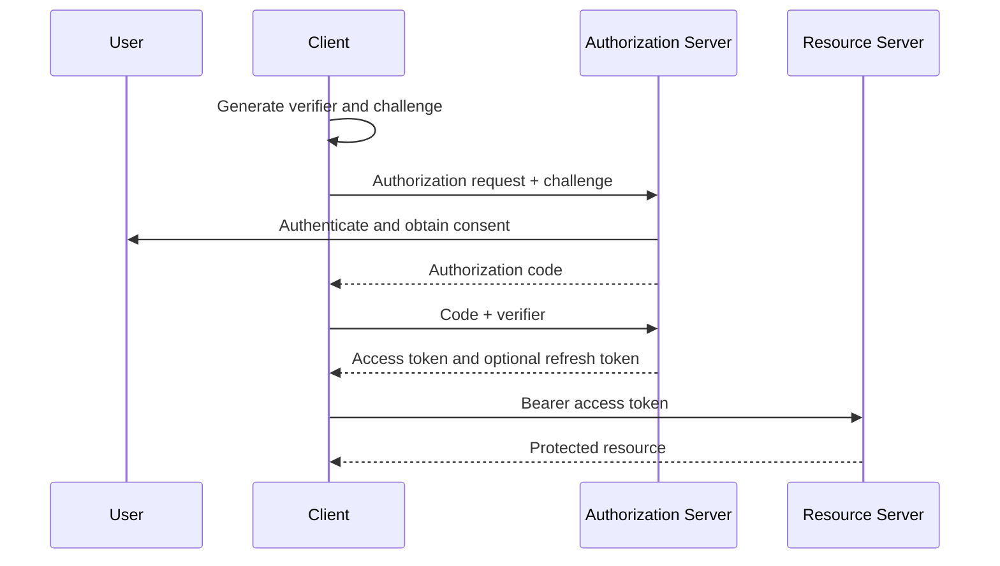

# OAuth2 OIDC And Token Flows

<DocLabels items={[
  {label: 'OAuth2', tone: 'intermediate'},
  {label: 'OIDC', tone: 'advanced'},
  {label: 'Flow selection', tone: 'production'},
]} />

OAuth2 roles, authorization code with PKCE, client credentials, device flow, refresh tokens, password grant, and OIDC.

Back to [Spring Security](../SPRING-SECURITY-GENERIC.md).

## OAuth2 Roles

OAuth2 has four main actors:

| Actor | Responsibility |
|---|---|
| Resource Owner | User who owns data or grants access |
| Client | Application requesting access |
| Authorization Server | Authenticates and issues tokens |
| Resource Server | API validating tokens and protecting resources |

JWT is a token format. OAuth2 is an authorization framework. OAuth2 access
tokens can be JWTs or opaque reference tokens.

## Authorization Code With PKCE

Recommended for browser and mobile user-facing applications:

PKCE protects an intercepted authorization code from being exchanged by a
different client.

## Client Credentials

Used for machine-to-machine access where no user is involved. The token
represents the client/service identity and should have narrow scopes.

## Device Authorization

Used by devices with limited input capability. The user completes
authentication on another device.

## Refresh Tokens

Refresh tokens obtain new access tokens without asking the user to log in
again. They should be:

- stored more securely than access tokens;
- rotated on use;
- revocable;
- bound to the client;
- monitored for reuse.

Shopverse does not currently implement refresh tokens.

## OAuth2 Resource Owner Password Grant

The password grant is obsolete and should not be introduced for new systems.
Clients should not collect a user's identity-provider password.

Shopverse's custom `/auth/login` endpoint is a POC login design, not an OAuth2
password grant implementation.

## OAuth2 And OIDC

OAuth2 authorizes access to resources. OpenID Connect adds user authentication
and identity claims, including an ID Token and UserInfo endpoint.

Use OIDC when an application needs federated user login. Do not use an access
token as a substitute for an ID Token in a browser client.

## Interview Check

**Why does PKCE not replace the OAuth2 `state` parameter?**

<ExpandableAnswer title="Expand answer">

PKCE binds the authorization code to the client instance that created the code
challenge and mitigates code interception. `state` binds the authorization
response to the browser transaction and mitigates login CSRF/response mix-up.
They protect different parts of the flow and are commonly used together.

</ExpandableAnswer>

## Recommended Next

Secure browser integration with [CSRF, CORS And Browser Security](./CSRF-CORS-BROWSER-SECURITY.md).

