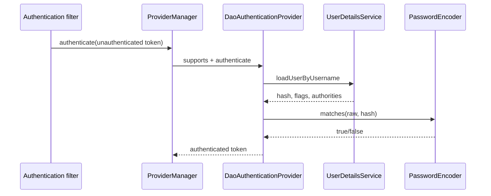

# Password Authentication Provider Runtime

<DocLabels items={[
  {label: 'Authentication runtime', tone: 'advanced'},
  {label: 'ProviderManager', tone: 'intermediate'},
  {label: 'Password safety', tone: 'production'},
]} />

## Runtime Objects

| Object | Responsibility | Does not do |
|---|---|---|
| credential filter/controller | creates an unauthenticated token | verify a database password |
| `AuthenticationManager` | entry point for authentication | define one credential mechanism |
| `ProviderManager` | selects supporting providers | load users itself |
| `AuthenticationProvider` | validates one token family | persist request context |
| `UserDetailsService` | loads security account data | compare raw/hash values |
| `PasswordEncoder` | encode and verify one-way hashes | decrypt a password |

`ProviderManager` iterates providers whose `supports(authentication.getClass())`
returns true. A successful provider returns a trusted `Authentication`; an
account/credential failure normally stops the path with an authentication
exception. A provider returning `null` means it cannot decide, not success.

## User-Lookup Boundary

`DaoAuthenticationProvider` calls `UserDetailsService.loadUserByUsername()` for
username/password authentication. The returned `UserDetails` contains the hash,
account flags and authorities needed for the decision. It should be a deliberately
mapped security principal rather than an accidentally exposed persistence graph.

## DAO Provider Call Path

1. Retrieve the user and normalize “not found” behavior to avoid account probing.
2. Run pre-authentication checks: locked, disabled, expired.
3. Call `PasswordEncoder.matches(raw, encoded)`.
4. Run post-authentication credential-expiry checks.
5. Optionally upgrade an outdated hash after successful verification.
6. Create a new authenticated result without retaining raw credentials.

<DocCallout type="production" title="Equal-looking failures can take different paths">

Return generic client errors, but keep safe internal reason codes and metrics for
locked accounts, invalid credentials and dependency failures. Avoid timing and
message differences that enable username enumeration.

</DocCallout>

## Password Storage And Upgrade

Registration calls `encode(raw)` and stores only the adaptive hash. Login calls
`matches(raw, storedHash)`. `DelegatingPasswordEncoder` prefixes hashes such as
`{bcrypt}` so algorithms can evolve. After a successful match,
`upgradeEncoding(storedHash)` can trigger re-encoding with the current cost.

Never log the raw password, hash, authentication request, or complete exception
object if it can contain credentials. Rate-limit and monitor login attempts; do
not use reversible encryption as password storage.

## Configuration And Wiring

Spring can assemble a DAO provider from a `UserDetailsService` and
`PasswordEncoder`, or the application can publish an explicit provider/manager
when multiple authentication mechanisms require controlled ordering. In-memory
users still implement `UserDetailsService`; they are not a separate authentication
architecture and belong mainly in tests or constrained tools.

## Complete Request Flow

For HTTP Basic, `BasicAuthenticationFilter` decodes the transport value into a
username/password token, delegates to the manager, and on success places the
trusted result into the request `SecurityContext`. For form login,
`UsernamePasswordAuthenticationFilter` performs the analogous extraction and
adds success/failure handlers. Neither filter should contain domain authorization.

## Failure Map

| Symptom | Inspect |
|---|---|
| provider never called | token type and `supports(...)` |
| user lookup never called | selected provider/mechanism |
| every password fails | hash prefix, encoder policy, raw-value transformation |
| correct password but denied | account flags, authorities, later authorization |
| repeated DB lookup on JWT calls | custom token flow or wrong provider assumption |

## Interview Questions

**Can two providers support the same authentication token?**

<ExpandableAnswer title="Expand answer">

Yes, but ordering and failure semantics become critical. A provider that throws
for a token it should defer can prevent later providers from running. Prefer
distinct token types or explicit manager composition when mechanisms have
different trust or account sources.

</ExpandableAnswer>

**Why is password matching intentionally expensive?**

<ExpandableAnswer title="Expand answer">

Adaptive hashes make offline guessing costly after a credential database leak.
Tune cost from measured login capacity, apply rate limits, and upgrade over time.
The expense belongs only on authentication paths, not on every authorized request.

</ExpandableAnswer>

## Official References

- [DAO authentication provider](https://docs.spring.io/spring-security/reference/servlet/authentication/passwords/dao-authentication-provider.html)
- [Password storage](https://docs.spring.io/spring-security/reference/features/authentication/password-storage.html)

## Recommended Next

Continue with [SecurityContext Lifecycle](./SECURITY-CONTEXT-LIFECYCLE.md).
