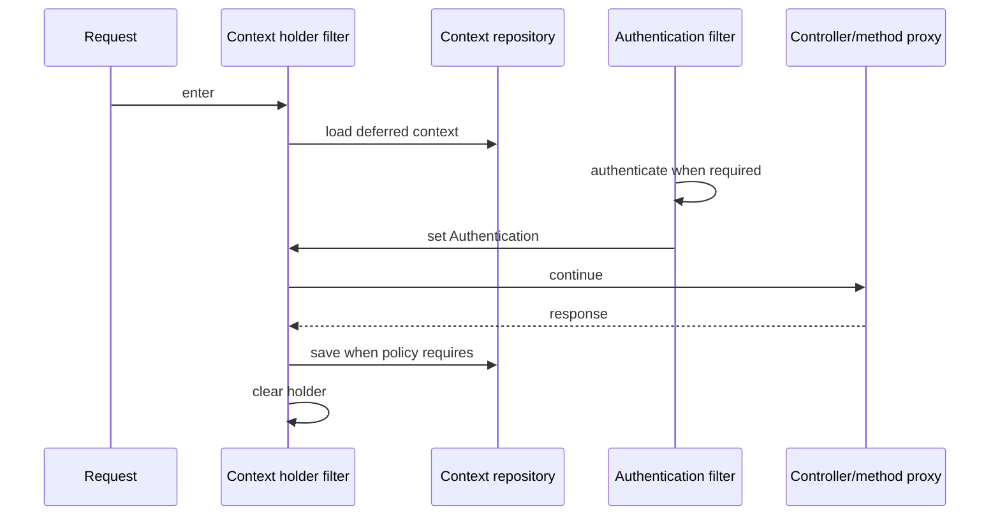

# Spring SecurityContext Lifecycle

<DocLabels items={[
  {label: 'SecurityContext', tone: 'advanced'},
  {label: 'Thread boundary', tone: 'production'},
  {label: 'Session and bearer', tone: 'intermediate'},
]} />

`SecurityContext` holds the current `Authentication`. `SecurityContextHolder`
provides the lookup strategy used by authorization components. The important
question is not only how identity is set, but who loads, saves and clears it at
every request and thread boundary.

## Lifecycle Invariants

1. Begin a request with an empty or repository-loaded context.
2. Replace it only after successful authentication.
3. Make authorization read the trusted result.
4. Persist only under the chosen session/repository policy.
5. Clear the holder in a `finally`-equivalent path before a pooled thread is reused.

A leaked thread-local identity is a cross-request security defect. Spring’s
filters manage the normal servlet lifecycle; custom filters and executors must
not bypass or outlive that ownership accidentally.

## Session, Stateless And Async Boundaries

| Boundary | Context behavior | Main risk |
|---|---|---|
| session login | repository reloads identity on later requests | fixation, stale authorization, CSRF |
| bearer API | each request authenticates token | revocation and key/control-plane behavior |
| `@Async` executor | new/pool thread has separate holder | missing or leaked identity |
| virtual thread | distinct thread-local state | assuming identity should propagate automatically |
| scheduled/Kafka work | no user request context by default | inventing a user identity for system work |

Use `DelegatingSecurityContextExecutor` or framework integration only when the
business operation truly requires caller identity after handoff. Prefer passing
an immutable, minimal actor/audit value to long-lived asynchronous work; an access
token or entire mutable context should not be queued indefinitely.

<DocCallout type="production" title="Context propagation is not authorization propagation">

Copying identity makes it available; the target operation must still evaluate
current policy and resource ownership. Long queues can outlive token or role
validity, so define when authorization is checked again.

</DocCallout>

## Session Versus Stateless Decisions

Session authentication enables immediate server-side invalidation and natural
browser login, but requires fixation protection, cookie controls and CSRF defense.
Bearer authentication scales without shared HTTP sessions, but resource servers
must validate every token and have an explicit expiry/revocation strategy.
`SessionCreationPolicy.STATELESS` is not proof that no cookie or context repository
is active; verify the complete filter chain.

## Failure Investigation

| Symptom | Likely boundary |
|---|---|
| authenticated in filter, anonymous in controller | context set on wrong holder or cleared early |
| user from previous request appears | custom thread-local cleanup failure |
| identity missing in async task | propagation not configured or intentionally absent |
| logout succeeds but JWT still works | bearer token remains valid until expiry/revocation control |
| role change not visible | session/token contains stale authorities |

## Interview Questions

**Should a Kafka consumer inherit the user’s `SecurityContext` from the producer?**

<ExpandableAnswer title="Expand answer">

No implicit thread context crosses a broker, and serializing it would create a
dangerous trust shortcut. Put only required actor/delegation claims in a signed or
otherwise trusted message contract, authenticate the consuming service, and have
the consumer authorize the operation under an explicit policy.

</ExpandableAnswer>

**Why must the holder be cleared even after authentication fails?**

<ExpandableAnswer title="Expand answer">

Servlet threads are reused. Cleanup on every exit path prevents a prior or
partially established context from becoming visible to another request. The
framework filter lifecycle handles this when custom code remains inside it.

</ExpandableAnswer>

## Official References

- [SecurityContextHolder](https://docs.spring.io/spring-security/reference/servlet/authentication/architecture.html#servlet-authentication-securitycontextholder)
- [Authentication persistence](https://docs.spring.io/spring-security/reference/servlet/authentication/persistence.html)

## Recommended Next

Trace chain selection in [Servlet Filter Chain](./SERVLET-FILTER-CHAIN.md).
