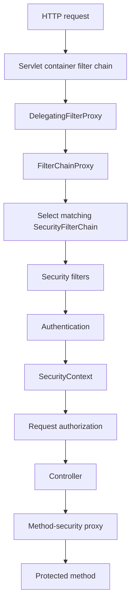

---
title: Spring Security Servlet Filter Chain
---

# Spring Security Servlet Filter Chain

Servlet security architecture, core classes, SecurityContext, multiple chains, exceptions, sessions, CSRF, and CORS.

Back to [Spring Security](../SPRING-SECURITY-GENERIC.md).

## Servlet Security Architecture



`DelegatingFilterProxy` bridges the servlet container to a Spring-managed
filter bean.

`FilterChainProxy` contains one or more `SecurityFilterChain` objects. It
selects the first chain whose matcher accepts the request.

Each chain contains ordered filters for concerns such as CSRF, sessions,
Basic authentication, bearer tokens, anonymous authentication, exception
translation, and authorization.


## Important Interfaces And Classes

| Type | Responsibility |
|---|---|
| `SecurityFilterChain` | Security rules and filters for matching requests |
| `Authentication` | Principal, credentials, authorities, and authentication state |
| `AuthenticationManager` | Entry point for authenticating an `Authentication` request |
| `ProviderManager` | Delegates authentication to compatible providers |
| `AuthenticationProvider` | Authenticates one credential/token type |
| `UserDetails` | Spring Security representation of a user |
| `UserDetailsService` | Loads a user by username |
| `PasswordEncoder` | Hashes and verifies passwords |
| `GrantedAuthority` | A role, permission, or scope used for authorization |
| `SecurityContext` | Holds the current `Authentication` |
| `SecurityContextHolder` | Access point for the current servlet security context |
| `AuthorizationManager` | Makes request or method authorization decisions |
| `AuthenticationEntryPoint` | Handles unauthenticated access, normally `401` |
| `AccessDeniedHandler` | Handles authenticated but unauthorized access, normally `403` |


## SecurityContext And SecurityContextHolder

After successful servlet authentication:

```text
SecurityContext
  -> Authentication
       -> principal
       -> authorities
       -> authenticated=true
```

Application code can access it:

```java
Authentication authentication =
        SecurityContextHolder.getContext().getAuthentication();

String username = authentication.getName();
```

In servlet applications, the holder commonly uses thread-associated context.
Async work requires explicit context propagation.

WebFlux uses `ReactiveSecurityContextHolder` and Reactor Context instead of
assuming one thread per request.

Prefer injecting `Authentication` into a controller or using method-security
expressions when possible. Direct global access makes code harder to test.


## Multiple SecurityFilterChains

Multiple chains are appropriate when endpoints use materially different
authentication mechanisms.

Shopverse User Service uses:

```text
Order 1: /api/v1/internal/users/** -> HTTP Basic
Order 2: remaining application APIs -> JWT bearer
```

Rules:

- use narrow `securityMatcher` patterns;
- order the most specific chain first;
- ensure every request matches the intended chain;
- avoid duplicating rules unnecessarily;
- test authentication mechanism and denial behavior for each chain.


## Exceptions

Unauthenticated access normally produces `401 Unauthorized` through an
`AuthenticationEntryPoint`.

Authenticated access without permission produces `403 Forbidden` through an
`AccessDeniedHandler`.

Do not convert both into `401`; clients and operators need to distinguish
invalid identity from insufficient authorization.

Avoid returning cryptographic or account-enumeration details in error
responses.


## Session And Stateless Security

Session-based:

- authentication stored server-side;
- browser sends a session cookie;
- logout can invalidate the session immediately;
- CSRF protection is normally required.

Stateless bearer:

- each request contains a token;
- no server HTTP session is required;
- horizontal scaling is simpler;
- revocation is more complex.

`SessionCreationPolicy.STATELESS` tells Spring Security not to use an HTTP
session as the security-context repository for API authentication.


## CSRF And CORS

CSRF exploits credentials automatically attached by a browser, especially
cookies. Disabling CSRF is generally appropriate for stateless APIs that accept
only bearer tokens from headers, but not automatically for browser session
applications.

CORS controls which browser origins may call an API. It is not authentication
and does not protect non-browser clients.

Use explicit origin, method, and header allowlists in production.


