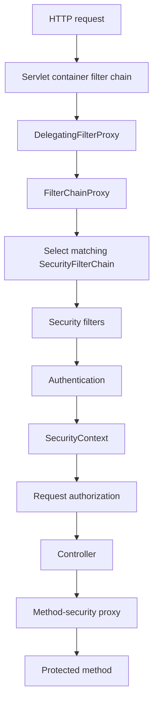
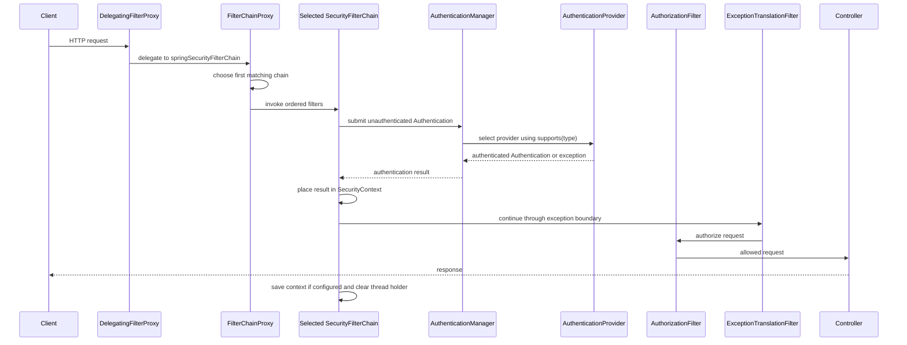

# Spring Security Servlet Filter Chain

<DocLabels items={[
  {label: 'Servlet security', tone: 'intermediate'},
  {label: 'Filter runtime', tone: 'advanced'},
  {label: 'Request boundary', tone: 'production'},
]} />

Servlet security architecture, core classes, SecurityContext, multiple chains, exceptions, sessions, CSRF, and CORS.

Back to [Spring Security](../SPRING-SECURITY-GENERIC.md).

## Servlet Security Architecture



`DelegatingFilterProxy` bridges the servlet container to a Spring-managed
filter bean.

`FilterChainProxy` contains one or more `SecurityFilterChain` objects. It
selects the first chain whose matcher accepts the request.

Each chain contains ordered filters for concerns such as CSRF, sessions,
Basic authentication, bearer tokens, anonymous authentication, exception
translation, and authorization.

## Representative Filter Order And Ownership

The precise list varies with enabled configurers and Spring Security version.
Inspect the startup/debug filter list instead of copying a fixed numeric order.
For a typical servlet application, reason about these relative stages:

| Relative stage | Common filter | Responsibility |
|---|---|---|
| context setup | `SecurityContextHolderFilter` | obtains a deferred or empty context for the request; explicit authentication mechanisms save it when required |
| response headers | `HeaderWriterFilter` | writes configured security headers |
| cross-origin | `CorsFilter` | handles CORS, including preflight, before authentication rejection |
| browser exploit protection | `CsrfFilter` | validates CSRF tokens when the accepted credential transport requires it |
| logout | `LogoutFilter` | recognizes logout and invokes logout handlers before login filters |
| username/password | `UsernamePasswordAuthenticationFilter` | extracts form credentials and authenticates a username/password token |
| HTTP Basic | `BasicAuthenticationFilter` | decodes the Basic header and authenticates it |
| bearer token | `BearerTokenAuthenticationFilter` | resolves a bearer token and submits it for authentication |
| anonymous fallback | `AnonymousAuthenticationFilter` | supplies an anonymous authentication when no mechanism authenticated the request |
| exception boundary | `ExceptionTranslationFilter` | translates downstream authentication/access-denied exceptions into entry-point or denied-handler responses |
| request authorization | `AuthorizationFilter` | uses an `AuthorizationManager` for the matched HTTP request |

Not every chain contains every filter. Form, Basic and bearer filters appear
only when their mechanisms are enabled. Multiple credential filters can exist,
but accepting several credential transports at one boundary increases ambiguity
and must be tested explicitly.

`ExceptionTranslationFilter` does not authenticate or authorize. It catches
specific exceptions thrown later in the chain. An anonymous or unauthenticated
caller that needs authentication is sent to an `AuthenticationEntryPoint`
(normally `401` or a login redirect); an authenticated caller lacking authority
is sent to an `AccessDeniedHandler` (normally `403`).

## Complete Request Timeline



If authentication itself fails inside an authentication filter, that filter can
invoke its configured failure handler or entry point directly. If request
authorization fails downstream, `ExceptionTranslationFilter` handles the
exception. This distinction explains why not every `AuthenticationException`
travels through the same filter.


## Important Interfaces And Classes

| Type | Responsibility |
|---|---|
| `SecurityFilterChain` | Security rules and filters for matching requests |
| `Authentication` | Principal, credentials, authorities, and authentication state |
| `AuthenticationManager` | Entry point for authenticating an `Authentication` request |
| `ProviderManager` | Delegates authentication to compatible providers |
| `AuthenticationProvider` | Authenticates one credential/token type |
| `UserDetails` | Spring Security representation of a user |
| `UserDetailsService` | Loads a user by username |
| `PasswordEncoder` | Hashes and verifies passwords |
| `GrantedAuthority` | A role, permission, or scope used for authorization |
| `SecurityContext` | Holds the current `Authentication` |
| `SecurityContextHolder` | Access point for the current servlet security context |
| `AuthorizationManager` | Makes request or method authorization decisions |
| `AuthenticationEntryPoint` | Handles unauthenticated access, normally `401` |
| `AccessDeniedHandler` | Handles authenticated but unauthorized access, normally `403` |


## SecurityContext And SecurityContextHolder

After successful servlet authentication:

```text
SecurityContext
  -> Authentication
       -> principal
       -> authorities
       -> authenticated=true
```

Application code can access it:

```java
Authentication authentication =
        SecurityContextHolder.getContext().getAuthentication();

String username = authentication.getName();
```

In servlet applications, the holder commonly uses thread-associated context.
Async work requires explicit context propagation.

WebFlux uses `ReactiveSecurityContextHolder` and Reactor Context instead of
assuming one thread per request.

Prefer injecting `Authentication` into a controller or using method-security
expressions when possible. Direct global access makes code harder to test.


## Multiple SecurityFilterChains

Multiple chains are appropriate when endpoints use materially different
authentication mechanisms.

Shopverse User Service uses:

```text
Order 1: /api/v1/internal/users/** -> HTTP Basic
Order 2: remaining application APIs -> JWT bearer
```

Rules:

- use narrow `securityMatcher` patterns;
- order the most specific chain first;
- ensure every request matches the intended chain;
- avoid duplicating rules unnecessarily;
- test authentication mechanism and denial behavior for each chain.


## Exceptions

Unauthenticated access normally produces `401 Unauthorized` through an
`AuthenticationEntryPoint`.

Authenticated access without permission produces `403 Forbidden` through an
`AccessDeniedHandler`.

Do not convert both into `401`; clients and operators need to distinguish
invalid identity from insufficient authorization.

Avoid returning cryptographic or account-enumeration details in error
responses.


## Session And Stateless Security

Session-based:

- authentication stored server-side;
- browser sends a session cookie;
- logout can invalidate the session immediately;
- CSRF protection is normally required.

Stateless bearer:

- each request contains a token;
- no server HTTP session is required;
- horizontal scaling is simpler;
- revocation is more complex.

`SessionCreationPolicy.STATELESS` tells Spring Security not to use an HTTP
session as the security-context repository for API authentication.


## CSRF And CORS

CSRF exploits credentials automatically attached by a browser, especially
cookies. Disabling CSRF is generally appropriate for stateless APIs that accept
only bearer tokens from headers, but not automatically for browser session
applications.

CORS controls which browser origins may call an API. It is not authentication
and does not protect non-browser clients.

Use explicit origin, method, and header allowlists in production.

## Interview Check

**Why does filter-chain order matter when multiple `SecurityFilterChain` beans exist?**

<ExpandableAnswer title="Expand answer">

`FilterChainProxy` selects the first matching chain. A broad matcher ordered
before a specific actuator or API chain can shadow its policy, producing either
unexpected denial or a security bypass. Give chains explicit order, make matchers
non-overlapping where possible, and test representative routes against the
selected authentication mechanism and authorization rules.

</ExpandableAnswer>

## Recommended Next

Deepen browser controls in [CSRF, CORS And Browser Security](./CSRF-CORS-BROWSER-SECURITY.md).


