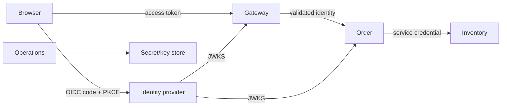

# Spring Security Threat-Modelling And Interview Lab

<DocLabels items={[
  {label: 'Threat modelling', tone: 'production'},
  {label: 'Architect interview', tone: 'advanced'},
  {label: 'Shopverse scenarios', tone: 'shopverse'},
]} />

## Trust-Boundary Model

For each arrow record actor, credential, issuer, audience, transport protection,
authorization decision, replay resistance, expiry, revocation, audit event and
failure behavior. Treat gateway-to-service and service-to-service paths as trust
boundaries, not “internal” exceptions.

## Shopverse Threat Exercise

| Threat | Boundary | Required controls | Evidence |
|---|---|---|---|
| stolen access token | browser/API | short expiry, audience, secure storage, anomaly detection | token-use audit by subject/client |
| forged JWT | resource server | algorithm allowlist, signature, issuer/JWKS validation | negative token tests and key-rotation drill |
| cross-customer order read | order method | subject-to-resource ownership check | MockMvc/method test for wrong owner |
| confused service identity | service call | client-specific credential and audience | caller identity in trace/audit |
| stale role after removal | token lifecycle | bounded token life, revocation/version strategy | role-change propagation SLO |
| CSRF mutation | browser session | CSRF token and cookie policy | cross-site negative test |
| excessive scope | authorization server/API | least privilege and endpoint/method policy | scope inventory and denied tests |

<!-- snippet-source: labs/spring-architect/src/main/java/io/shopverse/labs/security/SecurityConfiguration.java -->
<!-- snippet-test: labs/spring-architect/src/test/java/io/shopverse/labs/SecurityAuthorizationTest.java -->

## Architect Interview Scenarios

**A JWT signature is valid. Why can the request still be rejected?**

<ExpandableAnswer title="Expand answer">

Signature validity proves integrity under a key, not suitability for this API.
Validate issuer, audience, time claims, allowed algorithm, required claims and
token type. Then map authorities and apply endpoint plus object-level policy.

</ExpandableAnswer>

**Where should authorization run when the gateway already validates the token?**

<ExpandableAnswer title="Expand answer">

The gateway can reject invalid tokens and coarse routes, but each reachable
resource service must validate identity and enforce its own endpoint and object
ownership rules. Otherwise alternate routing or gateway policy drift becomes a
bypass. Method security protects business entry points beyond MVC routing.

</ExpandableAnswer>

**Roles, scopes and permissions: which should a method check?**

<ExpandableAnswer title="Expand answer">

Check the smallest stable authority expressing the operation. Scopes describe
delegated client capability; roles describe coarse responsibility; permissions
can represent fine actions. Object ownership or relationship is dynamic domain
data and usually needs a policy/service check, not an ever-growing JWT claim.

</ExpandableAnswer>

**How do you rotate a JWT signing key without downtime?**

<ExpandableAnswer title="Expand answer">

Publish the new public key with a distinct `kid`, start signing new tokens with
the new private key, and retain the old public key for at least the maximum old
token lifetime plus clock/cache margin. Observe unknown-key failures, refresh
JWKS safely, then remove the old key. Never publish private key material.

</ExpandableAnswer>

**Authorization Code with PKCE versus Client Credentials?**

<ExpandableAnswer title="Expand answer">

Authorization Code with PKCE represents a user-mediated login for public or
interactive clients and protects the authorization code from interception.
Client Credentials represents the client itself for machine-to-machine access;
there is no end-user identity unless separately propagated and trusted.

</ExpandableAnswer>

**Why is a long-lived JWT operationally difficult?**

<ExpandableAnswer title="Expand answer">

Offline validation improves availability but accepted claims remain valid until
expiry unless every resource server adds revocation or security-version checks.
Long lifetime enlarges the theft and stale-authorization window. Prefer short
access-token life, protected refresh rotation where applicable, and explicit
high-risk revocation controls.

</ExpandableAnswer>

**Why test both request and method authorization?**

<ExpandableAnswer title="Expand answer">

Request rules protect URL dispatch; method rules protect business operations
called through other controllers, schedulers or messaging adapters. Tests should
prove anonymous, insufficient scope, wrong owner and privileged success, and
must confirm the protected call crosses the method-security proxy.

</ExpandableAnswer>

<DocCallout type="production" title="Threat models expire">

Review after new identity providers, routes, token claims, service credentials,
browser storage, admin functions, data classifications or bypass paths. Attach
controls to owners and evidence, not only a diagram.

</DocCallout>

## Official References

- [Spring Security architecture](https://docs.spring.io/spring-security/reference/servlet/architecture.html)
- [Spring Security authorization](https://docs.spring.io/spring-security/reference/servlet/authorization/index.html)

## Recommended Next

Run the security test in the [Spring Architect Labs](../../spring/architect-labs/README.md)
and record one improvement as an ADR.
