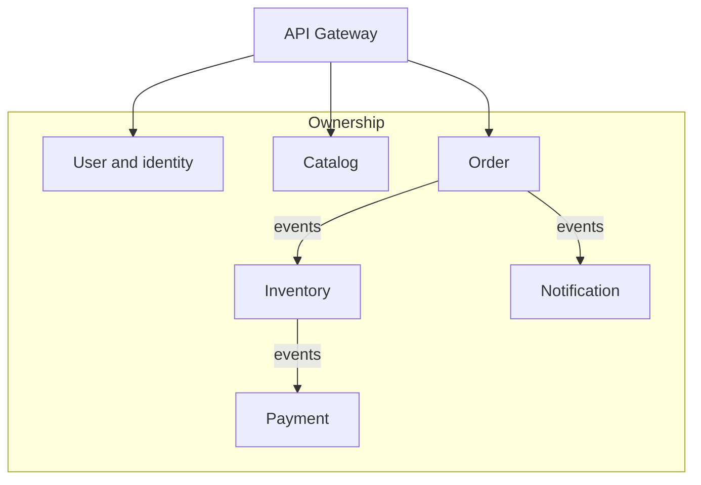

# Shopverse Service Landscape

<DocLabels items={[{label: 'Shopverse', tone: 'shopverse'}, {label: 'Ownership', tone: 'advanced'}, {label: 'Runtime map', tone: 'production'}]} />

Use this section to answer four questions for every service: which business capability it owns, which data it may mutate, which contracts it publishes or consumes, and which signals prove healthy operation. A deployable name alone is not a service boundary.

<TopicCards items={[
  {title: 'Service catalog', href: '/services/SERVICE-CATALOG', description: 'Ports, responsibilities, dependencies, data, and signals.', icon: 'layers', tags: ['Inventory', 'Operations']},
  {title: 'Service boundaries', href: '/architecture/microservices/SERVICE-BOUNDARIES-OWNERSHIP', description: 'Derive boundaries from invariants and ownership.', icon: 'security', tags: ['DDD', 'Ownership']},
  {title: 'System design', href: '/architecture/SYSTEM-DESIGN', description: 'Connect services through runtime and failure flows.', icon: 'network', tags: ['Architecture']},
]} />

<DocCallout type="production" title="One writer for each invariant">

Other services may cache or project owned data, but they must not become hidden writers. Cross-service changes travel through explicit commands or events with reconciliation.

</DocCallout>

## Recommended Next

Continue with the [Shopverse architect capstones](../architecture/shopverse-capstones/README.md) to apply the ownership map to complete system-design exercises.

## Official References

- [Spring Boot reference](https://docs.spring.io/spring-boot/reference/)
- [Domain-driven design reference](https://www.domainlanguage.com/ddd/reference/)
