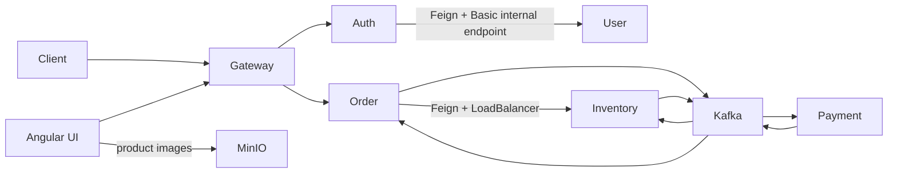

# Shopverse Service Catalog

This page provides one operational map of the Shopverse services. Detailed
commands remain in each service README.

| Component | Port | Responsibility | Key dependencies |
|---|---:|---|---|
| API Gateway | 8080 | routing, edge JWT validation, correlation, request metrics | Eureka, Config Server, Auth JWKS |
| Auth Service | 8081 | login, RSA JWT signing, JWKS publication | User Service, Eureka, Config Server |
| User Service | 8082 | users, roles, permissions, internal credential lookup | MySQL, Eureka, Config Server |
| Order Service | 8083 | idempotent checkout, order state, timeline, SAGA participation | MySQL, Inventory HTTP, Kafka |
| Payment Service | 8084 | payment lifecycle, simulation, reconciliation, refund | MySQL, Kafka |
| Inventory Service | 8086 | stock, reservation, expiry, compensation | MySQL, Kafka |
| Angular Storefront | 4200 | customer storefront and admin UI served by nginx in Docker | API Gateway, MinIO product URLs |
| Documentation Portal | 3001 | Docusaurus documentation site served by nginx in Docker | generated static documentation build |
| Discovery Server | 8761 | Eureka service registration and discovery | Config Server |
| Config Server | 8888 | centralized configuration delivery | local/Git configuration repository |
| Kafka | 9092 | durable asynchronous event transport | persistent broker storage |
| MinIO | 9000 object API, 9001 console | local product image object storage | seeded assets under `assets/products/products` |
| Zipkin | 9411 | distributed trace storage and exploration | span exporters |
| Prometheus | 9090 | metric scraping, TSDB, rules, alerts | service Actuator endpoints |
| Grafana | 3000 | dashboards and Explore across telemetry stores | Prometheus, Loki, Zipkin |
| Loki | 3100 | log storage and LogQL | Promtail or replacement collector |
| Promtail | internal | log discovery, parsing, and shipping | Docker socket and service log volumes |
| MySQL | 3307 host | separate service databases | persistent volume |

## Request Flow



## Data Ownership

Shopverse uses separate databases/schemas for service-owned data:

```text
user_service
order_service
inventory_service
payment_service
```

Services do not join across another service's tables. Cross-domain information
comes through APIs and events.

## Centralized Capabilities

| Capability | Component |
|---|---|
| Routing | API Gateway |
| Runtime configuration | Config Server |
| Registration and discovery | Eureka |
| Authentication token issuance | Auth Service |
| Distributed authorization | resource-server JWT validation in each protected service |
| Logs | Logback JSON, Promtail, Loki, Grafana |
| Metrics | Actuator, Micrometer, Prometheus, Grafana |
| Traces | Micrometer Tracing, Zipkin |
| Delivery automation | GitHub Actions and Jenkins |
| Product media | MinIO plus Inventory image metadata |
| Web UI | Angular served by nginx and proxied through API Gateway |

## Service Documentation

- [API Gateway README](https://github.com/taukhir/shopverse/tree/main/api-gateway)
- [Auth Service README](https://github.com/taukhir/shopverse/tree/main/auth-service)
- [User Service README](https://github.com/taukhir/shopverse/tree/main/user-service)
- [Order Service README](https://github.com/taukhir/shopverse/tree/main/order-service)
- [Inventory Service README](https://github.com/taukhir/shopverse/tree/main/inventory-service)
- [Payment Service README](https://github.com/taukhir/shopverse/tree/main/payment-service)
- [Config Server README](https://github.com/taukhir/shopverse/tree/main/config-server)
- [Discovery Server README](https://github.com/taukhir/shopverse/tree/main/discovery-server)
- [Angular Storefront README](https://github.com/taukhir/shopverse/tree/main/shopverse-web)
- [Documentation README](https://github.com/taukhir/shopverse/tree/main/documentation)
