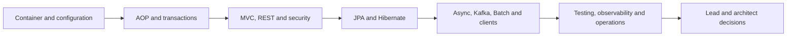

# Spring And Spring Boot Learning Guide

<DocLabels items={[
  {label: 'Beginner to architect', tone: 'foundation'},
  {label: 'Spring Boot 4', tone: 'intermediate'},
  {label: 'Production depth', tone: 'production'},
  {label: 'Shopverse examples', tone: 'shopverse'},
]} />

This is the canonical Spring learning route. Generic mechanics live in this track;
Shopverse pages show repository-specific implementation and link back here instead of
copying the same explanations.

## Choose A Track

<TopicCards items={[
  {
    title: 'Spring Fundamentals',
    href: './SPRING-ECOSYSTEM',
    description: 'Understand the framework, Boot, web, data, security and cloud modules.',
    icon: 'book',
    tags: ['Start here', 'Foundation'],
  },
  {
    title: 'Boot 4 And Framework 7',
    href: './SPRING-BOOT-4-FRAMEWORK-7',
    description: 'Use the correct generation, starter, Jakarta and migration assumptions.',
    icon: 'route',
    tags: ['Compatibility', 'Migration'],
  },
  {
    title: 'Lead And Architect Path',
    href: './SPRING-ARCHITECT-PATH',
    description: 'Trace proxies, threads, transactions, persistence and production lifecycle.',
    icon: 'layers',
    tags: ['Advanced', 'Runtime'],
  },
  {
    title: 'REST And MVC',
    href: '../development/SPRING-REST-APIS',
    description: 'Design HTTP contracts, validation, errors, idempotency and clients.',
    icon: 'route',
    tags: ['HTTP', 'APIs'],
  },
  {
    title: 'Data JPA And Hibernate',
    href: './SPRING-DATA-JPA',
    description: 'Model entities, queries, fetch plans, transactions and concurrency.',
    icon: 'boxes',
    tags: ['SQL', 'Persistence'],
  },
  {
    title: 'Kafka And Integration',
    href: './SPRING-KAFKA',
    description: 'Own delivery, retries, DLTs, idempotency, ordering and capacity.',
    icon: 'network',
    tags: ['Messaging', 'Reliability'],
  },
  {
    title: 'Testing And Quality',
    href: './SPRING-BOOT-TESTING',
    description: 'Choose unit, slice, integration, contract and system evidence.',
    icon: 'experiment',
    tags: ['JUnit', 'Testcontainers'],
  },
  {
    title: 'Interview Preparation',
    href: './SPRING-INTERVIEW-PREPARATION',
    description: 'Practise expandable answers from fundamentals through architecture.',
    icon: 'brain',
    tags: ['Questions', 'Scenarios'],
  },
]} />

## Step-By-Step Learning Order

| Stage | Outcome | Entry page |
|---:|---|---|
| 1 | Distinguish Framework, Boot, Data, Security and Cloud | [Spring Ecosystem](./SPRING-ECOSYSTEM.md) |
| 2 | Explain startup, bean creation and configuration | [Spring Boot Internals](../development/SPRING-BOOT-INTERNALS.md) |
| 3 | Trace interception and transaction behavior | [Proxy And Transaction Internals](./SPRING-PROXY-TRANSACTION-ARCHITECT.md) |
| 4 | Trace filters, dispatch, validation and serialization | [MVC And Security Runtime](./SPRING-MVC-SECURITY-RUNTIME.md) |
| 5 | Design persistence and concurrency from SQL evidence | [JPA And Hibernate Runtime](./SPRING-JPA-HIBERNATE-ARCHITECT.md) |
| 6 | Bound remote, async, broker and batch work | [Async And Production Lifecycle](./SPRING-ASYNC-PRODUCTION-ARCHITECT.md) |
| 7 | Prove behavior with tests and operational evidence | [Spring Internals Labs](./SPRING-INTERNALS-LABS.md) |

## Related Spring Portfolio Tracks

Some portfolio projects already have a stronger canonical home elsewhere in the
documentation. They are linked here instead of being copied into the core track.

| Portfolio area | Canonical guide | Why it is separate |
|---|---|---|
| Spring Security | [Spring Security](../security/SPRING-SECURITY-GENERIC.md) | authentication, authorization, OAuth2/OIDC and threat controls form a full security track |
| Spring Cloud Gateway | [Advanced Gateway](../development/SPRING-CLOUD-GATEWAY-ADVANCED.md) | edge routing, filters, rate limits and reactive capacity belong to gateway architecture |
| Spring AI | [Spring AI](../ai/SPRING-AI-UMBRELLA.md) | model clients, retrieval, tools and MCP have their own fast-moving compatibility surface |
| Modulith, native, streaming and multi-tenancy | [Advanced Spring Platform Patterns](./SPRING-PLATFORM-ADVANCED.md) | architect decisions are driven by deployment and ownership trade-offs |

<DocCallout type="shopverse" title="Keep examples and implementation claims separate">

Spring pages may use Shopverse order, inventory, payment and identity scenarios. Claims
about what the repository currently implements must link to a platform, case-study or
reliability page, because those pages are maintained with the code.

</DocCallout>

## Shopverse Implementation Links

- [Platform Kafka Parsing](../platform/KAFKA-PARSING.md)
- [Platform Kafka Recovery Starter](../platform/KAFKA-RECOVERY-STARTER.md)
- [Platform Security Starter](../platform/SECURITY-STARTER.md)
- [Runtime Reliability Problems](../reliability/problems/RUNTIME-RELIABILITY-PROBLEMS.md)
- [Spring Security Track](../security/SPRING-SECURITY-GENERIC.md)

## Recommended Next

Start with [Spring Ecosystem](./SPRING-ECOSYSTEM.md).
