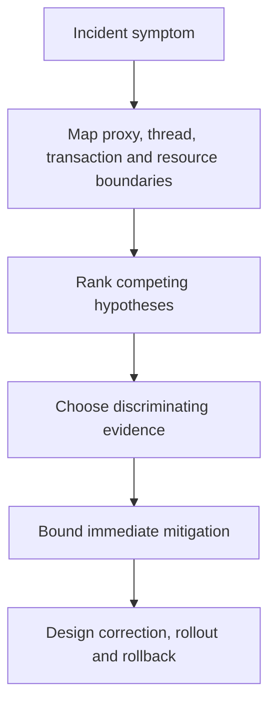

# Spring And Spring Boot Architect Interview Workbook

<DocLabels items={[
  {label: 'Architect interview', tone: 'advanced'},
  {label: 'Applied incidents', tone: 'production'},
  {label: 'Evidence-based', tone: 'intermediate'},
  {label: 'Shopverse scenarios', tone: 'shopverse'},
]} />

Attempt each prompt before opening its answer. A strong response names the
container, proxy, thread, transaction, connection, persistence state, and
multi-replica boundary that owns the behavior.

<DocCallout type="tip" title="Score the evidence, not the vocabulary">
An annotation or API name earns little credit by itself. Require a mechanism,
a failure path, evidence that distinguishes competing explanations, and a safer
production design with rollback or recovery.
</DocCallout>

## Container Incidents

<ExpandableAnswer title="An inventory bean is created inside a BeanFactoryPostProcessor and later misses metrics and transaction advice. Why?">

The factory post-processor forced an ordinary bean into existence before the
complete `BeanPostProcessor` and auto-proxy-creator chain was registered. The
published reference can therefore be raw or only partially processed. Confirm
creation timing and processor-eligibility logs, then refactor the processor to
operate on definitions and defer application-bean lookup until normal creation.

</ExpandableAnswer>

<ExpandableAnswer title="OrderService and PaymentService form a constructor cycle. Why does startup fail, and what is the architectural fix?">

Neither constructor can run until the other completed dependency exists; early
singleton exposure cannot provide an object before construction. Field injection
only hides the ownership problem. Introduce a checkout coordinator, publish an
event, extract the shared responsibility, or reverse one dependency behind a
narrower interface. The new graph should be verified with a context test.

</ExpandableAnswer>

<ExpandableAnswer title="A singleton FraudEngine receives one prototype rule strategy, but the team expected a fresh strategy per request. What happened?">

The prototype was resolved once while the singleton was created. Prototype scope
does not change the lifetime of the reference already injected. Use an
`ObjectProvider`, method lookup, or a correctly owned scoped proxy only if fresh
instances are a real requirement, and define who destroys resources held by each
prototype.

</ExpandableAnswer>

## AOP And Transaction Incidents

<ExpandableAnswer title="OrderService.place calls its own REQUIRES_NEW reserve method, but both operations use one transaction. Diagnose it.">

The direct same-instance call never re-enters the transaction proxy, so the inner
metadata is not evaluated. Inspect the call site, proxy identity, transaction ID,
and connection ID. Put the distinct reserve boundary on another bean, move the
transaction to the outer operation, or use an explicit transaction template when
local orchestration must stay visible.

</ExpandableAnswer>

<ExpandableAnswer title="Checkout catches a DataAccessException and returns a fallback, yet commit still fails. Why?">

An inner participating scope can mark the shared physical transaction rollback-only.
Catching the exception does not clear that state, so the outer commit produces
`UnexpectedRollbackException`. Trace logical scopes and rollback-only state, then
redesign the fallback outside the doomed transaction or give it a deliberately
independent boundary with adequate resource capacity.

</ExpandableAnswer>

<ExpandableAnswer title="Concurrent audit writes use REQUIRES_NEW and Hikari times out although SQL is fast. Explain the queue.">

Each outer transaction can retain one connection while the inner audit transaction
requests another. Enough concurrent outer work occupies the pool and every request
waits for an inner connection, creating a capacity deadlock. Correlate active and
pending connections with transaction spans; remove unnecessary nesting, bound
admission, or size from measured concurrency and timeout policy.

</ExpandableAnswer>

<ExpandableAnswer title="An afterCommit listener publishes OrderCreated to Kafka. Can it guarantee delivery after a process crash?">

No. The database has committed before the callback performs the remote publish,
so a crash in that gap loses the message. Persist an outbox record with the order,
publish it through a retryable process, and make consumers idempotent. Prove the
design with failure injection after commit and before broker acknowledgement.

</ExpandableAnswer>

## MVC And Security Incidents

<ExpandableAnswer title="Trace an authenticated JSON request through filters, security, MVC dispatch, validation, the controller, and response conversion.">

The servlet container invokes ordered filters; `FilterChainProxy` selects the first
matching security chain; authentication and authorization run before
`DispatcherServlet`. MVC then selects a handler mapping and adapter, resolves and
validates arguments, invokes the controller, and uses a message converter for the
response. Evidence should identify where errors are translated and whether the
response was already committed.

</ExpandableAnswer>

<ExpandableAnswer title="A JWT failure returns 401 but the ControllerAdvice breakpoint never runs. Why?">

Authentication failed in the security filter chain before controller dispatch.
Security's entry point or access-denied handler owns that response; MVC exception
resolvers never receive it. Confirm the selected chain and filter trace, then keep
the security and MVC error contracts consistent without trying to route filter
failures through controller advice.

</ExpandableAnswer>

<ExpandableAnswer title="Returning a managed Order entity suddenly adds hundreds of SQL queries during JSON serialization. Explain it.">

Jackson traversed lazy associations while the persistence context remained open,
triggering N+1 loading. With a closed context it could instead fail lazy access.
Map an explicit DTO inside the service transaction, fetch only the required graph,
disable open-session-in-view for clear boundaries, and verify query count plus
response compatibility in an integration test.

</ExpandableAnswer>

<ExpandableAnswer title="A broad security chain at order 1 makes the stricter actuator chain ineffective. What rule was violated?">

Spring Security uses the first matching `SecurityFilterChain`. The broad matcher
captured actuator requests before the later policy could apply. Make matchers
mutually understandable, place the narrow chain first, and test representative
paths for chain selection, authentication mechanism, authorization, and error
translation.

</ExpandableAnswer>

## JPA And Hibernate Incidents

<ExpandableAnswer title="Hibernate emits an INSERT during flush, but the transaction later rolls back. Was the row committed?">

No. Flush synchronizes pending state to the database connection but does not
commit the physical transaction. Constraints may fail during flush, a query-triggered
auto-flush, or commit. Verify the final state from a separate transaction rather
than treating emitted SQL as durability evidence.

</ExpandableAnswer>

<ExpandableAnswer title="A caller mutates the detached object passed to merge, but later changes are not persisted. Why?">

`merge` copies state into and returns a managed instance; the supplied detached
object does not become managed. Code that ignores the return value continues
mutating the wrong identity. Prefer loading the managed aggregate and applying an
explicit command, or retain the returned instance when merge is truly required.

</ExpandableAnswer>

<ExpandableAnswer title="A bulk status update succeeds, but a following entity lookup in the same transaction returns stale state. Explain it.">

Bulk DML operates directly on database rows and bypasses persistence-context
dirty checking and managed-instance synchronization. Existing managed entities
therefore retain old values. Clear or refresh the context deliberately, or isolate
the bulk operation, and test database state and in-memory state separately.

</ExpandableAnswer>

<ExpandableAnswer title="A fetch join over order lines makes page sizes and totals unreliable. Why?">

The SQL result contains one row per joined child while pagination is defined over
root orders. Row multiplication conflicts with entity-level page semantics and can
also increase memory. Page root identifiers first and fetch the required graph in
a second bounded query, or use a projection designed for the response.

</ExpandableAnswer>

<ExpandableAnswer title="Two references to one generated-ID entity compare differently across a Hibernate proxy boundary. What must the equality strategy define?">

It must define stable identity before and after persistence, compatible class
semantics across proxies, and an immutable hash while an object is in hashed
collections. Generated identifiers are unavailable for new entities, so blindly
hashing on them is unsafe. Choose and test one explicit strategy across transient,
managed, detached, and proxied states.

</ExpandableAnswer>

## Async And Operations Incidents

<ExpandableAnswer title="Increasing an executor from 50 to 500 threads lowers throughput. What evidence distinguishes CPU contention from downstream saturation?">

Correlate runnable threads, CPU utilization, context switches, executor queue age,
connection acquisition, lock waits, and downstream latency. CPU-bound work may
lose to scheduling and cache contention; blocking work may only deepen a database
or HTTP queue. Bound admission at the scarce resource and isolate workloads rather
than using thread count as capacity.

</ExpandableAnswer>

<ExpandableAnswer title="A scheduled reservation expiry runs three times after scaling to three replicas. Is the scheduler broken?">

No. Each application instance owns a local scheduler unless coordination is added.
Make the operation idempotent and use a database claim, distributed scheduler, or
partition ownership when exactly one active worker is required. Prove behavior
during overlap, crash, lease expiry, and rolling deployment.

</ExpandableAnswer>

<ExpandableAnswer title="Why is database reachability usually readiness rather than liveness?">

Restarting the application cannot repair an unavailable database and can amplify
the incident through synchronized reconnects. Readiness should stop new traffic
when the service cannot meet its contract; liveness should detect a process that
cannot recover without restart. Add hysteresis and verify dependency recovery
without a restart storm.

</ExpandableAnswer>

<ExpandableAnswer title="What must graceful shutdown prove for HTTP, Kafka, schedulers, and async work?">

Admission stops before owned work is drained or safely relinquished. HTTP requests
finish within a bound, Kafka offsets reflect completed processing, scheduled claims
expire or transfer, executors reject new tasks, and remaining work is idempotently
retryable. Metrics must show phase duration, unfinished work, forced termination,
and readiness removal before process exit.

</ExpandableAnswer>

## Architect Scenario

Design Shopverse order placement across order, inventory, and payment. Cover proxy
and transaction boundaries, idempotency, outbox/Kafka, database isolation, executor
and connection bounds, rollback/compensation, security context, metrics/traces,
readiness, graceful shutdown, and rolling compatibility. Reject distributed ACID
assumptions from `@Transactional` and process-local locks.

<ExpandableAnswer title="Show a model architecture answer">

The Order service authenticates and validates before opening a short local
transaction. It enforces an idempotency key and payload identity, writes the order
state and outbox event atomically, and commits without waiting on inventory or
payment. A bounded publisher sends the event to Kafka; consumers deduplicate by
event or command identity and persist their own local state transitions.

Inventory and payment expose explicit capacity through connection pools, executor
or listener concurrency, and admission timeouts. Workflow state records accepted,
rejected, timed-out, and compensated outcomes. Completed remote effects are
compensated; they are not assumed to roll back with the Order database. Retries
are bounded and operate only on complete idempotent units.

Security and trace context propagate independently from transactions. Metrics show
queue age, pool acquisition, transaction duration, Kafka lag, workflow age, retry,
and compensation. Traces carry stable correlation without PII. Readiness reflects
the ability to accept work, while graceful shutdown removes admission, drains or
relinquishes claims, and leaves unfinished operations safe to retry.

Schema and event changes are additive through mixed-version deployment. A canary
proves compatibility and capacity before wider rollout; rollback does not require
old binaries to understand newly mandatory fields. Failure-injection tests cover
every gap between durable steps.

</ExpandableAnswer>

## Scoring

| Score | Required evidence |
|---:|---|
| 1 | names an annotation or API |
| 2 | explains the correct proxy, container, persistence, or runtime mechanism |
| 3 | identifies failure behavior and the scarce resource boundary |
| 4 | supplies production evidence, rejected alternatives, and a safer design |
| 5 | handles multi-replica behavior, migration, rollback, and recovery |

A lead answer should reach 4 consistently. An architect answer should reach 5
without hiding correctness, capacity, or recovery behind framework terminology.

## Official References

- [Spring Framework reference](https://docs.spring.io/spring-framework/reference/)
- [Spring Boot reference](https://docs.spring.io/spring-boot/reference/)
- [Spring Security reference](https://docs.spring.io/spring-security/reference/)
- [Spring Data JPA reference](https://docs.spring.io/spring-data/jpa/reference/)

## Recommended Next

Run [Spring Internals Labs](./SPRING-INTERNALS-LABS.md) and preserve commands,
configuration, failure injection, evidence, interpretation, and rejected conclusions.
